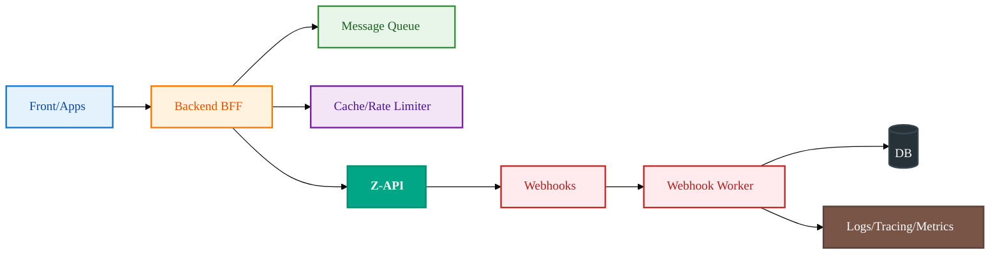

import { Icon } from '@site/src/components/shared/MdxIcon';


Publicado em 11 nov 2025

<!-- truncate -->

Escalar com tranquilidade é decidir antes como seu sistema vai resistir ao pico, à lentidão externa e a falhas parciais. Este guia traz uma arquitetura de referência pensada para operações com Z‑API em produção, conectando diagramas a decisões práticas e destacando transições claras entre resiliência, fluxo assíncrono e observabilidade.

## <Icon name="Network" size="md" /> Arquitetura de referência



## <Icon name="Shield" size="md" /> Padrões essenciais

Os blocos acima ganham robustez quando combinados com quatro padrões que se reforçam:

- Retry com backoff exponencial (evita tempestade de retries) 
- Circuit Breaker para isolar falhas temporárias (protege dependências) 
- Rate Limiting por IP/usuário (controla abuso e estabiliza latência) 
- Dead Letter Queue para mensagens problemáticas (facilita inspeção e reprocesso) 

## <Icon name="Workflow" size="md" /> Fluxo assíncrono (exemplo)

```mermaid
%%{init: {'theme':'base', 'themeVariables': {'fontSize':'16px', 'fontFamily':'var(--ifm-font-family-base)', 'nodeSpacing':50, 'rankSpacing':60, 'curve':'basis', 'padding':20}}}%%
sequenceDiagram
 participant App as Backend
 participant Q as Fila
 participant Z as Z-API
 App->>Q: Publica envio de mensagem
 Q->>Z: Worker consome e envia
 Z-->>App: Webhook de status
 
 classDef backend fill:#fff3e0,stroke:#f57c00,stroke-width:2px,color:#e65100,font-weight:500
 classDef queue fill:#e8f5e9,stroke:#388e3c,stroke-width:2px,color:#1b5e20,font-weight:500
 classDef zapi fill:#00a685,stroke:#008f73,stroke-width:2px,color:#ffffff,font-weight:600
 
 class App backend
 class Q queue
 class Z zapi
```

A fila desacopla o ritmo de produção do de envio, ganha elasticidade no consumo e permite backpressure controlado. O webhook fecha o ciclo para confirmação e auditoria.

## Métricas e observabilidade

- Latência por operação 
- Taxa de sucesso por tipo de mensagem 
- Fila: tempo em fila e taxa de consumo 
- Alertas por erro e degradação de SLA 

Conecte logs estruturados, tracing distribuído (correlation-id) e métricas em um painel único. Tome decisões com base em P95/P99 e tendências, não apenas em médias.
