import { Icon } from '@site/src/components/shared/MdxIcon';


Publicado em 11 nov 2025

<!-- truncate -->

Segurança não precisa travar seu início. Com poucos conceitos bem entendidos — instância, token e validações simples — você já sai do papel com tranquilidade e sem sustos. Este texto conecta conceitos a ações práticas, com links para aprofundar quando você precisar.

## <Icon name="Smartphone" size="md" /> Instância: pense em "um celular conectado"

Uma instância é como “um celular WhatsApp” conectado à sua aplicação. 
Você escaneia um QR Code para estabelecer a sessão e, a partir daí, envia e recebe mensagens programaticamente.

## <Icon name="Key" size="md" /> Tokens: chaves de acesso

Seu `Client-Token` autentica suas chamadas. Trate-o como uma chave de casa:

- Guarde em variáveis de ambiente
- Não comite no Git
- Faça rotação periódica quando possível

## <Icon name="Shield" size="md" /> Fluxo de autenticação

```mermaid
%%{init: {'theme':'base', 'themeVariables': {'fontSize':'16px', 'fontFamily':'var(--ifm-font-family-base)', 'nodeSpacing':50, 'rankSpacing':60, 'curve':'basis', 'padding':20}}}%%
sequenceDiagram
 participant App as Sua App
 participant API as Z-API
 App->>API: Envia requisição com Client-Token
 API-->>App: Valida token e processa
 API-->>App: Retorna resposta (200/erro)
 
 classDef app fill:#e3f2fd,stroke:#1976d2,stroke-width:2px,color:#0d47a1,font-weight:500
 classDef api fill:#00a685,stroke:#008f73,stroke-width:2px,color:#ffffff,font-weight:600
 
 class App app
 class API api
```

O token viaja no header em todas as chamadas; trate-o como segredo e padronize middlewares de autenticação no seu backend para reduzir erros e duplicação.

```mermaid
%%{init: {'theme':'base', 'themeVariables': {'fontSize':'16px', 'fontFamily':'var(--ifm-font-family-base)', 'nodeSpacing':50, 'rankSpacing':60, 'curve':'basis', 'padding':20}}}%%
flowchart LR
 A[Criar instância] --> B[Conectar via QR]
 B --> C[Enviar/receber mensagens]
 C --> D[Manter sessão ativa]
 
 classDef create fill:#e3f2fd,stroke:#1976d2,stroke-width:2px,color:#0d47a1,font-weight:500
 classDef connect fill:#fff3e0,stroke:#f57c00,stroke-width:2px,color:#e65100,font-weight:500
 classDef use fill:#00a685,stroke:#008f73,stroke-width:2px,color:#ffffff,font-weight:600
 classDef maintain fill:#e8f5e9,stroke:#388e3c,stroke-width:2px,color:#1b5e20,font-weight:500
 
 class A create
 class B connect
 class C use
 class D maintain
 D --> E[Reconectar quando necessário]
```

## <Icon name="RefreshCw" size="md" /> Ciclo de vida da instância



## Boas práticas essenciais

- Armazene tokens em variáveis de ambiente 
- Restrinja chamadas por IP quando possível 
- Valide webhooks com token no header `x-token` 
- Evite logs com dados sensíveis

Mais em: [/docs/security/introducao](/docs/security/introducao)
