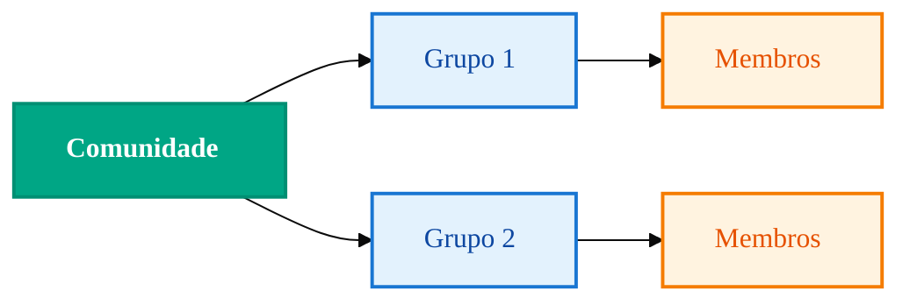

import { Icon } from '@site/src/components/shared/MdxIcon';


Publicado em 11 nov 2025

<!-- truncate -->

Gerenciar grupos e comunidades com código é abrir espaço para moderação inteligente, notificações certeiras e organização visual do seu "território" de conversa. Vamos do mapa à prática, conectando conceitos, fluxos e exemplos acionáveis para você implementar com segurança.

## <Icon name="Users" size="md" /> Hierarquia visual



## <Icon name="Workflow" size="md" /> Fluxo CRUD típico

```mermaid
%%{init: {'theme':'base', 'themeVariables': {'fontSize':'16px', 'fontFamily':'var(--ifm-font-family-base)', 'nodeSpacing':50, 'rankSpacing':60, 'curve':'basis', 'padding':20}}}%%
sequenceDiagram
 participant App as Sua App
 participant API as Z-API
 App->>API: Criar grupo
 API-->>App: ID do grupo
 App->>API: Adicionar participantes
 API-->>App: OK
 App->>API: Promover admin
 API-->>App: OK
 
 classDef app fill:#e3f2fd,stroke:#1976d2,stroke-width:2px,color:#0d47a1,font-weight:500
 classDef api fill:#00a685,stroke:#008f73,stroke-width:2px,color:#ffffff,font-weight:600
 
 class App app
 class API api
```

A partir daqui, padronize idempotência nos comandos (ex.: promover admin duas vezes não deve falhar) e registre os eventos para auditoria e suporte.

## <Icon name="Lightbulb" size="md" /> Exemplos úteis

- Criar grupo → adicionar participantes → fixar regras 
- Notificações em massa com listas segmentadas 
- Promover/despromover admins para moderação dinâmica 

Conheça as operações: [/docs/groups/introducao](/docs/groups/introducao)
