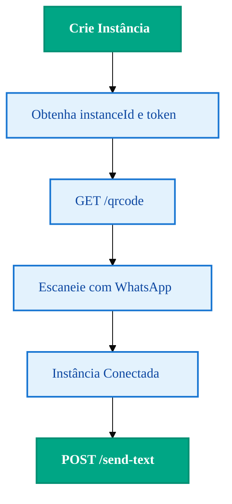

import { Icon } from '@site/src/components/shared/MdxIcon';


Publicado em 11 nov 2025

<!-- truncate -->

Quer um "hello world" que funciona de verdade? Este guia é direto ao ponto: você cria a instância, escaneia o QR e envia sua primeira mensagem — com exemplos em HTTP, cURL, JS e Python. Sem voltas. A cada passo, indicamos o que checar para não quebrar o fluxo (tokens, formato do telefone, status da instância).

## <Icon name="Workflow" size="md" /> Fluxo visual de conexão (QR Code)



## <Icon name="Checklist" size="md" /> Pré-requisitos

1. Conta ativa no Z-API 
2. Uma instância criada e conectada 
3. `instanceId` e `Client-Token`

## <Icon name="QrCode" size="md" /> 1) Obter QR Code

```http
GET https://api.z-api.io/instances/{instanceId}/qrcode
Client-Token: SEU_TOKEN
```

Se a leitura falhar, gere um novo QR e verifique conectividade do dispositivo. A conexão ativa é pré-requisito para o envio de mensagens.

## <Icon name="Send" size="md" /> 2) Enviar mensagem de texto

```http
POST https://api.z-api.io/instances/{instanceId}/send-text
Client-Token: SEU_TOKEN
Content-Type: application/json

{
 "phone": "5511999999999",
 "message": "Olá! Minha primeira mensagem via Z-API! "
}
```

### cURL

```bash
curl -X POST \
 https://api.z-api.io/instances/SEU_INSTANCE_ID/send-text \
 -H 'Client-Token: SEU_TOKEN' \
 -H 'Content-Type: application/json' \
 -d '{"phone":"5511999999999","message":"Olá via Z-API!"}'
```

### JavaScript (Node.js)

```javascript
import axios from 'axios';

const url = 'https://api.z-api.io/instances/SEU_INSTANCE_ID/send-text';
const headers = {'Client-Token': 'SEU_TOKEN','Content-Type': 'application/json'};
const body = {phone: '5511999999999', message: 'Olá via Z-API! '};

const main = async () => {
 const {data} = await axios.post(url, body, {headers});
 console.log(data);
};
main().catch(console.error);
```

### Python

```python
import requests

url = "https://api.z-api.io/instances/SEU_INSTANCE_ID/send-text"
headers = {"Client-Token": "SEU_TOKEN", "Content-Type": "application/json"}
payload = {"phone": "5511999999999", "message": "Olá via Z-API! "}

resp = requests.post(url, json=payload, headers=headers)
print(resp.status_code, resp.json())
```

## <Icon name="Wrench" size="md" /> Troubleshooting rápido

- Número do telefone deve estar em formato internacional, sem espaços (+55DDDNUMERO). 
- Verifique se a instância está “conectada” antes de enviar. 
- Confirme `Client-Token` e `instanceId`. 

## <Icon name="Code" size="md" /> Contexto técnico (para devs)

- Autenticação: header `Client-Token` obrigatório em todas as chamadas. 
- Estrutura mínima do corpo: `phone` (formato E.164) e `message` (string). 
- Resposta padrão: contém `messageId` e `status` inicial (ex.: `PENDING`, `queued`). 
- Erros comuns: 401 (token inválido), 400 (payload inválido), 5xx (transiente). 
- Limites: respeite padrões de uso do WhatsApp; evite rajadas e automatize retries com backoff.

## <Icon name="TestTube" size="md" /> Teste você mesmo

1) Com cURL, repita a chamada variando o `message` e verifique o `status`. 
2) Valide que um `401` ocorre ao remover o header `Client-Token`. 
3) Simule erro de payload (ex.: `phone` faltando) para observar `400` e mensagem de erro.

## <Icon name="Rocket" size="md" /> Próximos passos

- <Icon name="MessageSquare" size="sm" /> Tipos de mensagens: [/docs/messages/introducao](/docs/messages/introducao) 
- <Icon name="Webhook" size="sm" /> Webhooks: [/docs/webhooks/introducao](/docs/webhooks/introducao)

:::warning <Icon name="Shield" size="sm" /> Segurança
Não exponha tokens em repositórios. Use variáveis de ambiente e restrição de IP. Veja: [/docs/security/introducao](/docs/security/introducao).
:::
