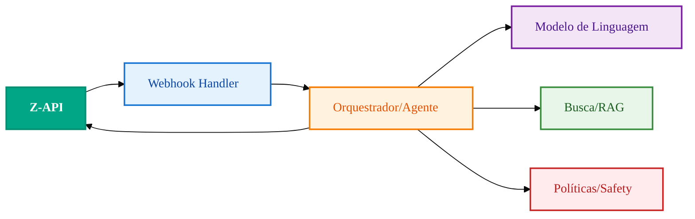

import { Icon } from '@site/src/components/shared/MdxIcon';


Publicado em 11 nov 2025

<!-- truncate -->

IA só é útil se resolver o "próximo passo" do usuário com contexto e segurança. Nesta leitura, você vê a arquitetura mínima, o fluxo de mensagem e os cuidados que evitam armadilhas comuns, conectando a Z‑API com LLMs e mecanismos de busca/RAG de forma segura.

## <Icon name="Network" size="md" /> Arquitetura do chatbot



## <Icon name="Workflow" size="md" /> Fluxo da mensagem

```mermaid
%%{init: {'theme':'base', 'themeVariables': {'fontSize':'16px', 'fontFamily':'var(--ifm-font-family-base)', 'nodeSpacing':50, 'rankSpacing':60, 'curve':'basis', 'padding':20}}}%%
sequenceDiagram
 participant User as Usuário
 participant Z as Z-API
 participant A as Agente
 participant M as LLM
 User->>Z: Envia mensagem
 Z->>A: Webhook (event: message)
 A->>M: Prompt + contexto
 M-->>A: Resposta
 A->>Z: Envia mensagem ao usuário
 
 classDef user fill:#e3f2fd,stroke:#1976d2,stroke-width:2px,color:#0d47a1,font-weight:500
 classDef zapi fill:#00a685,stroke:#008f73,stroke-width:2px,color:#ffffff,font-weight:600
 classDef agent fill:#fff3e0,stroke:#f57c00,stroke-width:2px,color:#e65100,font-weight:500
 classDef llm fill:#f3e5f5,stroke:#7b1fa2,stroke-width:2px,color:#4a148c,font-weight:500
 
 class User user
 class Z zapi
 class A agent
 class M llm
```

## <Icon name="Shield" size="md" /> Padrões e cuidados

- RAG para respostas atualizadas 
- Memória curta vs longa (histórico e preferências) 
- Safety: validação de saída e limites de escopo 
- Rate limiting para evitar loops

Implemente um "circuit breaker lógico" no orquestrador para evitar loops entre agente e LLM, e registre cada decisão (prompt, política aplicada, resposta enviada) para auditoria.
