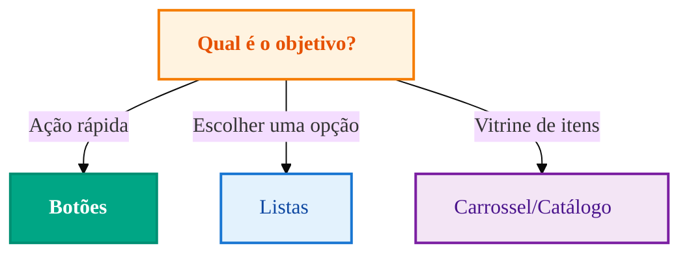
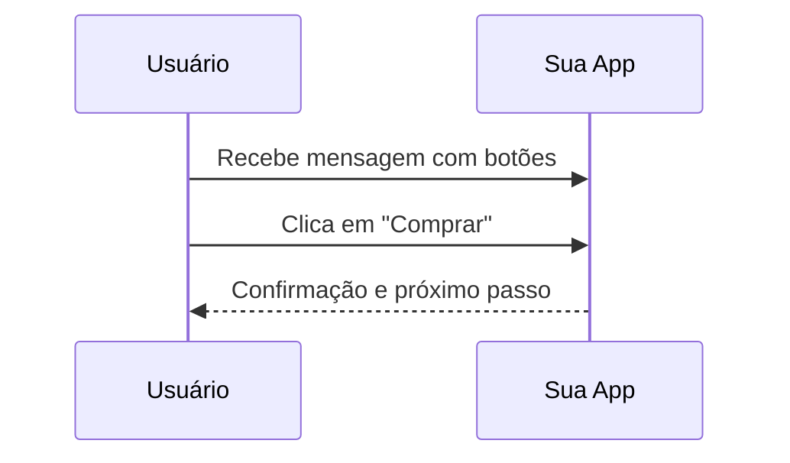

import { Icon } from '@site/src/components/shared/MdxIcon';


Publicado em 11 nov 2025

<!-- truncate -->

Quer reduzir o atrito do usuário e aumentar a taxa de ação? Mensagens interativas guiam decisões com clareza: botões para ações rápidas, listas para escolhas estruturadas e carrosséis para vitrines. Vamos ao quando, como e por quê — com critérios de escolha e exemplos práticos.

## <Icon name="MousePointerClick" size="md" /> Quando usar cada tipo? (Árvore de decisão)



## <Icon name="Eye" size="md" /> Comparação visual

- Mensagem simples: texto curto e link → baixa orientação 
- Mensagem com botões: CTA claro, reduz fricção de escolha 
- Lista: ótima para 3+ opções com contexto 

## <Icon name="FileCode" size="md" /> Exemplos

### Botões de ação

```json
{
 "phone": "5511999999999",
 "message": {
 "type": "button",
 "text": "Como posso ajudar?",
 "buttons": [
 {"id":"help","text":"Ajuda"},
 {"id":"buy","text":"Comprar"}
 ]
 }
}
```

### Lista de opções

```json
{
 "phone": "5511999999999",
 "message": {
 "type": "list",
 "title": "Escolha uma opção",
 "sections": [
 {
 "title": "Atendimento",
 "rows": [{"id":"1","title":"Suporte"},{"id":"2","title":"Comercial"}]
 }
 ]
 }
}
```

## <Icon name="Route" size="md" /> Jornada do usuário (exemplo)



Referências: [/docs/messages/botoes](/docs/messages/botoes), [/docs/messages/lista-opcoes](/docs/messages/lista-opcoes), [/docs/messages/carrossel](/docs/messages/carrossel). Ao escolher o tipo, valide também limitações de visualização por dispositivo e tamanho de payload.
