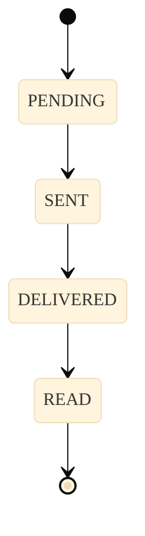

import { Icon } from '@site/src/components/shared/MdxIcon';


Publicado em 11 nov 2025

<!-- truncate -->

Quando seu sistema precisa "saber agora" o que aconteceu, webhooks são a campainha que toca na hora certa — sem você precisar ficar perguntando. Neste guia, você vê o fluxo completo, handlers práticos e cuidados que fazem diferença em produção, com transições claras do "por quê" ao "como".

## <Icon name="Webhook" size="md" /> Polling vs Webhook (uma boa analogia)

- Polling é “ficar batendo na porta” toda hora para perguntar se algo aconteceu. 
- Webhook é instalar uma “campainha”: quando acontece, você é avisado imediatamente.

## <Icon name="Workflow" size="md" /> Fluxo completo

```mermaid
%%{init: {'theme':'base', 'themeVariables': {'fontSize':'16px', 'fontFamily':'var(--ifm-font-family-base)', 'nodeSpacing':50, 'rankSpacing':60, 'curve':'basis', 'padding':20}}}%%
sequenceDiagram
 participant Z as Z-API
 participant S as Seu Servidor (Webhook)
 Z->>S: POST /webhook {event, data, x-token}
 S->>S: Valida x-token
 S->>S: Processa evento (message/status/connected/...)
 S-->>Z: 200 OK
 
 classDef api fill:#00a685,stroke:#008f73,stroke-width:2px,color:#ffffff,font-weight:600
 classDef server fill:#e3f2fd,stroke:#1976d2,stroke-width:2px,color:#0d47a1,font-weight:500
 
 class Z api
 class S server
```

Valide o `x-token` antes de qualquer processamento e responda 200 OK rapidamente, movendo trabalho pesado para filas/workers.

## <Icon name="MessageSquare" size="md" /> Estados de mensagens (exemplo)



## <Icon name="Code" size="md" /> Handler Node.js (Express)

```javascript
import express from 'express';
const app = express();
app.use(express.json());

const WEBHOOK_TOKEN = process.env.WEBHOOK_TOKEN;

app.post('/webhook', (req, res) => {
 const token = req.headers['x-token'];
 if (token !== WEBHOOK_TOKEN) return res.status(401).json({error: 'Unauthorized'});

 const {event, instanceId, data} = req.body;
 switch (event) {
 case 'message':
 // processa mensagem...
 break;
 case 'status':
 // atualiza status...
 break;
 }
 return res.status(200).json({status: 'OK'});
});

app.listen(3000);
```

## <Icon name="Code" size="md" /> Handler Python (FastAPI)

```python
from fastapi import FastAPI, Request, HTTPException

app = FastAPI()
WEBHOOK_TOKEN = "troque_por_env"

@app.post("/webhook")
async def webhook(request: Request):
 token = request.headers.get("x-token")
 if token != WEBHOOK_TOKEN:
 raise HTTPException(status_code=401, detail="Unauthorized")
 body = await request.json()
 event = body.get("event")
 # processar por tipo...
 return {"status": "OK"}
```

## <Icon name="Shield" size="md" /> Boas práticas

- Valide `x-token` em todas as requisições 
- Responda rápido (200 OK) e processe em background quando possível 
- Mantenha logs estruturados e idempotência no processamento 
- Registre correlation-id para rastrear ponta-a-ponta 

Mais em: [/docs/webhooks/introducao](/docs/webhooks/introducao)

## <Icon name="Code" size="md" /> Contexto técnico (para devs)

- Autenticação: valide `x-token` (header) com comparação segura (constant time). 
- Semântica: sempre retorne `200 OK` após enfileirar/processar com sucesso. 
- Idempotência: use `messageId`/`eventId` para evitar reprocessamento. 
- Confiabilidade: implemente retry/backoff no produtor e consumidor; aceite duplicatas. 
- Segurança: HTTPS obrigatório; sanitize payload; limite de taxa por IP.

## <Icon name="TestTube" size="md" /> Teste você mesmo

1) Exponha local com `ngrok http 3000` e use a URL no painel da Z‑API. 
2) Dispare um evento controlado (ex.: envio de mensagem) e verifique logs do handler. 
3) Simule `401` enviando `x-token` inválido e valide o bloqueio.
