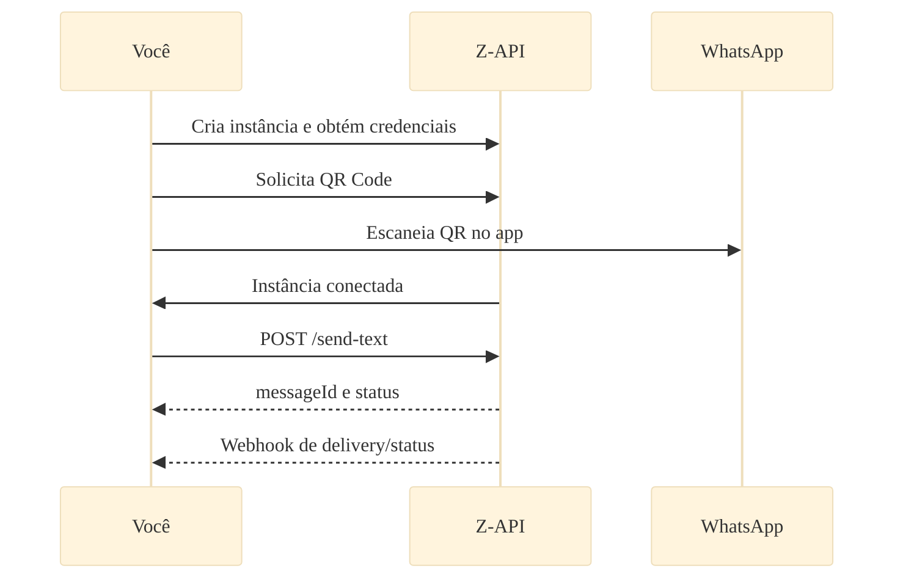

import { Icon } from '@site/src/components/shared/MdxIcon';


Publicado em 11 nov 2025

<!-- truncate -->

Se você chegou aqui querendo "entender rápido" se o Z-API é para você, pense nele como o caminho mais direto entre sua aplicação e conversas úteis no WhatsApp — sem sofrimento. Nesta leitura curta, você sai sabendo o que é, quando usar e como começar com segurança, com um mapa visual e próximos passos práticos.

## <Icon name="Info" size="md" /> O que é o Z-API (sem complicar)

Pense no Z-API como um "tradutor" entre seu sistema e o WhatsApp Web. 
Você fala HTTP (requisições REST), o Z-API entende e conversa com o WhatsApp por você.

## <Icon name="Layers" size="md" /> Onde ela entra no seu stack

```mermaid
%%{init: {'theme':'base', 'themeVariables': {'fontSize':'16px', 'fontFamily':'var(--ifm-font-family-base)', 'nodeSpacing':50, 'rankSpacing':60, 'curve':'basis', 'padding':20}}}%%
flowchart LR
 A[Sua Aplicação\n(Web, Backend, CRM, ERP)] -->|HTTP REST| B[Z-API]
 B -->|Sessão WhatsApp Web| C[WhatsApp]
 B -->|Webhooks| A
 
 classDef app fill:#e3f2fd,stroke:#1976d2,stroke-width:2px,color:#0d47a1,font-weight:500
 classDef zapi fill:#00a685,stroke:#008f73,stroke-width:2px,color:#ffffff,font-weight:600
 classDef whatsapp fill:#25d366,stroke:#128c7e,stroke-width:2px,color:#ffffff,font-weight:600
 
 class A app
 class B zapi
 class C whatsapp
```

- Você envia requisições HTTP para enviar mensagens ou gerenciar recursos.
- O Z-API chama seu endpoint (webhook) para notificações em tempo real.

## <Icon name="Lightbulb" size="md" /> Casos de uso que funcionam muito bem

- Atendimento automatizado com mensagens de boas-vindas e FAQs
- Notificações de status de pedido, pagamento ou agendamento
- Campanhas de remarketing e reengajamento (com consentimento)
- Pós-venda: pesquisa de satisfação e follow-ups inteligentes

Comece pelos casos com menor dependência externa e maior impacto imediato (ex.: notificações transacionais).

## <Icon name="Route" size="md" /> Jornada do desenvolvedor (mapa rápido)



## <Icon name="Scale" size="md" /> Quando usar Z-API vs outras opções

- Quer enviar/receber mensagens no WhatsApp Web com rapidez e flexibilidade? Use Z-API.
- Precisa de integrações profundas com o ecossistema Meta Business (Cloud API oficial)? Compare requisitos e custos; o Z-API cobre a maioria dos cenários com simplicidade.

## <Icon name="Rocket" size="md" /> Próximos passos

- Leia a introdução oficial: [/docs/intro](/docs/intro)
- Siga o guia rápido: [/docs/quick-start/introducao](/docs/quick-start/introducao)
- Entenda mensagens: [/docs/messages/introducao](/docs/messages/introducao)

:::info Aviso importante
Este conteúdo é educacional. Para produção, aplique as práticas de segurança em [/docs/security/introducao](/docs/security/introducao).
:::
