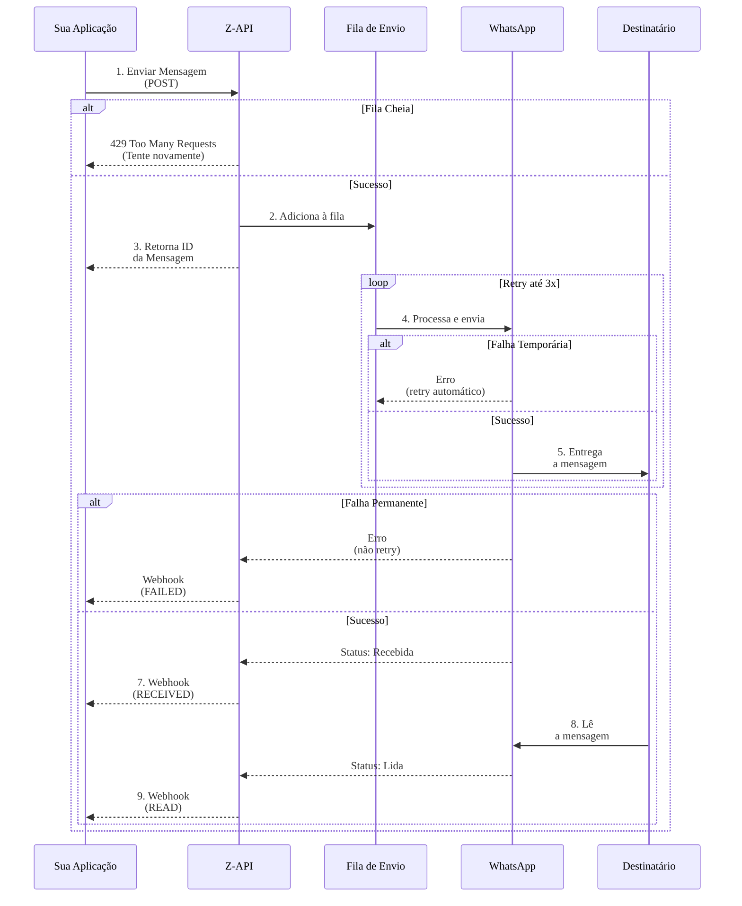

# Como Funciona o Ciclo de Vida de Mensagens no Z-API

**Compreender como uma mensagem percorre o sistema desde o envio até a confirmação de leitura é fundamental para construir integrações robustas.** Este conhecimento permite implementar tratamento de erros adequado, rastreamento de status preciso e feedback ao usuário final. Neste artigo, exploramos em detalhes cada etapa do processo e como implementar estratégias eficientes de monitoramento.

## Principais conclusões

* * **O processo não é instantâneo**: Mensagens passam por múltiplas etapas, cada uma com possibilidades de sucesso ou falha
* * **Webhooks são essenciais**: Notificações em tempo real permitem rastreamento completo do status
* * **messageId é crítico**: Armazene este identificador para correlacionar eventos posteriores
* * **Nem todas as mensagens chegam ao status READ**: Implemente lógica para lidar com mensagens que permanecem apenas como RECEIVED
* * **Retry logic é fundamental**: Compreender quando e como tentar novamente em caso de falha

---

## Por que entender o ciclo de vida importa?

Quando você envia uma mensagem através do Z-API, o processo não é instantâneo. A mensagem passa por várias etapas, cada uma com possibilidades de sucesso ou falha. Entender este fluxo permite:

<!-- truncate -->

- **Implementar retry logic**: Saber quando e como tentar novamente em caso de falha
- **Fornecer feedback ao usuário**: Informar o status real da mensagem (enviada, entregue, lida)
- **Otimizar performance**: Compreender onde podem ocorrer gargalos
- **Debugar problemas**: Identificar em qual etapa uma falha ocorreu

---

## As Etapas do Processo

O ciclo de vida de uma mensagem no Z-API segue estas etapas sequenciais:

### 1. Requisição de Envio

Sua aplicação realiza uma requisição HTTP POST para o endpoint do Z-API, incluindo o destinatário e o conteúdo da mensagem.

**Características:**
- Requisição síncrona (você espera a resposta)
- Validação inicial dos dados
- Resposta imediata (geralmente < 100ms)

### 2. Enfileiramento

O Z-API recebe sua requisição, valida os dados e adiciona a mensagem a uma fila de processamento. Imediatamente, o Z-API retorna uma resposta com um `messageId` único.

**Importante**: Este `messageId` é seu único meio de rastrear a mensagem. Sempre armazene este valor.

**Resposta típica:**
```json
{
  "messageId": "3EB0C767F26A",
  "status": "queued"
}
```

### 3. Processamento

A instância do WhatsApp conectada ao Z-API processa a mensagem da fila e realiza o envio através da infraestrutura do WhatsApp. Esta etapa pode incluir tentativas automáticas em caso de falhas temporárias.

**Características:**
- Processamento assíncrono (ocorre em background)
- Retry automático até 3x em caso de falhas temporárias
- Timeout configurável

### 4. Notificação de Envio

Após o processamento, o Z-API envia um webhook para seu sistema informando o resultado: sucesso (status `SENT`) ou falha (status `FAILED`).

**Webhook de sucesso:**
```json
{
  "event": "message.status",
  "data": {
    "messageId": "3EB0C767F26A",
    "status": "SENT"
  }
}
```

### 5. Status de Recebimento

Quando o WhatsApp confirma que a mensagem foi entregue ao dispositivo do destinatário, o Z-API envia outro webhook com status `RECEIVED`.

**Webhook de recebimento:**
```json
{
  "event": "message.status",
  "data": {
    "messageId": "3EB0C767F26A",
    "status": "RECEIVED"
  }
}
```

### 6. Status de Leitura

Finalmente, quando o destinatário abre e visualiza a mensagem, o Z-API envia um webhook final com status `READ`.

**Importante**: Nem todas as mensagens chegam ao status `READ`. O destinatário pode não abrir a conversa, ou pode ter desabilitado confirmações de leitura. Sempre implemente lógica para lidar com mensagens que permanecem apenas como `RECEIVED`.

---

## Diagrama do Fluxo Completo

O diagrama abaixo ilustra visualmente todo o processo, incluindo tratamento de erros:



**Legenda do Diagrama:**

- **Seta sólida (→)**: Fluxo de dados normal
- **Seta tracejada (-->>)**: Notificações/Webhooks
- **Caixa "alt"**: Condições alternativas (se/senão)
- **Caixa "loop"**: Tentativas automáticas (até 3x)
- **429 Too Many Requests**: Rate limit atingido - aguarde antes de tentar novamente
- **Falha Temporária**: Erro que será tentado novamente automaticamente
- **Falha Permanente**: Erro que não será tentado novamente - requer ação manual

---

## Estados da Mensagem

Durante o ciclo de vida, uma mensagem pode estar em diferentes estados:

| Estado | Descrição | Quando Ocorre |
|--------|-----------|---------------|
| `QUEUED` | Na fila aguardando processamento | Imediatamente após envio bem-sucedido |
| `SENT` | Enviada ao WhatsApp | Após processamento e envio bem-sucedido |
| `RECEIVED` | Entregue ao destinatário | Quando WhatsApp confirma entrega |
| `READ` | Lida pelo destinatário | Quando destinatário visualiza a mensagem |
| `FAILED` | Falha no envio | Quando ocorre erro permanente |

---

## Implementando Rastreamento de Status

Para implementar rastreamento eficiente, você precisa:

### 1. Armazenar o messageId

Sempre armazene o `messageId` retornado na resposta inicial:

```javascript
const response = await fetch('https://api.z-api.io/instance/xxx/send-text', {
  method: 'POST',
  headers: { 'Content-Type': 'application/json' },
  body: JSON.stringify({ phone: '5511999999999', message: 'Olá!' })
});

const { messageId } = await response.json();

// Armazenar no banco de dados
await db.messages.create({
  messageId,
  phone: '5511999999999',
  content: 'Olá!',
  status: 'QUEUED',
  createdAt: new Date()
});
```

### 2. Processar Webhooks de Status

Configure webhooks para receber atualizações de status:

```javascript
app.post('/webhook/message-status', (req, res) => {
  const { event, data } = req.body;
  
  if (event === 'message.status') {
    const { messageId, status } = data;
    
    // Atualizar status no banco de dados
    await db.messages.update({
      where: { messageId },
      data: { status, updatedAt: new Date() }
    });
  }
  
  res.status(200).send('OK');
});
```

### 3. Implementar Retry Logic

Para mensagens que falharam, implemente lógica de retry:

```javascript
async function retryFailedMessage(messageId) {
  const message = await db.messages.findUnique({ where: { messageId } });
  
  if (message.status === 'FAILED' && message.retryCount < 3) {
    // Tentar enviar novamente
    const response = await sendMessage(message.phone, message.content);
    
    await db.messages.update({
      where: { messageId },
      data: { 
        retryCount: message.retryCount + 1,
        lastRetryAt: new Date()
      }
    });
  }
}
```

---

## Tratamento de Erros Comuns

### Rate Limit (429 Too Many Requests)

Quando a fila está cheia, o Z-API retorna status 429. Implemente backoff exponencial:

```javascript
async function sendWithRetry(phone, message, maxRetries = 3) {
  for (let i = 0; i < maxRetries; i++) {
    try {
      const response = await sendMessage(phone, message);
      return response;
    } catch (error) {
      if (error.status === 429) {
        const delay = Math.pow(2, i) * 1000; // Backoff exponencial
        await sleep(delay);
        continue;
      }
      throw error;
    }
  }
}
```

### Mensagens que Não São Lidas

Nem todas as mensagens chegam ao status `READ`. Implemente timeout:

```javascript
// Verificar mensagens que não foram lidas após 24 horas
const unreadMessages = await db.messages.findMany({
  where: {
    status: 'RECEIVED',
    createdAt: { lt: new Date(Date.now() - 24 * 60 * 60 * 1000) }
  }
});

// Marcar como "não lida" ou enviar notificação alternativa
```

---

## Boas práticas de rastreamento

* * **Sempre armazene o messageId**: É seu único meio de correlacionar eventos
* * **Configure webhooks antes de enviar**: Garanta que não perca atualizações de status
* * **Implemente timeout para mensagens não lidas**: Nem todas chegam ao status READ
* * **Use retry logic com backoff exponencial**: Para lidar com falhas temporárias
* * **Monitore métricas de status**: Acompanhe taxas de SENT, RECEIVED e READ
* * **Implemente alertas para falhas**: Notifique quando taxas de falha aumentarem
* * **Mantenha histórico completo**: Armazene todos os estados para auditoria

---

## Implemente rastreamento de status hoje mesmo

1. **Configure webhooks de status** na seção de [Webhooks](/docs/webhooks/status-mensagem)
2. **Armazene messageId** em seu banco de dados após cada envio
3. **Implemente processamento de webhooks** para atualizar status
4. **Configure alertas** para monitorar taxas de falha

**Leia também:** [Configurando Webhooks em Tempo Real](/blog/webhooks-tempo-real)

---

## Conclusão

Compreender o ciclo de vida completo de mensagens no Z-API é essencial para construir integrações robustas e confiáveis. Ao implementar rastreamento adequado, tratamento de erros e retry logic, você garante que suas mensagens sejam entregues e monitoradas corretamente.

O sistema de webhooks do Z-API fornece visibilidade completa sobre o status de cada mensagem, permitindo criar experiências de usuário melhores e sistemas mais resilientes.

---

## Perguntas Frequentes

* * **Todas as mensagens chegam ao status READ?** 
  Não. O destinatário pode não abrir a conversa ou ter desabilitado confirmações de leitura. Sempre implemente lógica para lidar com mensagens que permanecem apenas como RECEIVED.

* * **Quanto tempo leva para uma mensagem ser enviada?**
  Geralmente menos de 1 segundo após a requisição, mas pode variar dependendo da carga do sistema e da fila.

* * **O que fazer se uma mensagem falhar?**
  Implemente retry logic com backoff exponencial. O Z-API já tenta automaticamente até 3x, mas você pode implementar retries adicionais se necessário.

* * **Como rastrear mensagens sem webhooks?**
  Você pode consultar o status através da API, mas webhooks são mais eficientes e fornecem atualizações em tempo real.

* * **Posso confiar apenas no status da resposta inicial?**
  Não. O status inicial é apenas "queued". Sempre configure webhooks para receber atualizações de status em tempo real.
