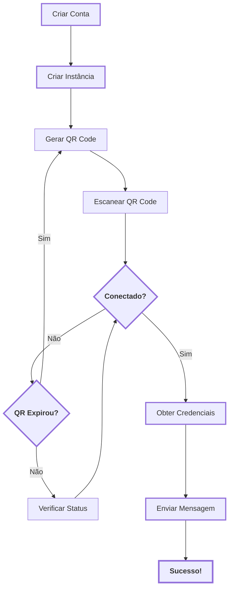
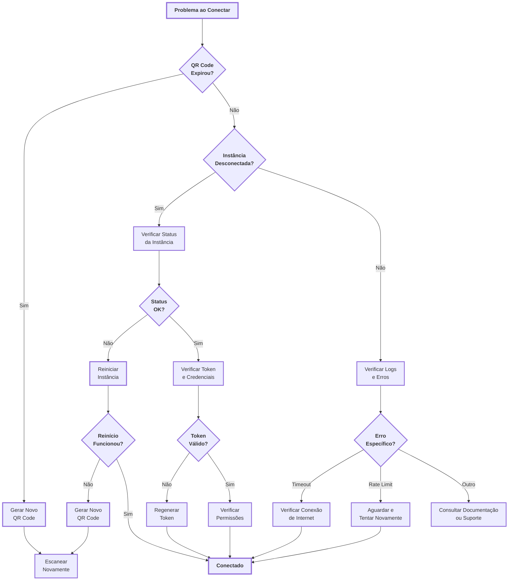
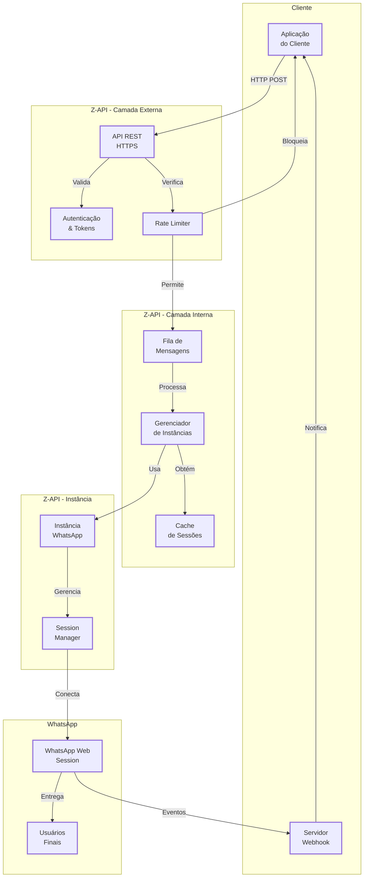
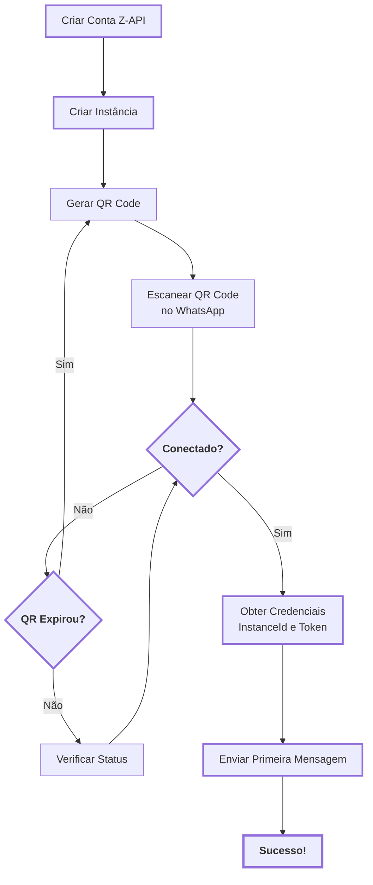
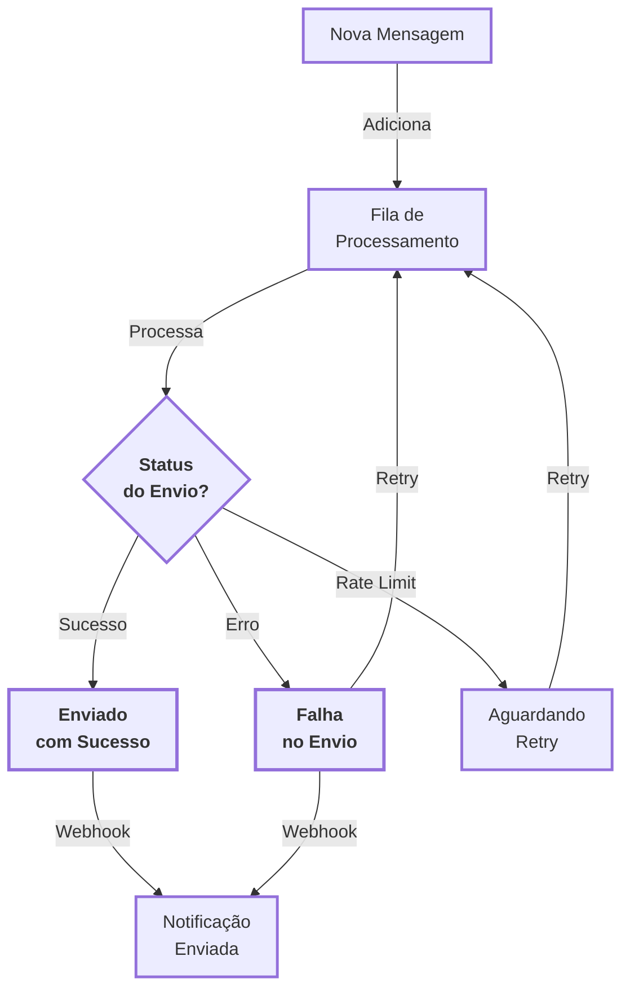

# Como Ler Diagramas: Entendendo Fluxos e Árvores de Decisão

Os diagramas são ferramentas visuais poderosas para entender processos complexos. Na documentação do Z-API, você encontrará diversos diagramas que explicam fluxos de trabalho, processos de decisão e arquitetura do sistema. Este guia vai te ajudar a interpretar esses diagramas de forma eficiente.

<!-- truncate -->

## Por que usar diagramas?

Diagramas transformam processos complexos em representações visuais fáceis de entender:

- **Visão geral rápida**: Entenda o processo completo em segundos
- **Navegação clara**: Veja todos os caminhos possíveis em um único lugar
- **Referência visual**: Volte ao diagrama sempre que precisar relembrar um passo
- **Comunicação eficiente**: Compartilhe o fluxo com sua equipe facilmente

---

## Elementos básicos de um diagrama

### 1. Nós (Caixas)

Os nós representam **ações**, **estados** ou **decisões**:

- **Retângulos**: Ações ou processos (ex: "Criar Instância", "Enviar Mensagem")
- **Losangos**: Decisões ou verificações (ex: "Conectado?", "QR Expirou?")
- **Círculos**: Estados ou pontos de início/fim

### 2. Setas (Conexões)

As setas mostram o **fluxo** e a **direção** do processo:

- **Setas simples**: Fluxo sequencial (A → B → C)
- **Setas com rótulos**: Condições específicas (ex: "Sim" ou "Não")
- **Setas de retorno**: Loops ou repetições (retorna a uma etapa anterior)

### 3. Caminhos alternativos

Quando há múltiplas possibilidades, o diagrama mostra **ramificações**:

- **Caminho principal**: Fluxo de sucesso (mais comum)
- **Ramificações**: Caminhos alternativos (erros, exceções, retentativas)

---

## Tipos de diagramas na documentação

### Diagramas de Fluxo (Flowchart)

Mostram o **processo passo a passo** desde o início até o fim.

**Como ler**:

1. Comece pelo nó inicial (geralmente no topo)
2. Siga as setas na direção indicada
3. Em nós de decisão, escolha o caminho baseado na condição
4. Continue até chegar ao estado final

**Exemplo prático - Diagrama Mermaid**:



**Análise do exemplo**:

- **Nós retangulares** (A, B, C, D, H, I): Ações ou processos
- **Nós losangos** (E, F): Decisões que determinam o próximo passo
- **Setas com rótulos** ("Sim", "Não"): Condições específicas
- **Setas de retorno** (F → C, G → E): Loops ou retentativas
- **Fluxo principal**: A → B → C → D → E (Sim) → H → I → J

```text
```

### Árvores de Decisão

Mostram **diferentes caminhos** baseados em decisões e condições.

**Como ler**:

1. Identifique o ponto de partida (problema ou situação inicial)
2. Em cada nó de decisão, avalie a condição
3. Siga o caminho correspondente à sua situação
4. Continue até encontrar a solução ou ação recomendada

**Exemplo prático - Diagrama Mermaid**:



**Análise do exemplo**:

- **Nó inicial** (A): Problema identificado
- **Múltiplos nós de decisão** (B, D, H, K, N, Q): Cada um direciona para um caminho específico
- **Ações corretivas** (C, I, L, O): O que fazer em cada situação
- **Estado final** (M): Problema resolvido
- **Múltiplos caminhos**: Diferentes soluções para diferentes problemas

### Diagramas de Arquitetura

Mostram como os **componentes se relacionam** e **comunicam** entre si.

**Como ler**:

1. Identifique as camadas ou grupos (subgrafos)
2. Entenda as conexões entre componentes
3. Siga os fluxos de dados (setas com rótulos)
4. Observe a direção das setas (quem envia para quem)

**Exemplo prático - Diagrama Mermaid**:



**Análise do exemplo**:

- **Subgrafos** (caixas grandes): Agrupam componentes relacionados (Cliente, Z-API Externa, etc.)
- **Componentes** (nós dentro dos subgrafos): Elementos individuais do sistema
- **Setas com rótulos**: Mostram o tipo de comunicação ("HTTP POST", "Valida", "Processa")
- **Fluxo de envio**: Cliente → API → Rate Limiter → Fila → Instância → WhatsApp
- **Fluxo de webhook**: WhatsApp → Instância → Webhook Server → Cliente

---

## Dicas práticas para ler diagramas

### 1. Comece pelo início

Sempre identifique o **ponto de partida** do diagrama. Geralmente está no topo ou à esquerda.

### 2. Siga o fluxo sequencial

Leia o diagrama como uma história: comece, siga as setas e veja onde cada caminho leva.

### 3. Entenda as decisões

Nós de decisão (losangos) são cruciais. Eles determinam qual caminho seguir baseado em uma condição.

### 4. Identifique loops

Se uma seta retorna para uma etapa anterior, você tem um **loop** ou **retentativa**. Isso indica que o processo pode repetir.

### 5. Procure caminhos alternativos

Nem todo fluxo é linear. Identifique:

- **Caminho de sucesso**: O que acontece quando tudo dá certo
- **Caminhos de erro**: O que acontece quando algo falha
- **Caminhos de retry**: Como o sistema tenta novamente

### 6. Use a legenda

A legenda explica os tipos de nós e o significado de cada elemento. Consulte-a quando tiver dúvidas.

---

## Exemplos práticos da documentação

### Exemplo 1: Fluxo de Configuração Inicial

**O que o diagrama mostra**: Processo completo desde criar conta até enviar primeira mensagem.

**Diagrama Mermaid**:



**Como interpretar**:

1. **Etapas sequenciais**: Criar Conta → Criar Instância → Gerar QR Code
2. **Ponto de decisão**: "Conectado?" - determina se continua ou verifica status
3. **Loop de retry**: Se QR expirar, retorna para "Gerar QR Code"
4. **Fluxo de sucesso**: Conectado → Credenciais → Mensagem → Sucesso!

**Quando usar**: Primeira vez configurando o Z-API ou quando precisar relembrar os passos.

### Exemplo 2: Árvore de Troubleshooting

**O que o diagrama mostra**: Como diagnosticar e resolver problemas comuns.

**Diagrama Mermaid**:


**Como interpretar**:

1. **Problema inicial** (A): Ponto de partida do diagnóstico
2. **Nós de decisão** (B, D, H, K, N, Q): Cada pergunta direciona para um caminho específico
3. **Ações corretivas** (C, I, L, O): O que fazer em cada situação
4. **Estado final** (M): Problema resolvido (Conectado)

**Quando usar**: Quando encontrar problemas durante a configuração ou uso.

### Exemplo 3: Processo de Fila de Mensagens

**O que o diagrama mostra**: Como as mensagens são processadas assincronamente.

**Diagrama Mermaid**:



**Como interpretar**:

1. **Entrada** (A): Nova mensagem chega à fila
2. **Processamento** (B): Fila processa a mensagem
3. **Decisão** (C): Status do envio (Sucesso/Erro/Rate Limit)
4. **Retry** (setas de retorno): Falhas retornam à fila para nova tentativa
5. **Notificação** (G): Resultado é enviado via webhook

**Quando usar**: Para entender como funciona o processamento assíncrono e retentativas.

---

## Erros comuns ao ler diagramas

### ❌ Erro 1: Ler de baixo para cima

**Correto**: Sempre comece pelo início (topo ou esquerda) e siga o fluxo natural.

### ❌ Erro 2: Ignorar nós de decisão

**Correto**: Preste atenção nas condições. Elas determinam qual caminho seguir.

### ❌ Erro 3: Não identificar loops

**Correto**: Setas que retornam indicam repetição. Identifique quando e por quê o processo repete.

### ❌ Erro 4: Ler apenas o caminho de sucesso

**Correto**: Entenda também os caminhos de erro para saber o que fazer quando algo der errado.

---

## Próximos passos

Agora que você sabe como ler diagramas:

1. **Explore a documentação**: Use os diagramas como guia visual
2. **Siga os fluxos**: Execute os processos seguindo os diagramas
3. **Consulte quando necessário**: Volte aos diagramas sempre que precisar relembrar um passo
4. **Compartilhe com a equipe**: Diagramas facilitam comunicação técnica


---

## Recursos relacionados

- **[Guia de Início Rápido](/docs/quick-start/introducao)** - Veja diagramas em ação
- **[Troubleshooting](/docs/quick-start/introducao#troubleshooting)** - Use árvores de decisão para resolver problemas
- **[Arquitetura do Sistema](/docs/architecture/overview)** - Entenda como os componentes se relacionam
- **[Fila de Mensagens](/docs/message-queue/introducao)** - Veja o processo de processamento assíncrono

---

**Dica**: Sempre que encontrar um diagrama na documentação, use este guia como referência para interpretá-lo corretamente!
