# Configurando Webhooks do Z-API em Plataformas No-Code: Um Guia Completo

**Se você utiliza ferramentas de automação visual como n8n, Make, Zapier, Integromat ou outras plataformas similares, webhooks são fundamentais para criar automações reativas e eficientes.** Este guia completo mostra passo a passo como configurar webhooks do Z-API em plataformas no-code, incluindo exemplos práticos e diagramas de fluxo.

## Principais conclusões

* * **Webhooks são triggers ideais**: Funcionam como gatilhos que iniciam fluxos automaticamente
* * **Configuração simples**: Processo em 4 passos básicos
* * **Elimina polling**: Não precisa de loops ou verificações periódicas
* * **Automações reativas**: Resposta instantânea a eventos do WhatsApp
* * **Integração poderosa**: Conecta WhatsApp com qualquer serviço via no-code

---

## Por que Webhooks São Essenciais em No-Code

Em plataformas no-code, webhooks funcionam como **triggers** (gatilhos) que iniciam seus fluxos de trabalho automaticamente. Sem webhooks, você teria que criar loops de polling ou agendar verificações periódicas, o que é ineficiente e pode causar atrasos.

**Vantagens em plataformas no-code:**

<!-- truncate -->

- **Automação verdadeiramente reativa**: Resposta instantânea a eventos
- **Sem necessidade de código**: Configuração visual e intuitiva
- **Integração fácil**: Conecta WhatsApp com centenas de serviços
- **Escalabilidade**: Processa milhares de eventos sem sobrecarga
- **Custo eficiente**: Reduz requisições desnecessárias

---

## Processo de Configuração Passo a Passo

### Passo 1: Criar o Nó Webhook na Sua Ferramenta

Na sua plataforma no-code, adicione um nó de trigger chamado "Webhook", "HTTP Request", "Listen for Webhook" ou similar (o nome varia por plataforma). Este nó irá:

- Gerar uma URL única e pública
- Aguardar requisições HTTP POST
- Passar os dados recebidos para os próximos nós do fluxo

**Exemplo de URL gerada:**
```
https://sua-plataforma.com/webhook/abc123xyz789
```

**Plataformas comuns:**

- **n8n**: Nó "Webhook" (trigger)
- **Make (Integromat)**: Módulo "Webhooks" > "Custom webhook"
- **Zapier**: Trigger "Webhooks by Zapier" > "Catch Hook"
- **Microsoft Power Automate**: Trigger "When an HTTP request is received"

### Passo 2: Configurar a URL no Painel do Z-API

1. Acesse o painel do Z-API
2. Navegue até a seção de Webhooks
3. Selecione o tipo de evento desejado (ex: "Ao receber mensagem")
4. Cole a URL gerada pela sua ferramenta no-code
5. Salve a configuração

**Tipos de eventos disponíveis:**

- **Ao receber mensagem**: Notifica quando nova mensagem chega
- **Status de mensagem**: Notifica mudanças de status (enviada, entregue, lida)
- **Conexão da instância**: Notifica quando instância conecta/desconecta
- **Outros eventos**: Conforme documentação do Z-API

### Passo 3: Testar a Conexão

Após configurar, teste enviando uma mensagem para sua instância do WhatsApp. Você deve ver os dados chegando no nó webhook da sua ferramenta no-code.

**Como testar:**

1. Envie uma mensagem de teste para o número conectado ao Z-API
2. Verifique se o webhook foi acionado na sua plataforma
3. Confirme que os dados estão sendo recebidos corretamente
4. Valide a estrutura dos dados recebidos

**Estrutura típica de dados recebidos:**

```json
{
  "event": "message",
  "instanceId": "3C3F8E5F4A2B1C9D",
  "data": {
    "messageId": "3EB0C767F26A",
    "phone": "5511999999999",
    "text": "Mensagem recebida",
    "timestamp": "2024-01-01T12:00:00Z"
  }
}
```

### Passo 4: Construir o Fluxo de Trabalho

Agora você pode construir seu fluxo completo:

- Processar os dados recebidos
- Extrair informações relevantes (texto da mensagem, remetente, etc.)
- Aplicar lógica condicional
- Integrar com outros serviços (planilhas, CRMs, bancos de dados)
- Enviar respostas automáticas através do Z-API

---

## Exemplo de Fluxo de Automação Completo

O diagrama abaixo ilustra um exemplo prático de como um webhook pode acionar uma automação completa em uma plataforma no-code:

```mermaid
%%{init: {'theme':'custom', 'themeVariables': {'primaryColor':'#4a90e2', 'secondaryColor':'#F59E0B', 'tertiaryColor':'#10B981', 'errorColor':'#EF4444', 'primaryTextColor':'#1a1a1a', 'fontSize':'14px', 'fontFamily':'system-ui, -apple-system, sans-serif'}, 'flowchart': {'useMaxWidth': true, 'htmlLabels': true, 'nodeSpacing': 50, 'rankSpacing': 60, 'curve': 'basis', 'padding': 10}}}%%
flowchart LR
 A["Webhook<br/>Recebe Mensagem"] --> B["Extrair Dados<br/>da Mensagem"]
 B --> C{"Verificar<br/>Palavra-chave"}
 C -->|"Encontrada"| D["Processar<br/>Comando"]
 C -->|"Não encontrada"| E["Salvar em<br/>Planilha"]
 D --> F["Enviar Resposta<br/>via Z-API"]
 F --> E
 E --> G["Registrar Log"]
 G --> H["Fim"]
 
 classDef webhookNode fill:#E9D5FF,stroke:#9333EA,stroke-width:2px,color:#1a1a1a,font-weight:500
 classDef processNode fill:#DBEAFE,stroke:#3B82F6,stroke-width:2px,color:#1a1a1a,font-weight:500
 classDef decisionNode fill:#FEF3C7,stroke:#F59E0B,stroke-width:2px,color:#1a1a1a,font-weight:600
 classDef actionNode fill:#D1FAE5,stroke:#10B981,stroke-width:2px,color:#1a1a1a,font-weight:500
 classDef endNode fill:#F3F4F6,stroke:#6B7280,stroke-width:2px,color:#1a1a1a,font-weight:500
 
 class A webhookNode
 class B processNode
 class C decisionNode
 class D,F,E,G actionNode
 class H endNode
```



**Explicação do fluxo:**

1. **Webhook recebe mensagem**: Quando uma nova mensagem chega, o Z-API envia os dados para sua URL
2. **Extrair dados**: Sua ferramenta no-code extrai informações relevantes (texto, remetente, timestamp)
3. **Verificar palavra-chave**: Lógica condicional verifica se a mensagem contém comandos específicos
4. **Processar comando**: Se encontrado, executa ação correspondente (buscar informação, processar pedido, etc.)
5. **Enviar resposta**: Usa a API do Z-API para enviar resposta automática
6. **Salvar em planilha**: Registra a interação para histórico e análise
7. **Registrar log**: Mantém log da execução para debugging

---

## Exemplos Práticos por Plataforma

### Exemplo 1: n8n - Chatbot Básico

**Configuração:**

1. **Webhook Node** (Trigger)
   - Método: POST
   - Path: `/zapi-webhook`
   - Response: Last Received Item

2. **IF Node** (Condição)
   - Condição: `{{ $json.body.data.text }}` contém "ajuda"

3. **HTTP Request Node** (Enviar Resposta)
   - Método: POST
   - URL: `https://api.z-api.io/instance/XXX/send-text`
   - Headers: `{ "Content-Type": "application/json", "Client-Token": "SEU_TOKEN" }`
   - Body: `{ "phone": "{{ $json.body.data.phone }}", "message": "Como posso ajudar?" }`

4. **Google Sheets Node** (Salvar Interação)
   - Operação: Append
   - Spreadsheet: Sua planilha
   - Range: A:D
   - Values: `[{{ $json.body.data.phone }}, {{ $json.body.data.text }}, {{ $json.body.timestamp }}, "Processado"]`

### Exemplo 2: Make (Integromat) - Integração com CRM

**Configuração:**

1. **Webhook Module** (Trigger)
   - Webhook Type: Custom webhook
   - Data Structure: JSON

2. **Router Module** (Roteamento)
   - Route 1: Mensagem contém "pedido"
   - Route 2: Mensagem contém "suporte"
   - Route 3: Outras mensagens

3. **HTTP Module** (Z-API - Enviar Mensagem)
   - URL: `https://api.z-api.io/instance/XXX/send-text`
   - Method: POST
   - Headers: `Client-Token: SEU_TOKEN`
   - Body: JSON com phone e message

4. **CRM Module** (Salvar no CRM)
   - Ação: Create/Update Contact
   - Campos: Nome, Telefone, Última Mensagem

### Exemplo 3: Zapier - Integração com Google Sheets

**Configuração:**

1. **Webhooks by Zapier** (Trigger)
   - Event: Catch Hook
   - URL gerada automaticamente

2. **Filter by Zapier** (Filtro)
   - Condição: Text contém "pedido"

3. **Google Sheets** (Ação)
   - Event: Create Spreadsheet Row
   - Spreadsheet: Sua planilha
   - Campos: Telefone, Mensagem, Data

4. **Webhooks by Zapier** (Ação)
   - Event: POST
   - URL: `https://api.z-api.io/instance/XXX/send-text`
   - Data: Phone e Message

---

## Casos de Uso Práticos

### Caso de Uso 1: Chatbot de Atendimento

**Fluxo:**
1. Webhook recebe mensagem
2. Extrai texto e remetente
3. Verifica intenção (NLP ou palavras-chave)
4. Busca resposta em base de conhecimento
5. Envia resposta via Z-API
6. Registra interação em planilha

**Benefícios:**
- Atendimento 24/7 automatizado
- Respostas instantâneas
- Histórico completo de interações

### Caso de Uso 2: Sistema de Pedidos

**Fluxo:**
1. Webhook recebe mensagem com pedido
2. Extrai informações do pedido
3. Valida estoque em planilha
4. Cria pedido no sistema
5. Envia confirmação via Z-API
6. Notifica equipe via email/Slack

**Benefícios:**
- Processamento automático de pedidos
- Integração com sistemas existentes
- Notificações em tempo real

### Caso de Uso 3: Pesquisa de Satisfação

**Fluxo:**
1. Webhook recebe resposta de pesquisa
2. Extrai avaliação e comentários
3. Salva em planilha para análise
4. Calcula NPS (Net Promoter Score)
5. Envia agradecimento via Z-API
6. Gera relatório automático

**Benefícios:**
- Coleta automática de feedback
- Análise em tempo real
- Melhoria contínua do serviço

---

## Boas Práticas para Webhooks em No-Code

* * **Valide dados recebidos**: Sempre verifique estrutura antes de processar
* * **Trate erros**: Implemente tratamento de erros para falhas de conexão
* * **Use variáveis de ambiente**: Armazene tokens e URLs sensíveis de forma segura
* * **Monitore execuções**: Acompanhe logs e métricas de seus fluxos
* * **Teste localmente**: Use ferramentas como ngrok para desenvolvimento
* * **Documente fluxos**: Mantenha documentação clara de cada automação
* * **Implemente rate limiting**: Evite sobrecarga com muitos eventos simultâneos
* * **Use filas quando necessário**: Para processamento pesado, use filas assíncronas
* * **Valide segurança**: Sempre valide origem dos webhooks quando possível
* * **Backup de dados**: Mantenha backup de configurações importantes

---

## Troubleshooting Comum

### Webhook não está recebendo dados

**Possíveis causas:**
- URL não configurada corretamente no Z-API
- Servidor webhook não acessível publicamente
- Firewall bloqueando requisições
- URL expirada ou inválida

**Soluções:**
- Verifique URL no painel do Z-API
- Teste URL com ferramenta como Postman
- Use ngrok para desenvolvimento local
- Verifique logs do webhook

### Dados não estão no formato esperado

**Possíveis causas:**
- Estrutura de dados mudou
- Evento diferente do esperado
- Erro no parsing JSON

**Soluções:**
- Verifique estrutura na documentação
- Adicione nó de debug para inspecionar dados
- Implemente validação de estrutura
- Trate diferentes tipos de evento

### Fluxo muito lento

**Possíveis causas:**
- Processamento síncrono pesado
- Muitas requisições HTTP sequenciais
- Falta de otimização

**Soluções:**
- Use processamento assíncrono quando possível
- Paralelize requisições independentes
- Otimize consultas a bancos de dados
- Use cache para dados frequentes

---

## Implemente webhooks no-code hoje mesmo

1. **Escolha sua plataforma** (n8n, Make, Zapier, etc.)
2. **Crie nó webhook** e copie a URL gerada
3. **Configure no Z-API** com a URL e tipo de evento
4. **Teste enviando mensagem** e verifique recebimento
5. **Construa seu fluxo** processando dados e integrando serviços

**Leia também:** [Entendendo Webhooks](/docs/webhooks/introducao)

---

## Conclusão

Webhooks são perfeitos para plataformas no-code! Eles funcionam como gatilhos que iniciam seus fluxos de trabalho automaticamente quando eventos acontecem, eliminando a necessidade de polling e criando automações verdadeiramente reativas.

Com este guia, você tem tudo que precisa para configurar webhooks do Z-API em qualquer plataforma no-code e criar automações poderosas que conectam WhatsApp com centenas de serviços diferentes.

---

## Perguntas Frequentes

* * **Qual plataforma no-code é melhor para webhooks?**
  Todas as principais plataformas (n8n, Make, Zapier) suportam webhooks bem. Escolha baseado em suas necessidades, orçamento e integrações desejadas.

* * **Posso usar webhooks em desenvolvimento local?**
  Sim, use ferramentas como ngrok para expor seu servidor local publicamente durante desenvolvimento.

* * **Quantos webhooks posso configurar?**
  Não há limite técnico, mas recomenda-se organizar por tipo de evento para facilitar manutenção.

* * **Webhooks funcionam com instâncias múltiplas?**
  Sim, cada webhook recebe o `instanceId` para identificar qual instância gerou o evento.

* * **Como garantir segurança dos webhooks?**
  Valide sempre o token `x-token` no header da requisição e use HTTPS para comunicação segura.
