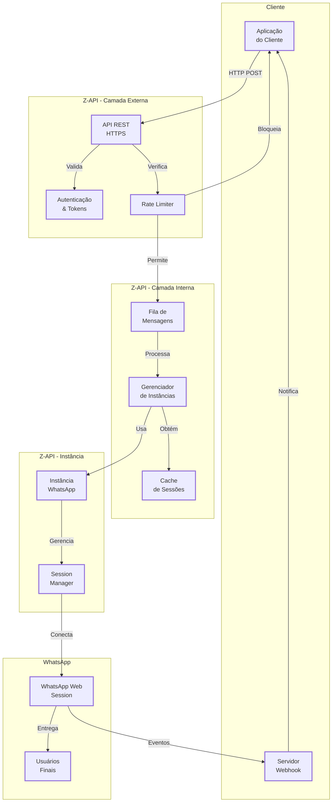

# <Icon name="Network" size="lg" /> Arquitetura do Sistema Z-API

Esta página apresenta uma visão geral da arquitetura do Z-API, mostrando como os componentes principais se relacionam e interagem.

## <Icon name="Info" size="md" /> Visão Geral {#visao-geral}

O Z-API é uma plataforma que conecta sua aplicação ao WhatsApp através de uma API RESTful. A arquitetura foi projetada para ser simples, escalável e confiável.

## <Icon name="Network" size="md" /> Diagrama de Arquitetura {#diagrama-de-arquitetura}

O diagrama abaixo mostra os principais componentes e como eles se comunicam:

<ScrollRevealDiagram direction="up">

</ScrollRevealDiagram>

<strong>Legenda do Diagrama</strong>

Este diagrama mostra a arquitetura em camadas do Z-API e como os componentes se comunicam.

**Camadas**: Cliente → Z-API Externa → Z-API Interna → Z-API Instância → WhatsApp

**Fluxos Principais**:

- **Envio**: Cliente → API → Rate Limiter → Fila → Instância → WhatsApp → Usuário
- **Webhook**: WhatsApp → Instância → Webhook Server → Cliente

**Características**: Arquitetura em camadas, processamento assíncrono, cache e rate limiting.

:::tip Aprenda a Ler Diagramas
Não está familiarizado com diagramas de arquitetura? Leia nosso [guia completo sobre como interpretar diagramas e fluxos](/blog/como-ler-diagramas-fluxos-decisao).
:::

## <Icon name="Layers" size="md" /> Componentes Principais {#componentes-principais}

### Aplicação do Cliente

Sua aplicação ou backend que utiliza a API do Z-API para enviar mensagens e receber notificações.

**Responsabilidades**:

- Enviar requisições HTTP para a API
- Receber e processar webhooks
- Gerenciar autenticação com tokens

### API REST

Interface principal de comunicação com o Z-API.

**Responsabilidades**:

- Receber requisições HTTP
- Validar autenticação
- Processar e enfileirar mensagens
- Retornar respostas padronizadas

### Fila de Mensagens

Sistema de fila que gerencia o processamento assíncrono de mensagens.

**Responsabilidades**:

- Armazenar mensagens pendentes
- Processar mensagens em ordem
- Gerenciar retentativas em caso de falha
- Garantir entrega confiável

### Instância WhatsApp

Conexão individual com uma sessão do WhatsApp Web.

**Responsabilidades**:

- Manter conexão ativa com WhatsApp
- Enviar mensagens para o WhatsApp
- Receber eventos do WhatsApp
- Gerenciar QR Code e autenticação

### Servidor Webhook

Seu servidor que recebe notificações do Z-API.

**Responsabilidades**:

- Receber requisições POST do Z-API
- Validar tokens de segurança
- Processar eventos recebidos
- Retornar confirmação (200 OK)

## <Icon name="GitBranch" size="md" /> Fluxo de Dados {#fluxo-de-dados}

### Envio de Mensagem

1. **Cliente → API**: Aplicação envia requisição HTTP POST
2. **API → Fila**: Mensagem é adicionada à fila de processamento
3. **API → Cliente**: Retorna ID da mensagem e status
4. **Fila → Instância**: Instância processa mensagem da fila
5. **Instância → WhatsApp**: Mensagem é enviada ao WhatsApp
6. **WhatsApp → Usuário**: Mensagem é entregue ao destinatário
7. **WhatsApp → Webhook**: Eventos são enviados ao webhook
8. **Webhook → Cliente**: Aplicação recebe notificações

### Recebimento de Mensagem

1. **WhatsApp → Instância**: Mensagem recebida no WhatsApp
2. **Instância → Webhook**: Evento é enviado ao webhook
3. **Webhook → Cliente**: Aplicação recebe notificação

## <Icon name="Shield" size="md" /> Segurança {#seguranca}

### Autenticação

- **Client-Token**: Token único por instância usado em todas as requisições
- **x-token**: Token de segurança para validação de webhooks
- **HTTPS**: Todas as comunicações são criptografadas

### Validação

- Tokens são validados em cada requisição
- Webhooks incluem token de segurança no header
- URLs de webhook devem ser HTTPS em produção

## <Icon name="ArrowRight" size="md" /> Próximos passos {#proximos-passos}

- [Configurar sua primeira instância](/docs/quick-start/introducao)
- [Entender webhooks](/docs/webhooks/introducao)
- [Gerenciar instâncias](/docs/instance/introducao)
- [Segurança](/docs/security/introducao)
