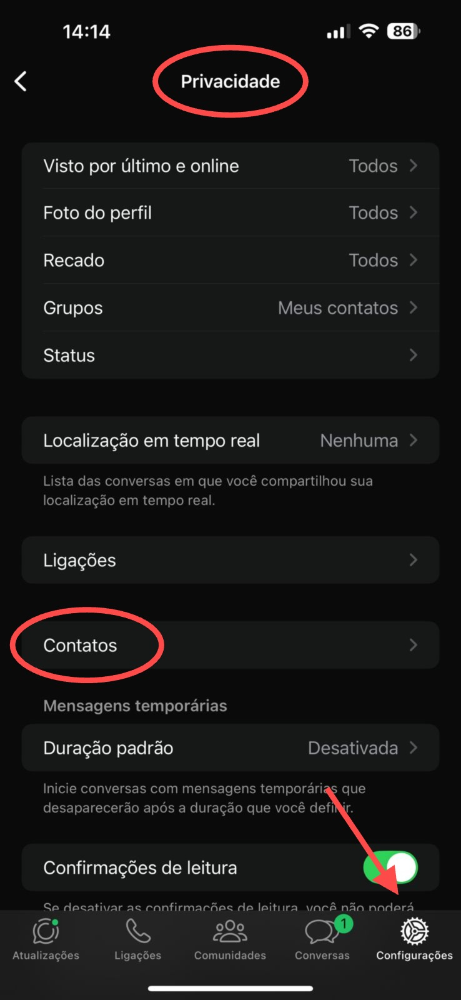

## Método

#### /contacts/add

`POST` https://api.z-api.io/instances/SUA_INSTANCIA/token/SEU_TOKEN/contacts/add

### Header

|      Key       |            Value            |
| :------------: |     :-----------------:     |
|  Client-Token  | **[TOKEN DE SEGURANÇA DA CONTA](../security/client-token)** |
---

## Conceituação

Este método é reponsavel por salvar os contatos do Whatsapp em sua lista de contatos no celular.

---

:::caution Sobre Esse recurso
O método para adicionar contatos à lista do WhatsApp só funcionará para contas que já receberam a atualização necessária. Certifique-se de que sua conta **do Whatsapp** tenha recebido a atualização antes de utilizar este recurso. Caso contrário, a operação não será concluída com sucesso.

Além disso, é necessário permitir que o WhatsApp adicione contatos diretamente no celular. Para isso, vá até as configurações de privacidade do seu aplicativo e ajuste as permissões de forma que o WhatsApp possa acessar e modificar seus contatos.

**Veja o exemplo nas imagens abaixo:**
:::

<details>
 <summary>Clique aqui para exibir as imagens</summary>

 

</details>

## Atributos

### Obrigatórios

| Atributos | Tipo   | Descrição                                            |
| :-------- | :----: | :--------------------------------------------------- |
| firstName | string | Nome do contato que vai ser adicionado na agenda     |
| phone     | string | Número do contato que vai ser adicionado na agenda   |

### Opcionais

| Atributos | Tipo | Descrição |
| :-------- | :--: | :-------- |
| lastName  | string | Sobrenome do contato que vai ser adicionado na agenda |

---

## Request Body

```json
[
  {
    "firstName": "Contato 1",
    "lastName": "Sobrenome 1",
    "phone": "554499999999"
  },
  {
    "firstName": "Contato 2",
    "lastName": "Sobrenome 2",
    "phone": "554499998888"
  }
]
```

## Response

### 200

| Atributos | Tipo  | Descrição |
| :-- | :-- | :--   |
| success | boolean |  |
| errors  | array   |  |


Exemplo

```json
{
    "success": true,
    "errors": []
}
```

### 405

Neste caso certifique que esteja enviando o corretamente a especificação do método, ou seja verifique se você enviou o POST ou GET conforme especificado no inicio deste tópico.

### 415

Caso você receba um erro 415, certifique de adicionar na headers da requisição o "Content-Type" do objeto que você está enviando, em sua grande maioria "application/json"

---

## Code

<iframe src="//api.apiembed.com/?source=https://raw.githubusercontent.com/Z-API/z-api-docs/main/json-examples/add-contacts.json&targets=all" frameborder="0" scrolling="no" width="100%" height="500px" seamless></iframe>
