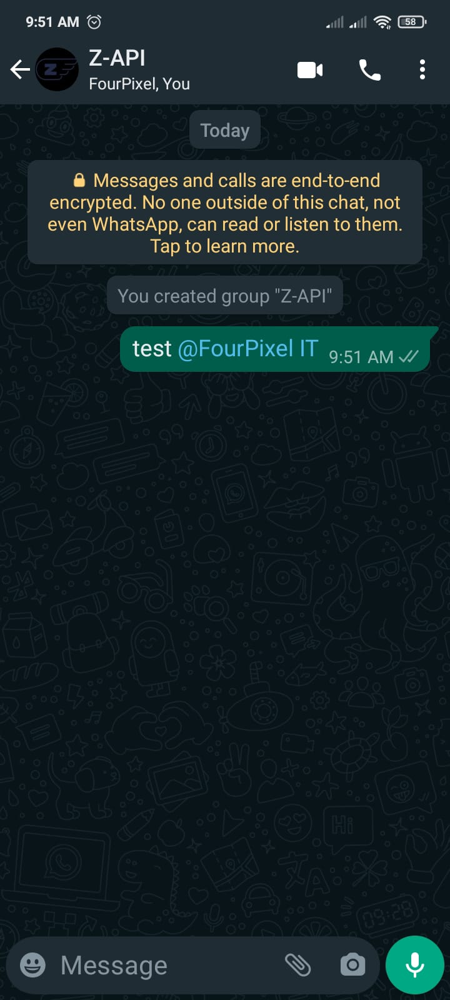

## Método

#### /send-text

`POST` https://api.z-api.io/instances/SUA_INSTANCIA/token/SEU_TOKEN/send-text

---

## Conceituação

Este método é responsável por fazer a menção dos participantes em um grupo. 




---

## Atributos

### Obrigatórios

| Atributos | Tipo   | Descrição |
| :--       | :-:    | :-- |
| phone     | string | ID do grupo onde os participantes serão mencionados|
| message   | string | Texto a ser enviado. Deve conter o @ com o número |
| mentioned | array  | números a ser mencionado |

### Opcionais

| Atributos | Tipo | Descrição |
| :-- | :-: | :-- |
| delayMessage | number | Nesse atributo um delay é adicionado na mensagem. Você pode decidir entre um range de 1~15 sec, significa quantos segundos ele vai esperar para enviar a próxima mensagem. (Ex "delayMessage": 5, ). O delay default caso não seja informado é de 1~3 sec |

---

## Request Body

```json
{
  "phone": "5511999999999-group",
  "message": "Welcome to *Z-API group* @número",
  "mentioned": [número]
}
```

---

## Marcar todos no grupo

Este método permite mencionar vários membros de um grupo no WhatsApp sem a necessidade de incluir explicitamente o "@" antes dos números. Isso é útil para marcar vários membros de uma só vez.

```json
{
  "phone": "5511999999999-group",
  "message": "Welcome to *Z-API group*",
  "mentioned": [número,número,número,número,número,número]
}
```
---

## Response

### 200

| Atributos | Tipo   | Descrição      |
| :-------- | :----- | :------------- |
| zaapId    | string | id no z-api    |
| messageId | string | id no whatsapp |
| id | string | Adicionado para compatibilidade com zapier, ele tem o mesmo valor do messageId |

Exemplo

```json
{
  "zaapId": "3999984263738042930CD6ECDE9VDWSA",
  "messageId": "D241XXXX732339502B68",
  "id": "D241XXXX732339502B68"
}
```

### 405

Neste caso certifique que esteja enviando o corretamente a especificação do método, ou seja verifique se você enviou o POST ou GET conforme especificado no inicio deste tópico.

### 415

Caso você receba um erro 415, certifique de adicionar na headers da requisição o "Content-Type" do objeto que você está enviando, em sua grande maioria "application/json"

---

## Webhook Response

Link para a response do webhook (ao receber)

[Webhook](../webhooks/on-message-received#exemplo-de-retorno-de-texto)

---

## Code

<iframe src="//api.apiembed.com/?source=https://raw.githubusercontent.com/Z-API/z-api-docs/main/json-examples/send-text.json&targets=all" frameborder="0" scrolling="no" width="100%" height="500px" seamless></iframe>
