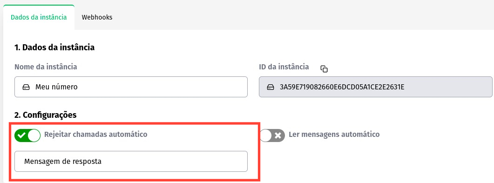

## Conceituação

Através desse método você define a mensagem que será enviada após rejeitar a chamada de voz recebida pela API.

:::important
Para a mensagem ser enviada o método anterior (Rejeitar chamadas) precisa estar ativo!
:::
---
### Método

#### /update-call-reject-message

`PUT` https://api.z-api.io/instances/SUA_INSTANCIA/token/SEU_TOKEN/update-call-reject-message

#### Request Body

```json
{
  "value": "Mensagem de resposta"
}
```

---

### Painel Administrativo



---

## Response

### 200

```json
{
  "value": true
}
```

### 405

Neste caso certifique que esteja enviando o corretamente a especificação do método, ou seja verifique se você enviou o POST ou GET conforme especificado no inicio deste tópico.

### 415

Caso você receba um erro 415, certifique de adicionar na headers da requisição o "Content-Type" do objeto que você está enviando, em sua grande maioria "application/json"

---