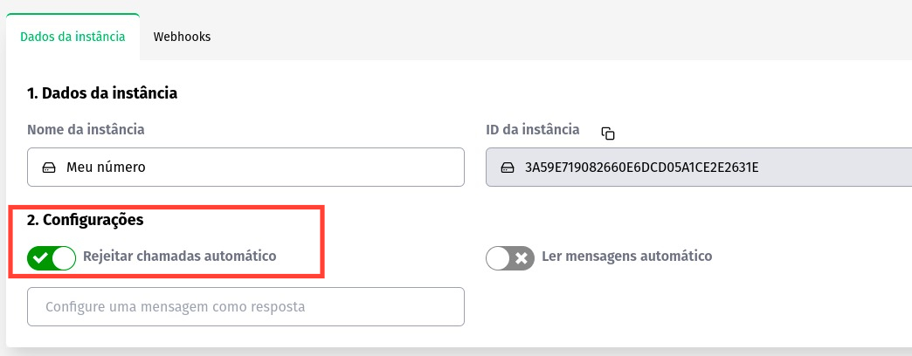

## Conceituação

Esse método ativa a opção de Rejeitar chamadas automático na sua API, com ela ativa todas as chamadas de voz recebidas pelo número conectado a API serão rejeitadas de forma automática.

---
### Método

#### /update-call-reject-auto

`PUT` https://api.z-api.io/instances/SUA_INSTANCIA/token/SEU_TOKEN/update-call-reject-auto

### Header

|      Key       |            Value            |
| :------------: |     :-----------------:     |
|  Client-Token  | **[TOKEN DE SEGURANÇA DA CONTA](../security/client-token)** |

#### Request Body

```json
{
"value": true ou false
}
```

---

### Painel Administrativo



---

## Response

### 200

```json
{
  "value": true
}
```

### 405

Neste caso certifique que esteja enviando o corretamente a especificação do método, ou seja verifique se você enviou o POST ou PUT conforme especificado no inicio deste tópico.

### 415

Caso você receba um erro 415, certifique de adicionar na headers da requisição o "Content-Type" do objeto que você está enviando, em sua grande maioria "application/json"

---