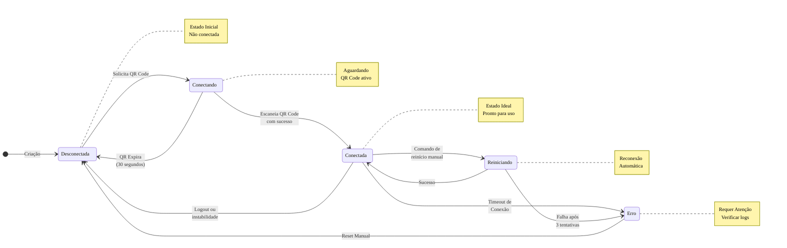

import { Icon } from '@site/src/components/shared/MdxIcon';

# <Icon name="Smartphone" size="lg" /> Gerenciando sua Instância

A "instância" é o coração da sua conexão com o Z-API. É a ponte digital que conecta um número de WhatsApp à nossa plataforma, permitindo que suas automações enviem e recebam mensagens.

Esta seção aborda tudo o que você precisa saber para criar, conectar e manter suas instâncias saudáveis e ativas.

:::tip Conceito Fundamental
A instância é o ponto central de toda sua automação. Entender como gerenciá-la é essencial para manter suas integrações funcionando perfeitamente!
:::

:::info Artigo Explicativo
Para uma explicação didática sobre instâncias usando analogias simples e acessíveis, especialmente útil para automatizadores que estão começando, consulte o artigo: [O Que É Uma Instância? Entenda Como Seu WhatsApp Vira um Assistente Digital](/blog/o-que-e-uma-instancia-entenda-como-seu-whatsapp-vira-um-assistente-digital).
:::

---

## <Icon name="Info" size="md" /> O que é uma Instância? Uma Analogia

Pense em uma **instância como um smartphone virtual na nuvem, dedicado exclusivamente à sua automação.**

- <Icon name="Smartphone" size="sm" /> Cada instância está vinculada a **um único número de WhatsApp**.
- <Icon name="Globe" size="sm" /> Assim como um celular, ela precisa estar **conectada à internet e ao WhatsApp** para funcionar.
- <Icon name="MessageSquare" size="sm" /> Toda a comunicação da sua automação (envio e recebimento de mensagens) passa por esta instância.

---

## <Icon name="RefreshCw" size="md" /> O Ciclo de Vida de uma Instância

Uma instância passa por diferentes estados. Entender esses estados é fundamental para gerenciar sua conexão.

:::info Estados da Instância
Cada estado representa uma fase diferente da conexão. O objetivo é manter sua instância sempre no estado "Conectada"!
:::

<ScrollRevealDiagram direction="up" initialZoom={3.0}>

</ScrollRevealDiagram>

<strong>Legenda do Diagrama</strong>

Este diagrama mostra todos os estados possíveis de uma instância e suas transições:

**Estados**:
- **Desconectada**: Estado inicial, não conectada
- **Conectando**: Aguardando escaneamento do QR Code
- **Conectada**: Estado ideal, pronta para uso
- **Reiniciando**: Tentando reconectar automaticamente
- **Erro**: Estado de erro que requer atenção

**Transições**:
- **Normal**: Desconectada → Conectando → Conectada
- **Expiração**: Conectando → Desconectada (QR expira em 30s)
- **Reconexão**: Conectada → Reiniciando → Conectada/Erro
- **Erro**: Conectada → Erro → Desconectada (reset manual)

**Notas**:
- Estado **Conectada** é o ideal para operação
- Estado **Erro** requer verificação de logs e possível reset

### <Icon name="CircleDashed" size="sm" /> Estados da Instância com Indicadores Visuais

| Estado | Ícone | Cor | Descrição | Ação Necessária |
|:----- |:---- |:-- |:-------- |:-------------- |
| **Desconectada** | <Icon name="LogOut" size="xs" /> | Cinza | A instância não está vinculada a nenhuma sessão do WhatsApp. | **[Gerar um QR Code](/docs/instance/qrcode)** para iniciar a conexão. |
| **Conectando** | <Icon name="QrCode" size="xs" /> | Amarelo | Um QR Code foi gerado e a instância está aguardando ser escaneada pelo app do WhatsApp. | Escanear o QR Code com seu celular. O QR Code expira em 30 segundos. |
| **Conectada** | <Icon name="CircleCheck" size="xs" /> | Verde | Sucesso! A instância está online e pronta para enviar e receber mensagens. | Monitore o status periodicamente. Este é o estado ideal para operação. |
| **Reiniciando** | <Icon name="RefreshCw" size="xs" /> | Azul | A instância está tentando restabelecer uma conexão perdida automaticamente. | Aguardar o processo ser concluído (geralmente leva alguns segundos). |
| **Erro** | <Icon name="XSquare" size="xs" /> | Vermelho | A instância encontrou um erro crítico e não consegue se conectar. | Verificar logs, tentar reset manual ou **[gerar novo QR Code](/docs/instance/qrcode)**. |

:::success Estado Ideal
A principal tarefa no gerenciamento de uma instância é garantir que ela permaneça no estado **"Conectada"**. Este é o único estado onde sua automação pode funcionar completamente.
:::

---

## <Icon name="ListChecks" size="md" /> Tarefas Essenciais de Gerenciamento

Navegue pelos guias desta seção para aprender a realizar as operações mais importantes.

### <Icon name="QrCode" size="sm" /> 1. Conectar e Reconectar

- <Icon name="QrCode" size="xs" /> **[Obter QR Code](/docs/instance/qrcode):** O primeiro passo para qualquer nova instância. Aprenda a gerar o QR Code para escanear com seu celular.
- <Icon name="RefreshCw" size="xs" /> **[Reiniciar Instância](/docs/instance/reiniciar):** Se sua instância se desconectar por um breve período, use esta função para tentar restabelecer a sessão sem precisar escanear o QR Code novamente.

### <Icon name="Eye" size="sm" /> 2. Monitorar a Saúde da Conexão

- <Icon name="Circle" size="xs" /> **[Verificar Status da Instância](/docs/instance/status):** A operação mais importante para o dia a dia. Verifique se sua instância está conectada e veja detalhes sobre o aparelho vinculado.

### <Icon name="UserCheck" size="sm" /> 3. Configurações do Perfil

- <Icon name="Image" size="xs" /> **[Atualizar Imagem de Perfil](/docs/instance/atualizar-imagem-perfil):** Altere a foto de perfil do número conectado.
- <Icon name="Edit3" size="xs" /> **[Atualizar Nome e Recado](/docs/instance/atualizar-nome-perfil):** Modifique o nome e o recado (descrição) do perfil do WhatsApp.

### <Icon name="Settings" size="sm" /> 4. Configurações de Comportamento

- <Icon name="CheckCheck" size="xs" /> **[Leitura Automática de Mensagens](/docs/instance/leitura-automatica):** Configure a instância para marcar automaticamente as mensagens como lidas.
- <Icon name="PhoneOff" size="xs" /> **[Rejeitar Chamadas](/docs/instance/rejeitar-chamadas):** Ative a rejeição automática de chamadas de voz e vídeo.

---

## <Icon name="Rocket" size="md" /> Próximos Passos

Agora que você entende os conceitos, aqui está o que fazer a seguir:

1. <Icon name="QrCode" size="xs" /> **[Conecte sua Instância](/docs/instance/qrcode):** Siga o guia para gerar seu QR Code e colocar sua instância online.
2. <Icon name="Circle" size="xs" /> **[Verifique o Status](/docs/instance/status):** Confirme se a conexão foi bem-sucedida.
3. <Icon name="Settings" size="xs" /> **Explore as Configurações:** Personalize o comportamento da sua instância conforme sua necessidade.

