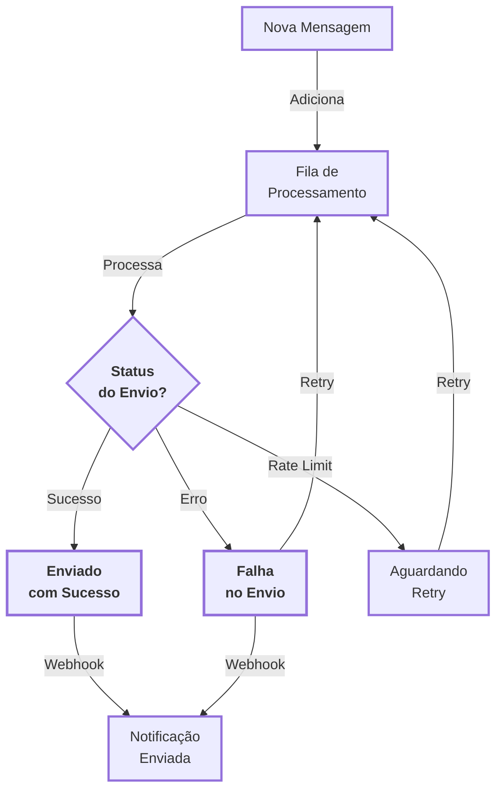

---
id: introducao
title: Fila de mensagens
sidebar_position: 1
---

# <Icon name="List" size="lg" /> Fila de mensagens

Gerencie a fila de mensagens da sua instância através do Z-API. Visualize mensagens pendentes, remova mensagens específicas da fila e, quando necessário, esvazie toda a fila de processamento.

:::tip Gerenciamento de Fila
A fila de mensagens permite monitorar e controlar mensagens que aguardam processamento, essencial para gerenciar alto volume de envios!
:::

:::info Artigo Explicativo
Para uma explicação didática sobre filas de mensagens usando analogias simples e práticas, especialmente útil para entender por que filas são essenciais ao enviar milhares de mensagens, consulte o artigo: [Fila de Mensagens: Como Enviar Milhares de Mensagens Sem Travar o Sistema](/blog/fila-mensagens-como-enviar-milhares-sem-travar).
:::

---

## <Icon name="Info" size="md" /> Visão geral

A seção **Fila de mensagens** reúne os endpoints que trabalham com mensagens **ainda não processadas** pela instância.
Use estas operações para:

- <Icon name="Eye" size="sm" /> **Monitorar a fila**: listar mensagens que aguardam envio.
- <Icon name="XSquare" size="sm" /> **Remover mensagens específicas**: cancelar apenas um `messageId` que não deve mais ser enviado.
- <Icon name="Trash2" size="sm" /> **Esvaziar a fila**: limpar todos os itens pendentes em situações de emergência ou reconfiguração.

:::warning Processamento Assíncrono
A fila reflete o estado **assíncrono** do processamento. Uma mensagem pode ter sido aceita pela API, mas ainda não enviada ao WhatsApp e, portanto, permanecerá na fila até o processamento.
:::

---

## <Icon name="ListChecks" size="md" /> Operações principais

Gerencie sua fila de mensagens com estas páginas:

- <Icon name="List" size="xs" /> **Visualizar fila**: [`GET https://api.z-api.io/instances/SUA_INSTANCIA/token/SEU_TOKEN/queue`](/docs/message-queue/fila) – lista mensagens aguardando processamento.
- <Icon name="XSquare" size="xs" /> **Remover mensagem específica**: [`DELETE https://api.z-api.io/instances/SUA_INSTANCIA/token/SEU_TOKEN/queue/{messageId}`](/docs/message-queue/apagar-mensagem) – remove apenas um item da fila.
- <Icon name="Trash2" size="xs" /> **Limpar fila**: [`DELETE https://api.z-api.io/instances/SUA_INSTANCIA/token/SEU_TOKEN/queue`](/docs/message-queue/apagar-fila) – esvazia toda a fila da instância.

## <Icon name="BookOpen" size="md" /> Conceitos importantes

### <Icon name="List" size="sm" /> O que é a Fila de Mensagens?

A fila de mensagens é o buffer onde as mensagens ficam **aguardando processamento** antes de serem entregues ao WhatsApp. Em cenários de alto volume, é normal que a fila tenha dezenas ou centenas de mensagens em diferentes estágios.

### <Icon name="RefreshCw" size="sm" /> Fluxo de Processamento {#fluxo-de-processamento}

O diagrama abaixo ilustra como as mensagens são processadas na fila:

<ScrollRevealDiagram direction="up">

</ScrollRevealDiagram>

<strong>Legenda do Diagrama</strong>

Este diagrama mostra como as mensagens são processadas na fila.

**Fluxo Principal**: Nova Mensagem → Fila → Processamento → Status do Envio? (Sucesso) → Enviado → Notificação

**Caminhos Alternativos**:

- Status do Envio? (Erro) → Falha → Retry → (retorna à Fila)
- Status do Envio? (Rate Limit) → Aguardando → Retry → (retorna à Fila)

**Características**: Processamento assíncrono com retry automático e notificações via webhook.

:::tip Aprenda a Ler Diagramas
Não está familiarizado com diagramas de fluxo? Leia nosso [guia completo sobre como interpretar diagramas e processos](/blog/como-ler-diagramas-fluxos-decisao).
:::

### <Icon name="CircleDashed" size="sm" /> Status da fila (exemplos)

Os estados exatos podem variar conforme a versão da API, mas, em geral, você encontrará categorias como:

- <Icon name="Clock" size="xs" /> **Pendente**: aguardando processamento.
- <Icon name="RefreshCw" size="xs" /> **Processando**: a mensagem está sendo enviada ao WhatsApp.
- <Icon name="CircleCheck" size="xs" /> **Enviada**: processada com sucesso (normalmente não permanece na fila).
- <Icon name="XSquare" size="xs" /> **Falha**: houve erro ao enviar, podendo exigir nova tentativa ou análise de logs.

Consulte a seção [**Fila de mensagens**](/docs/message-queue/fila) para ver os campos e estados retornados pela API.

---

## <Icon name="CheckSquare" size="md" /> Pré-requisitos

Para trabalhar com a fila de mensagens, você precisa de:

- <Icon name="Smartphone" size="sm" /> **Uma instância ativa** com `instanceId` válido.
- <Icon name="KeyRound" size="sm" /> **Token de acesso** (`Client-Token`) com permissões para leitura e escrita na instância.
- <Icon name="Terminal" size="sm" /> **Ferramenta de testes** (por exemplo, cURL, Postman ou uma collection HTTP) para experimentar os endpoints.

---

## <Icon name="ShieldCheck" size="md" /> Boas práticas

- <Icon name="Eye" size="sm" /> **Monitore a fila periodicamente** para identificar gargalos de envio ou erros recorrentes.
- <Icon name="FileText" size="sm" /> **Evite esvaziar a fila sem registro**: ao usar o endpoint de limpeza total, registre o motivo em logs ou sistemas internos.
- <Icon name="Shield" size="sm" /> **Trate erros de forma idempotente**: ao remover mensagens específicas, considere o caso em que o `messageId` já não está mais na fila (por exemplo, já foi processado).
- <Icon name="CheckSquare" size="sm" /> **Valide suas integrações em ambiente de testes** antes de automatizar limpezas ou remoções em produção.

:::tip Monitoramento Contínuo
Monitore a fila regularmente para identificar problemas antes que afetem o desempenho do sistema!
:::

---

## <Icon name="Rocket" size="md" /> Próximos passos

- <Icon name="List" size="sm" /> **Ver detalhes do endpoint de listagem da fila**: [`GET https://api.z-api.io/instances/SUA_INSTANCIA/token/SEU_TOKEN/queue`](/docs/message-queue/fila)
- <Icon name="XSquare" size="sm" /> **Aprender a remover uma mensagem específica**: [`DELETE https://api.z-api.io/instances/SUA_INSTANCIA/token/SEU_TOKEN/queue/{messageId}`](/docs/message-queue/apagar-mensagem)
- <Icon name="Trash2" size="sm" /> **Entender como esvaziar toda a fila**: [`DELETE https://api.z-api.io/instances/SUA_INSTANCIA/token/SEU_TOKEN/queue`](/docs/message-queue/apagar-fila)
