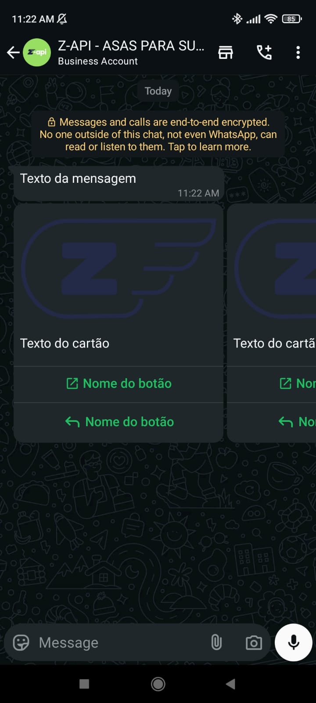

## Método

#### /send-carousel

`POST` https://api.z-api.io/instances/SUA_INSTANCIA/token/SEU_TOKEN/send-carousel

### Header

|      Key       |            Value            |
| :------------: |     :-----------------:     |
|  Client-Token  | **[TOKEN DE SEGURANÇA DA CONTA](../security/client-token)** |
---

:::caution Atenção
Envios de botões que acompanham o carrosel atualmente se encontram disponíveis, porém possui alguns fatores decisivos para o funcionamento. Para mais detalhes acesse o tópico [Funcionamento dos Botões](https://developer.z-api.io/tips/button-status)
:::

## Conceituação

Neste método você poderá enviar mensagens de carrosel com imagens, texto e com botões de ação. A partir dos botões de ação, você conseguirá redirecionar para links, fazer chamadas, e também dar respostas padrões.



---

## Atributos

### Obrigatórios

| Atributos   | Tipo          | Descrição |
| :----------:| :-----------: | :-------- |
| phone         | string        | Telefone (ou ID do grupo para casos de envio para grupos) do destinatário no formato DDI DDD NÚMERO Ex: 551199999999. **IMPORTANTE** Envie somente números, sem formatação ou máscara |
| message       | string          | Texto a ser enviado  |
| carousel      | carouselCard[]  | Array de objetos com cartões do carrosel |

### carouselCard

| Atributos |  Tipo  | Descrição                     |
| :-------: | :----: | :----------------------------: |
| text      | string | Texto do cartão  |
| image     | string | Imagem do cartão |

### Opcionais carouselCard
| Atributos |  Tipo  | Descrição                     |
| :-------: | :----: | :----------------------------: |
| buttons   | buttonActions[] | Array de objetos do tipo buttonActions |

### buttonActions

| Atributos |  Tipo  | Descrição                     |
| :-------: | :----: | :----------------------------: |
| type      | string | Tipos de botão a ser enviados (CALL, URL, REPLY) |
| phone     | string | Número atribuído ao botão caso seja do tipo CALL |
| url       | string | Link atribuído ao botão caso seja do tipo URL.   |
| label     | string | Texto para o botão |

### Opcionais buttonActions

| Atributos |  Tipo  | Descrição                    |
| :-------: | :----: | :---------------------:      |
| id        | string | Identificador do botão       |

### Opcionais
| Atributos    | Tipo   | Descrição |
| :----------: | :----: | :-------: |
| delayMessage | number | Nesse atributo um delay é adicionado na mensagem. Você pode decidir entre um range de 1~15 sec, significa quantos segundos ele vai esperar para enviar a próxima mensagem. (Ex "delayMessage": 5, ). O delay default caso não seja informado é de 1~3 sec |

---

## Request Body

```json
{
    "phone": "551199999999",
    "message": "Texto da mensagem",
    "carousel": [
        {
            "text": "Texto do cartão",
            "image": "https://firebasestorage.googleapis.com/v0/b/zaap-messenger-web.appspot.com/o/logo.png?alt=media",
            "buttons": [
                {
                    "id": "1",
                    "label": "Nome do botão",
                    "url": "https://z-api.io",
                    "type": "URL"
                },
                {
                    "id": "2",
                    "label": "Nome do botão",
                    "type": "REPLY"
                }
            ]
        },
        {
            "text": "Texto do cartão",
            "image": "https://firebasestorage.googleapis.com/v0/b/zaap-messenger-web.appspot.com/o/logo.png?alt=media",
            "buttons": [
                {
                    "id": "1",
                    "label": "Nome do botão",
                    "url": "https://z-api.io",
                    "type": "URL"
                },
                {
                    "id": "2",
                    "label": "Nome do botão",
                    "type": "REPLY"
                }
            ]
        }
    ]
}
```

```json
{
    "phone": "551199999999",
    "message": "Texto da mensagem",
    "carousel": [
        {
            "text": "Texto do cartão",
            "image": "https://firebasestorage.googleapis.com/v0/b/zaap-messenger-web.appspot.com/o/logo.png?alt=media"
        },
        {
            "text": "Texto do cartão",
            "image": "https://firebasestorage.googleapis.com/v0/b/zaap-messenger-web.appspot.com/o/logo.png?alt=media"
        }
    ]
}
```

---

## Response

### 200

| Atributos | Tipo   | Descrição      |
| :-------- | :----- | :------------- |
| zaapId    | string | id no z-api    |
| messageId | string | id no whatsapp |
| id | string | Adicionado para compatibilidade com zapier, ele tem o mesmo valor do messageId |

Exemplo

```json
{
  "zaapId": "3999984263738042930CD6ECDE9VDWSA",
  "messageId": "D241XXXX732339502B68",
  "id": "D241XXXX732339502B68"
}
```

### 405

Neste caso certifique que esteja enviando o corretamente a especificação do método, ou seja verifique se você enviou o POST ou GET conforme especificado no inicio deste tópico.

### 415

Caso você receba um erro 415, certifique de adicionar na headers da requisição o "Content-Type" do objeto que você está enviando, em sua grande maioria "application/json"

---

## Webhook Response

Link para a response do webhook (ao receber)

[Webhook](../webhooks/on-message-received#exemplo-de-retorno-de-carrosel)

---

## Code

<iframe src="//api.apiembed.com/?source=https://raw.githubusercontent.com/Z-API/z-api-docs/main/json-examples/send-carousel.json&targets=all" frameborder="0" scrolling="no" width="100%" height="500px" seamless></iframe>
