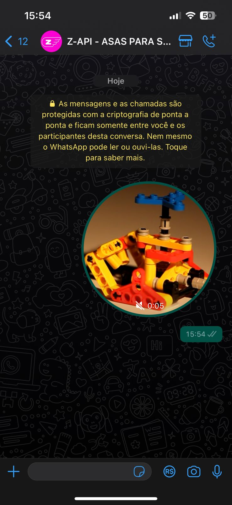

## Método

#### /send-ptv

`POST` https://api.z-api.io/instances/SUA_INSTANCIA/token/SEU_TOKEN/send-ptv

### Header

|      Key       |            Value            |
| :------------: |     :-----------------:     |
|  Client-Token  | **[TOKEN DE SEGURANÇA DA CONTA](https://developer.z-api.io/security/client-token)** |
---

## Conceituação

Método responsavel por enviar PTV para os seus chats, você pode trabalhar com as PTV de 2 formas que são:

Por Link, onde você tem um video hospedado em algum lugar da internet e envia apenas o link do mesmo.

Por Base64, se você optar por esta opção precisará ter em sua aplicação um método para converter o video em Base64.

### Tamanho e formatos

O Whatsapp limita o tamanho de arquivos e sua politica muda constantemente, por isso sempre recomendamos a verificação direto no site do próprio Whatsapp.

Neste [link] você encontra tudo que precisa saber sobre formatos e tamanhos de arquivos.

[link]: https://developers.facebook.com/docs/whatsapp/api/media



---

## Atributos

### Obrigatórios

| Atributos | Tipo | Descrição |
| :-- | :-: | :-- |
| phone | string | Telefone (ou ID do grupo para casos de envio para grupos) do destinatário no formato DDI DDD NÚMERO Ex: 551199999999. **IMPORTANTE** Envie somente números, sem formatação ou máscara |
| ptv | string | Link do video ou seu Base64 |

### Opcionais

| Atributos | Tipo | Descrição |
| :-- | :-: | :-- |
| messageId | String | Atributo utilizado para responder uma mensagem do chat, basta adicionar o messageId da mensagem que queira responder neste atributo |
| delayMessage | number | Nesse atributo um delay é adicionado na mensagem. Você pode decidir entre um range de 1~15 sec, significa quantos segundos ele vai esperar para enviar a próxima mensagem. (Ex "delayMessage": 5, ). O delay default caso não seja informado é de 1~3 sec |

---

## Request Body

##### Envio por URL
```json
{
  "phone": "5511999999999",
  "ptv": "http://techslides.com/demos/sample-videos/small.mp4"
}
```

##### Envio por Base64
```json
{
  "phone": "5544999999999",
  "ptv": "data:video/mp4;base64,AAYXJ0eHJlZgIGZ0eXBtc0eHDQyAAg3NDINCiUlRUAAAG1wNDJtcD"
}
```

---

## Response

### 200

| Atributos | Tipo   | Descrição      |
| :-------- | :----- | :------------- |
| zaapId    | string | id no z-api    |
| messageId | string | id no whatsapp |
| id | string | Adicionado para compatibilidade com zapier, ele tem o mesmo valor do messageId |

Exemplo

```json
{
  "zaapId": "3999984263738042930CD6ECDE9VDWSA",
  "messageId": "D241XXXX732339502B68",
  "id": "D241XXXX732339502B68"
}
```


### 405

Neste caso certifique que esteja enviando o corretamente a especificação do método, ou seja verifique se você enviou o POST ou GET conforme especificado no inicio deste tópico.

### 415

Caso você receba um erro 415, certifique de adicionar na headers da requisição o "Content-Type" do objeto que você está enviando, em sua grande maioria "application/json"

---

## Webhook Response

Link para a response do webhook (ao receber)

[Webhook](../webhooks/on-message-received#exemplo-de-retorno-de-ptv)

---

## Code

<iframe src="//api.apiembed.com/?source=https://raw.githubusercontent.com/Z-API/z-api-docs/main/json-examples/send-ptv.json&targets=all" frameborder="0" scrolling="no" width="100%" height="500px" seamless></iframe>
