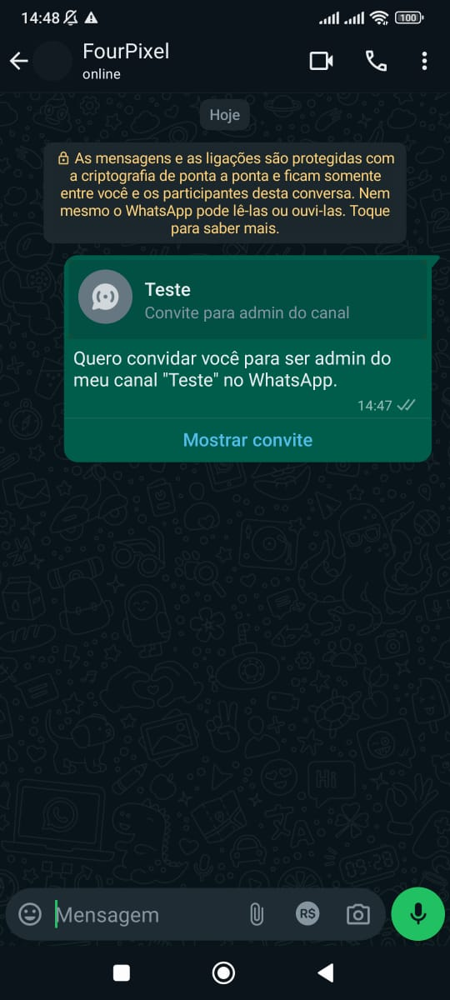

## Método

#### /send-newsletter-admin-invite

`POST` https://api.z-api.io/instances/SUA_INSTANCIA/token/SEU_TOKEN/send-newsletter-admin-invite

### Header

|      Key       |            Value            |
| :------------: |     :-----------------:     |
|  Client-Token  | **[TOKEN DE SEGURANÇA DA CONTA](../security/client-token)** |
---

## Conceituação

Neste método você poderá enviar mensagens convidando pessoas para serem administradoras dos seus canais no WhatsApp.



---

## Atributos

### Obrigatórios

| Atributos | Tipo   | Descrição |
| :------   | :----: | :------   |
| phone     | string | Telefone do destinatário no formato DDI DDD NÚMERO Ex: 551199999999. **IMPORTANTE** Envie somente números, sem formatação ou máscara |
| adminInviteMessage | object | Objeto com os dados necessários para o envio da mensagem de convite |

Object (adminInviteMessage)

| Atributos | Tipo   | Descrição |
| :------   | :----: | :------   |
| newsletterId       | string | Id do canal o qual pertence o convite. Ex: 999999999999999999@newsletter. |
| caption  | object | Texto da mensagem de convite |

---

## Request Body

```json

{
  "phone": "5511999999999",
  "adminInviteMessage": { 
    "newsletterId": "120363166555745933@newsletter",
    "caption": "Quero convidar você para ser admin do meu canal no WhatsApp."
  }
}
```

## Response

### 200

| Atributos | Tipo   | Descrição      |
| :-------- | :----- | :------------- |
| zaapId    | string | id no z-api    |
| messageId | string | id no whatsapp |
| id        | string | Adicionado para compatibilidade com zapier, ele tem o mesmo valor do messageId |


Exemplo

```json
{
  "zaapId": "3999984263738042930CD6ECDE9VDWSA",
  "messageId": "D241XXXX732339502B68",
  "id": "D241XXXX732339502B68"
}
```

### 405

Neste caso certifique que esteja enviando o corretamente a especificação do método, ou seja verifique se você enviou o POST ou GET conforme especificado no inicio deste tópico.

### 415

Caso você receba um erro 415, certifique de adicionar na headers da requisição o "Content-Type" do objeto que você está enviando, em sua grande maioria "application/json"

---

## Webhook Response

Link para a response do webhook (ao receber)

[Webhook](../webhooks/on-message-received#exemplo-de-retorno-de-convite-admin-de-canal)

---

## Code

<iframe src="//api.apiembed.com/?source=https://raw.githubusercontent.com/Z-API/z-api-docs/main/json-examples/send-newsletter-admin-invite.json&targets=all" frameborder="0" scrolling="no" width="100%" height="500px" seamless></iframe>
