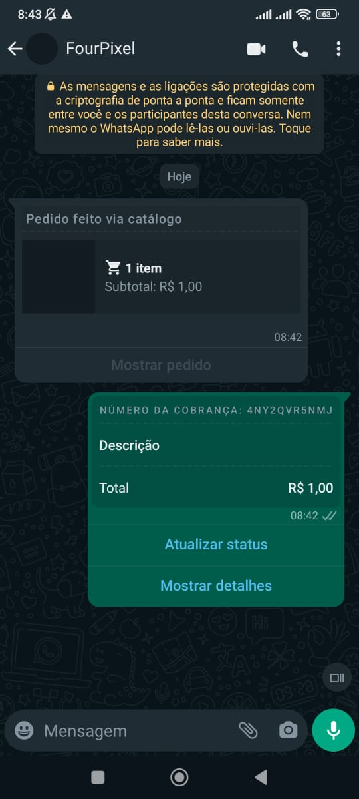

## Método

#### /send-order

`POST` https://api.z-api.io/instances/SUA_INSTANCIA/token/SEU_TOKEN/send-order

### Header

|      Key       |            Value            |
| :------------: |     :-----------------:     |
|  Client-Token  | **[TOKEN DE SEGURANÇA DA CONTA](../security/client-token)** |
---

## Conceituação

Neste método você poderá enviar mensagens de pedidos, contendo produtos do seu catálogo ou customizados no momento do envio. Lembrando que esta mensagem é a mesma que é enviada quando você clica no botão "Aceitar pedido" - ou "Enviar cobrança" - no pedido do cliente. Tal mensagem, retorna no **[webhook](../webhooks/on-message-received#exemplo-de-retorno-de-envio-de-pedido)** informações sobre o pedido, bem como os dados necessários para atualizações de **[status](./update-order-status.md)** e **[pagamento](./update-order-payment.md)**, que, por sua vez, também são mensagens, que referenciam a mensagem principal do pedido, isto é, a mensagem enviada a partir desta rota.




---

:::important Importante
Este método está disponível apenas para contas Business do whatsapp. 
:::

---

## Atributos

### Obrigatórios

| Atributos         | Tipo   | Descrição |
| :---------------  | :----: | :------   |
| phone             | string | Telefone do destinatário no formato DDI DDD NÚMERO Ex: 551199999999. **IMPORTANTE** Envie somente números, sem formatação ou máscara |
| order             | object | Informações do pedido a ser enviado |
| paymentSettings   | object | Configurações de pagamento (para o funcionamento de cartões, é necessário que seja configurado na conta do WhatsApp pelo celular) |

Object (order)

| Atributos | Tipo         | Descrição       |
| :------   | :----------: | :-------------  |
| currency  | string       | Código da moeda |
| products  | array object | Informações dos produtos relacionados ao pedido |

Object (products)

| Atributos | Tipo         | Descrição        |
| :------   | :----------: | :-------------   |
| name      | string       | Nome do produto  |
| value     | number       | Valor do produto |
| quantity  | number       | Quantidade       |

### Opcionais

Object (order)

| Atributos | Tipo         | Descrição         |
| :------   | :----------: | :---------------  |
| discount  | number       | Valor de desconto |
| tax       | number       | Valor de imposto  |
| shipping  | number       | Valor de frete    |

Object (products)

| Atributos | Tipo         | Descrição                    |
| :------   | :----------: | :--------------------------- |
| productId | string       | Id do produto do catálogo    |

Object (paymentSettings)

| Atributos | Tipo         | Descrição                 |
| :------   | :----------: | :-----------------------  |
| pix       | object       | Informações da chave PIX  |
| card      | object       | Habilitar o pagamento via cartão  |

Object (pix)

| Atributos | Tipo         | Descrição         |
| :------   | :----------: | :---------------  |
| key       | string       | Chave PIX         |
| keyType   | string       | Tipo da chave (cpf, cnpj, phone, email, randomKey) |
| name      | string       | Nome da chave     |

Object (card)

| Atributos | Tipo         | Descrição         |
| :------   | :----------: | :---------------  |
| enabled   | boolean      | Habilitar o pagamento via cartão |

---

## Request Body

### Incluindo parâmetros opcionais

```json
{
    "phone": "554499999999",
    "order": {
        "currency": "BRL",
        "discount": 10,
        "tax": 10,
        "shipping": 5,
        "products": [
            {
                "productId": "23940797548900636",
                "name": "Nome do produto",
                "value": 10,
                "quantity": 2
            }
        ]
    },
    "paymentSettings": {
        "pix": {
            "key": "Chave PIX",
            "keyType": "Tipo da chave (cpf | cnpj | phone | email | randomKey)",
            "name": "Nome da chave"
        },
        "card": {
            "enabled": true
        }
    }
}
```

### Apenas parâmetros obrigatórios

```json
{
    "phone": "554499999999",
    "order": {
        "currency": "BRL",
        "products": [
            {
                "name": "Nome do produto",
                "value": 150,
                "quantity": 1
            }
        ]
    }
}
```

:::tip Dica
Ao enviar um produto na lista "products" sem o atributo "productId", isso é caracterizado como um produto "customizado". Ele recebe um id para ser utilizado no contexto desse pedido, o qual é retornado no webhook de **[ReceivedCallback](../webhooks/on-message-received#exemplo-de-retorno-de-envio-de-pedido)** e deve ser utilizado para as atualizações de status do pedido.
:::

## Response

### 200

| Atributos | Tipo   | Descrição      |
| :-------- | :----- | :------------- |
| zaapId    | string | id no z-api    |
| messageId | string | id no whatsapp |
| id        | string | Adicionado para compatibilidade com zapier, ele tem o mesmo valor do messageId |


Exemplo

```json
{
  "zaapId": "3999984263738042930CD6ECDE9VDWSA",
  "messageId": "D241XXXX732339502B68",
  "id": "D241XXXX732339502B68"
}
```

### 405

Neste caso certifique que esteja enviando o corretamente a especificação do método, ou seja verifique se você enviou o POST ou GET conforme especificado no inicio deste tópico.

### 415

Caso você receba um erro 415, certifique de adicionar na headers da requisição o "Content-Type" do objeto que você está enviando, em sua grande maioria "application/json"

---

## Webhook Response

Link para a response do webhook (ao receber)

[Webhook](../webhooks/on-message-received#exemplo-de-retorno-de-envio-de-pedido)

---

## Code

<iframe src="//api.apiembed.com/?source=https://raw.githubusercontent.com/Z-API/z-api-docs/main/json-examples/send-order.json&targets=all" frameborder="0" scrolling="no" width="100%" height="500px" seamless></iframe>
