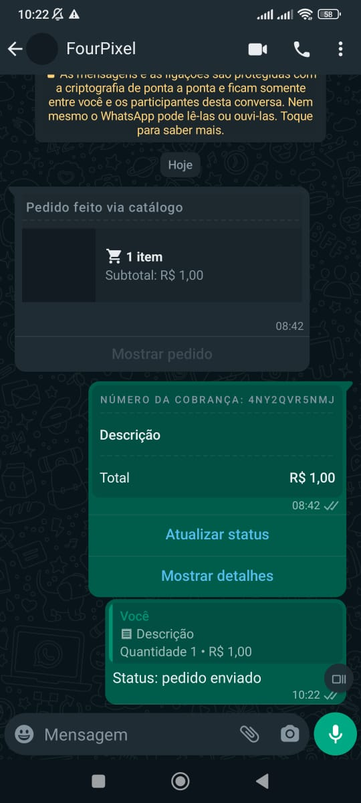

## Método

#### /order-status-update

`POST` https://api.z-api.io/instances/SUA_INSTANCIA/token/SEU_TOKEN/order-status-update

### Header

|      Key       |            Value            |
| :------------: |     :-----------------:     |
|  Client-Token  | **[TOKEN DE SEGURANÇA DA CONTA](../security/client-token)** |
---

## Conceituação

Neste método você poderá enviar mensagens de atualização de status dos pedidos enviados.



---

:::important Importante
Este método está disponível apenas para contas Business do whatsapp. 
:::

---

## Atributos

### Obrigatórios

| Atributos       | Tipo   | Descrição |
| :-------------- | :----: | :-------- |
| phone           | string | Telefone do destinatário no formato DDI DDD NÚMERO Ex: 551199999999. **IMPORTANTE** Envie somente números, sem formatação ou máscara |
| messageId       | string | Id do whatsapp da mensagem original do pedido                                                                         |
| referenceId     | string | Id de referência do pedido (retornado no **[webhook](../webhooks/on-message-received#exemplo-de-retorno-de-envio-de-pedido)**) |
| orderRequestId  | string | Id de referência da requisição do pedido (retornado no **[webhook](../webhooks/on-message-received#exemplo-de-retorno-de-envio-de-pedido)**) |
| orderStatus     | string | Novo status do pedido (pending, processing, shipped, completed, canceled) |
| paymentStatus   | string | Status atual do pagamento (pending, paid) (retornado no **[webhook](../webhooks/on-message-received#exemplo-de-retorno-de-envio-de-pedido)**) |
| order           | object | Informações do pedido a ser enviado |

Object (order)

| Atributos | Tipo         | Descrição       |
| :------   | :----------: | :-------------  |
| currency  | string       | Código da moeda |
| products  | array object | Informações dos produtos relacionados ao pedido |

Object (products)

| Atributos     | Tipo         | Descrição                 |
| :------------ | :----------: | :------------------------ |
| productId     | string       | Id do produto (retornado no **[webhook](../webhooks/on-message-received#exemplo-de-retorno-de-envio-de-pedido)**) |
| name          | string       | Nome do produto           |
| value         | number       | Valor do produto          |
| quantity      | number       | Quantidade                |
| isCustomItem  | boolean      | Informa se é um produto customizado na hora do envio (retornado no **[webhook](../webhooks/on-message-received#exemplo-de-retorno-de-envio-de-pedido)**) |

### Opcionais

| Atributos | Tipo         | Descrição         |
| :------   | :----------: | :---------------  |
| message   | string       | Texto da mensagem |

Object (order)

| Atributos | Tipo         | Descrição         |
| :------   | :----------: | :---------------  |
| discount  | number       | Valor de desconto |
| tax       | number       | Valor de imposto  |
| shipping  | number       | Valor de frete    |

---

## Request Body

:::caution Atenção
É necessário enviar na requisição todos os dados previamente informados no envio do pedido, com a inclusão de alguns parâmetros adicionais obrigatórios, os quais são retornados no **[webhook](../webhooks/on-message-received#exemplo-de-retorno-de-envio-de-pedido)**
:::

```json
{
    "phone": "554499999999",
    "messageId": "3EB0F91BBA791BB0A787FC",
    "message": "Mensagem de texto da atualização do pedido",
    "referenceId": "4N8FCTW1WM6",
    "orderRequestId": "4N8FCTW22W4",
    "orderStatus": "processing",
    "paymentStatus": "pending",
    "order": {
        "currency": "BRL",
        "discount": 10,
        "tax": 10,
        "shipping": 5,
        "products": [
            {
                "value": 150,
                "quantity": 2,
                "name": "order 1",
                "isCustomItem": true,
                "productId": "custom-item-4N8FCTW23N7"
            },
            {
                "productId": "23940797548900636",
                "value": 150,
                "quantity": 2,
                "name": "order 2",
                "isCustomItem": false
            }
        ]
    }
}
```

:::tip Dica
É possível notar que o produto com o atributo "isCustomItem" com o valor true, tem um id com o prefixo "custom-item". Isso ocorre quando ao enviar um pedido não é informado nenhum id de produto, ou seja, o whatsapp assume que é um produto customizado. Esse id é retornado no **[webhook](../webhooks/on-message-received#exemplo-de-retorno-de-envio-de-pedido)** e é um parâmetro obrigatório, juntamente com o "isCustomItem", para atualizações do pedido.
:::

## Response

### 200

| Atributos | Tipo   | Descrição      |
| :-------- | :----- | :------------- |
| zaapId    | string | id no z-api    |
| messageId | string | id no whatsapp |
| id        | string | Adicionado para compatibilidade com zapier, ele tem o mesmo valor do messageId |


Exemplo

```json
{
  "zaapId": "3999984263738042930CD6ECDE9VDWSA",
  "messageId": "D241XXXX732339502B68",
  "id": "D241XXXX732339502B68"
}
```

### 405

Neste caso certifique que esteja enviando o corretamente a especificação do método, ou seja verifique se você enviou o POST ou GET conforme especificado no inicio deste tópico.

### 415

Caso você receba um erro 415, certifique de adicionar na headers da requisição o "Content-Type" do objeto que você está enviando, em sua grande maioria "application/json"

---

## Webhook Response

Link para a response do webhook (ao receber)

[Webhook](../webhooks/on-message-received#exemplo-de-retorno-de-atualização-de-pedido)

---

## Code

<iframe src="//api.apiembed.com/?source=https://raw.githubusercontent.com/Z-API/z-api-docs/main/json-examples/send-order-status-update.json&targets=all" frameborder="0" scrolling="no" width="100%" height="500px" seamless></iframe>
