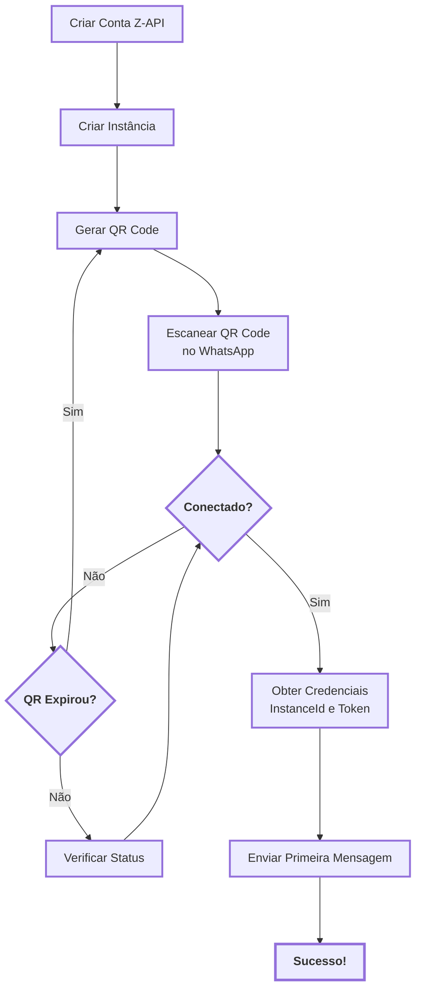
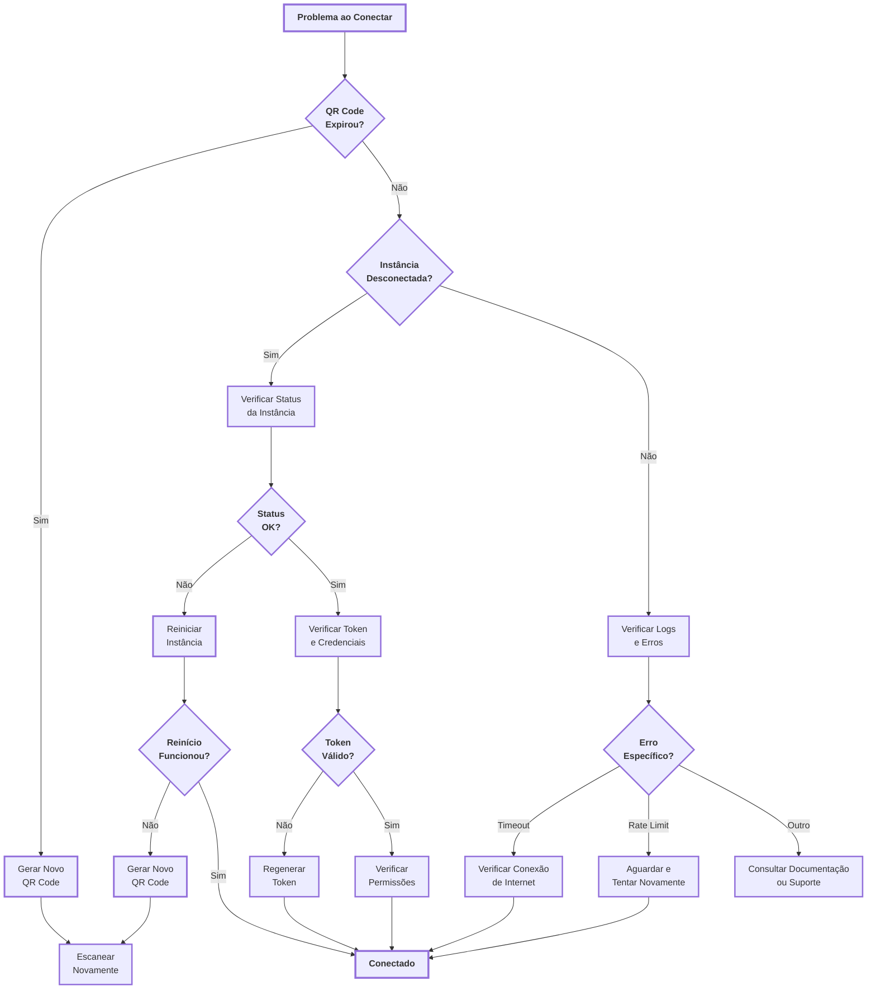

import { UrlDisplay, IdDisplay, PhoneDisplay, RequestBodyDisplay, PathParameterDisplay } from '@site/src/components/shared/HighlightBox';

# <Icon name="Rocket" size="lg" /> Começando com o Z-API

Bem-vindo ao guia de início rápido do Z-API! Este guia prático e direto foi projetado para que você configure sua conta e envie sua primeira mensagem em poucos minutos, mesmo sem experiência prévia em programação ou APIs. Siga os passos abaixo e você estará pronto para começar a automatizar suas comunicações via WhatsApp.

:::info <Icon name="Clock" size="sm" /> Tempo Estimado
Este guia leva aproximadamente **5-10 minutos** para ser concluído, dependendo da sua experiência com APIs e ferramentas de desenvolvimento.
:::

:::tip Comece Agora
Este guia foi cuidadosamente projetado para ser acessível a todos. Mesmo sem experiência prévia em programação ou APIs, você conseguirá configurar tudo em poucos minutos e enviar sua primeira mensagem automatizada!
:::

:::info Artigo Complementar
Se você quer entender melhor o conceito de instância antes de começar, especialmente se você está começando a automatizar, leia primeiro o artigo: [O Que É Uma Instância? Entenda Como Seu WhatsApp Vira um Assistente Digital](/blog/o-que-e-uma-instancia-entenda-como-seu-whatsapp-vira-um-assistente-digital). Ele explica de forma simples e didática o que é uma instância usando analogias do dia a dia.
:::

---

## <Icon name="CheckSquare" size="md" /> O Que Você Precisa Antes de Começar

Para garantir um processo tranquilo, certifique-se de que você tem:

- <Icon name="UserCheck" size="sm" /> Uma **conta Z-API** criada.
- <Icon name="Smartphone" size="sm" /> Um **smartphone** com o WhatsApp ativo que você usará para a automação.
- <Icon name="Terminal" size="sm" /> **Acesso a um computador** para escanear o QR Code no painel do Z-API.

:::info Dica
Não se preocupe se você não tem experiência com programação. Este guia foi feito para todos!
:::

---

## <Icon name="RefreshCw" size="md" /> Fluxo Visual: Da Criação ao Envio

Antes de começar, veja o fluxo completo do processo:

<ScrollRevealDiagram direction="up">

</ScrollRevealDiagram>

**Legenda do Diagrama**

Este diagrama mostra o processo completo desde a criação da conta até o envio da primeira mensagem.

**Fluxo Principal**: Criar Conta → Instância → QR Code → Escanear → Conectado → Credenciais → Mensagem → Sucesso!

**Caminhos Alternativos**:

- QR Expirou? (Sim) → Gerar Novo QR Code
- Conectado? (Não) → Verificar Status → Tentar Novamente

**Dicas**:

- Mantenha o QR Code visível durante o escaneamento
- Se o QR expirar, gere um novo imediatamente
- Verifique o status da instância se houver problemas de conexão

:::tip Aprenda a Ler Diagramas
Não está familiarizado com diagramas de fluxo? Leia nosso [guia completo sobre como interpretar diagramas e árvores de decisão](/blog/como-ler-diagramas-fluxos-decisao).
:::

## <Icon name="ListChecks" size="md" /> Passo a Passo: Da Configuração ao Envio

Siga as etapas abaixo para conectar sua conta do WhatsApp e enviar uma mensagem de teste.

### <Icon name="PlusCircle" size="sm" /> Passo 1: Crie sua Instância

A "instância" é a conexão entre o Z-API e a sua conta do WhatsApp.

1. <Icon name="Terminal" size="xs" /> Acesse o **painel de controle** do Z-API.
2. <Icon name="MousePointerClick" size="xs" /> No menu principal, encontre e clique na opção para **criar uma nova instância**.
3. <Icon name="Edit3" size="xs" /> Dê um nome fácil de lembrar para sua instância (por exemplo, "Automação Vendas" ou "Suporte Cliente").

:::tip Nome da Instância
Escolha um nome descritivo que facilite a identificação quando você tiver múltiplas instâncias no futuro.
:::

### <Icon name="QrCode" size="sm" /> Passo 2: Conecte seu WhatsApp

Agora, vamos conectar seu telefone à instância que você acabou de criar.

1. <Icon name="QrCode" size="xs" /> Com a instância selecionada no painel, clique na opção para **obter o QR Code**.
2. <Icon name="Smartphone" size="xs" /> Abra o **WhatsApp** no seu smartphone.
3. <Icon name="Settings" size="xs" /> Vá para **Configurações > Aparelhos conectados > Conectar um aparelho**.
4. <Icon name="Scan" size="xs" /> Aponte a câmera do seu celular para o **QR Code** exibido no painel do Z-API.

:::info Aguarde a Conexão
Aguarde alguns instantes enquanto a conexão é estabelecida. Assim que o status da sua instância mudar para **"Conectado"**, você está pronto para o próximo passo!
:::

### <Icon name="Send" size="sm" /> Passo 3: Envie sua Primeira Mensagem

Vamos testar a conexão enviando uma mensagem de texto simples. Para esta etapa, recomendamos o uso do **Postman**, uma ferramenta que facilita o teste de APIs sem precisar escrever código.

1. <Icon name="KeyRound" size="xs" /> Primeiro, certifique-se de ter suas **credenciais** em mãos. Você as encontrará no painel da sua instância:
   - <Icon name="IdCard" size="xs" /> **InstanceId**: O identificador único da sua instância.
   - <Icon name="KeySquare" size="xs" /> **Token**: Sua chave de acesso segura.

2. <Icon name="Code2" size="xs" /> Agora, vamos usar a API para enviar a mensagem. A estrutura da requisição será a seguinte:

   - **Método:** `POST`
   - **URL:**

   <UrlDisplay
     url="https://api.z-api.io/instances/{instanceId}/token/{token}/send-text"
     instructionText="URL completa do endpoint (substitua {instanceId} e {token} pelos seus valores)"
   />

   - **Corpo da Requisição (Body):**

   <RequestBodyDisplay
     body={{
       phone: "5511999999999",
       message: "Olá, mundo! Esta é minha primeira mensagem com o Z-API."
     }}
     instructionText="Corpo da requisição em formato JSON"
   />

3. <Icon name="RefreshCw" size="xs" /> Substitua os seguintes valores pelos seus dados:

   - <PathParameterDisplay param="{instanceId}" instructionText="ID da sua instância" />
   - <PathParameterDisplay param="{token}" instructionText="Token da sua instância" />
   - <PhoneDisplay phone="5511999999999" instructionText="Número de telefone do destinatário" />

4. <Icon name="Send" size="xs" /> Envie a requisição! Em segundos, a mensagem deverá chegar no número de destino.

:::success Parabéns!
Você acaba de enviar sua primeira mensagem usando o Z-API!
:::

---

## <Icon name="HelpCircle" size="md" /> Troubleshooting: Problemas Comuns {#troubleshooting}

Se você encontrou algum problema durante o processo, use este guia visual para identificar e resolver:

<ScrollRevealDiagram direction="up">

</ScrollRevealDiagram>

**Legenda do Diagrama de Troubleshooting**

Este diagrama apresenta uma árvore de decisão para diagnosticar e resolver problemas comuns.

**Fluxos de Solução**:

- QR Expirou? (Sim) → Gerar Novo QR Code → Escanear Novamente
- Instância Desconectada? (Sim) → Verificar Status → Reiniciar
- Token Inválido? (Não) → Regenerar Token
- Erro Específico? → Identificar Tipo → Aplicar Solução

**Dicas**:

- Sempre verifique o status da instância primeiro
- Tokens podem expirar - verifique se está usando o correto
- Rate limits são temporários - aguarde alguns minutos

:::tip Aprenda a Ler Diagramas
Não está familiarizado com árvores de decisão? Leia nosso [guia completo sobre como interpretar diagramas e fluxos](/blog/como-ler-diagramas-fluxos-decisao).
:::

### <Icon name="ListChecks" size="sm" /> Problemas Frequentes e Soluções

| Problema | Causa Provável | Solução |
|:------- |:------------- |:------ |
| <Icon name="QrCode" size="xs" /> **QR Code não aparece** | Instância não foi criada corretamente | Verifique se a instância foi criada no painel e tente gerar o QR Code novamente |
| <Icon name="Timer" size="xs" /> **QR Code expira muito rápido** | WhatsApp limita o tempo de validade | Gere um novo QR Code imediatamente após abrir a tela de escaneamento |
| <Icon name="Power" size="xs" /> **"Instância desconectada" após escanear** | Problema de conexão ou sessão inválida | Verifique sua conexão com a internet e tente **[reiniciar a instância](/docs/instance/reiniciar)** |
| <Icon name="KeyRound" size="xs" /> **Erro 401 (Não autorizado)** | Token inválido ou expirado | Verifique se está usando o token correto no header `Client-Token` |
| <Icon name="Clock" size="xs" /> **Erro 429 (Muitas requisições)** | Rate limit atingido | Aguarde alguns minutos antes de tentar novamente |
| <Icon name="MessageSquare" size="xs" /> **Mensagem não é enviada** | Instância desconectada ou número inválido | Verifique o status da instância e o formato do número (deve incluir código do país) |

:::tip Dica Pro
Se o problema persistir, verifique os logs da sua instância no painel do Z-API. Eles geralmente contêm informações detalhadas sobre o que está acontecendo.
:::

---

## <Icon name="Rocket" size="md" /> Próximos Passos

Agora que você dominou o básico, aqui estão algumas sugestões do que explorar a seguir:

- <Icon name="Plug" size="sm" /> **[Coleção Postman](/docs/quick-start/colecao-postman)** - Aprenda a usar nossa coleção completa no Postman para testar todas as funcionalidades da API de forma visual.
- <Icon name="MessageSquare" size="sm" /> **[Tipos de Mensagens](/docs/messages/introducao)** - Descubra como enviar imagens, vídeos, documentos e mensagens com botões.
- <Icon name="Webhook" size="sm" /> **[Webhooks](/docs/webhooks/introducao)** - Configure notificações para ser avisado em tempo real quando receber novas mensagens.
- <Icon name="ShieldAlert" size="sm" /> **[Boas Práticas: Evitando Bloqueios](/docs/quick-start/bloqueios-e-banimentos)** - Leia nosso guia essencial para usar a automação de forma segura e eficiente.

:::tip Continue Aprendendo
Cada seção da documentação foi pensada para guiá-lo passo a passo. Explore no seu próprio ritmo e não hesite em consultar os exemplos de código!
:::
