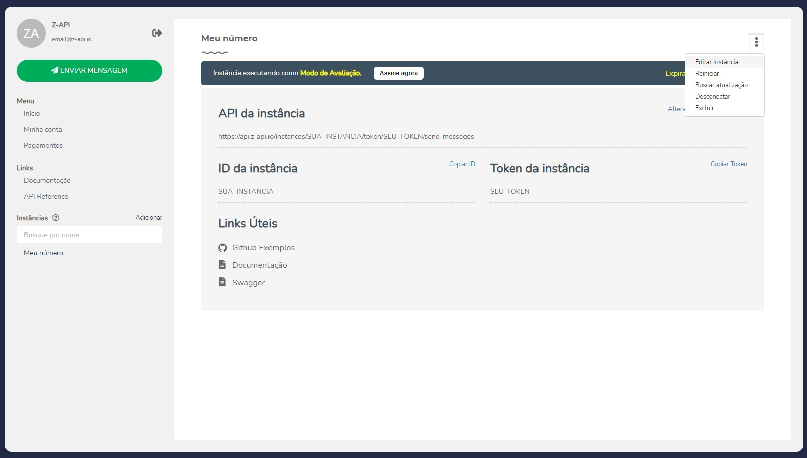

## O que é e para que serve ?

Segundo o Google Webhook é um recurso usado na internet para que uma ferramenta (ou aplicativo) se comunique com outra ferramenta, fornecendo dados em tempo real sempre que um evento acontecer. Desta forma os dois sistemas realizam troca de informações sem que nenhuma ação externa precise ser realizada.

Então se você esta se integrando com o _Z-API_ e precisar receber informações pelo Whatsapp você precisa prover estes end-points na sua aplicação para que a gente consiga te avisar sobre tudo que chega para você no numero conectado. Ou seja toda vez que o número conetado receber uma interação, ou uma notificação vamos fazer uma requisição com o método POST dos eventos para a URL configurada previamente para cada requisição há um corpo em JSON específico.

Atualmete temos 4 webhooks que vou explicar abaixo.

> Obvio você não precisa configurar todos, mas quanto mais você tiver controle sobre sua instância mais vai conseguir extrair recursos e desenvolver negócios com _Z-API_

---

## Ao Enviar

    Utilizado para te passar

---

## Ao Receber

---

## Ao desconectar

---

## Ao receber status de mensagem

> Obvio você não precisa configurar todos, mas quanto mais você tiver controle sobre sua instância mais vai conseguir extrair recursos e desenvolver negócios com _Z-API_

---

Como configurar meu Webhook ?

Acesse nosso painel admin, em opções escolha a opção editar instância.

:::important

Nunca compartilhe o seu id e token com ninguém.
