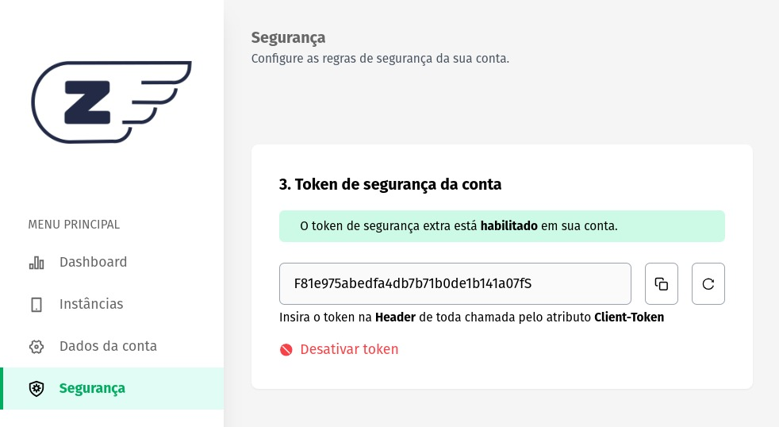

### **Token de segurança da conta**

Esse método de segurança da Z-API, utiliza a validação por token, proporcionando uma camada adicional de proteção para suas instâncias, garantindo que apenas solicitações autorizadas tenham acesso aos seus recursos.

## Ativando o Recurso

Para habilitar o recurso de validação por token, siga estas etapas simples:

1. Faça login na sua conta Z-API.

2. Na aba "Segurança", localize o módulo "Token de Segurança da Conta".

3. Clique na opção "Configurar Agora". Isso gerará um token, que inicialmente estará desabilitado para evitar interrupções na operação da sua aplicação.



## Funcionamento Básico

O funcionamento do método de segurança por token é direto:

1. Após a geração do token, ele deve ser incluído na header de todas as suas requisições HTTP.

2. O token deve ser passado da seguinte forma:
   - **Atributo**: Client-Token
   - **Valor**: [token]

3. Após configurar seu ambiente para enviar o token nas requisições, você pode clicar em "Ativar Token".

4. A partir deste momento, todas as instâncias da sua aplicação só aceitarão requisições que contenham o token na header.

## Comportamento do Token Não Cadastrado

Caso uma requisição seja feita sem o token configurado, a API responderá com um erro, conforme o exemplo abaixo:

```json
{
    "error": "null not allowed"
}
```

Isso garante que apenas solicitações autorizadas com o token sejam processadas.

## Benefícios da Validação por Token

A validação por token oferece inúmeros benefícios para a segurança da sua aplicação:

1. **Proteção Avançada**: O token adiciona uma camada adicional de autenticação, protegendo sua aplicação contra acesso não autorizado.

2. **Controle Total**: Você tem controle total sobre quem pode acessar suas instâncias, garantindo que apenas solicitações legítimas sejam atendidas.

Com a validação por token habilitada, sua aplicação Z-API estará mais segura e protegida contra ameaças cibernéticas, garantindo a integridade e confidencialidade dos seus dados. Certifique-se de configurar e ativar esse recurso em todas as instâncias relevantes para manter sua aplicação segura.