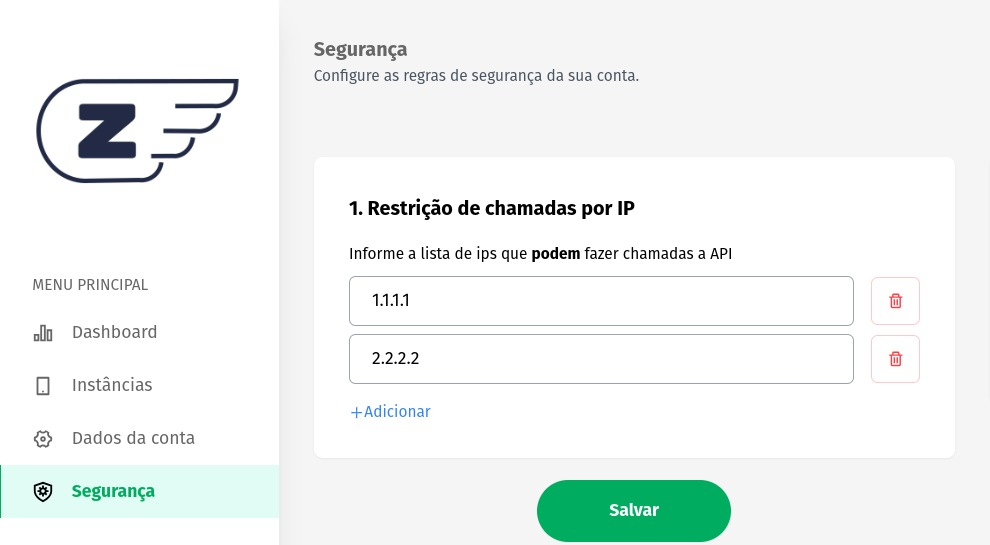

### **Restrição de IPs**

O método de segurança de bloqueio por IP introduz uma camada adicional de proteção, permitindo aos usuários restringir as chamadas feitas à API com base nos endereços IP dos solicitantes. Isso significa que você pode controlar quais IPs têm permissão para acessar sua API e quais são bloqueados. Abaixo, detalhamos como funciona esse recurso:

### **Ativando o Recurso**

Para ativar esse recurso, siga os passos simples abaixo:

1. Faça o Login na Z-API:
Acesse o painel de controle da Z-API com suas credenciais de administrador.

2. Navegue até a Página de Segurança:
No painel da Z-API, encontre a opção "Segurança" no menu de navegação ou na área de configurações.



### **Funcionamento Básico:**

Quando o módulo de Restrição de IPs não está ativado, a API funciona normalmente e permite o acesso de qualquer endereço IP que faça uma solicitação. Isso é adequado para situações em que não é necessária nenhuma restrição de IP e a API deve ser de acesso público.

### **Comportamento de IP não cadastrado:**

Quando uma solicitação é feita a partir de um endereço IP que não está na lista de IPs permitidos, a API responde com uma mensagem de erro clara:

```json
{
    "error": "[IP da chamada] not allowed"
}
```
---

### **Benefícios do bloqueio por IP:**

1. **Controle:** Com essa funcionalidade, você tem controle total sobre quem pode acessar a sua API, permitindo apenas IPs confiáveis.

2. **Proteção contra Ameaças:** A restrição de IPs ajuda a proteger sua API contra acessos não autorizados, tentativas de ataque e outras ameaças à segurança.

3. **Conformidade de Segurança:** Para empresas que precisam cumprir regulamentos rigorosos de segurança, esse recurso pode ser essencial.

O método de segurança de Restrição de IPs torna sua API mais segura, oferecendo controle total sobre quem pode acessá-la e garantindo que apenas IPs autorizados tenham permissão para usar os recursos da API. Essa funcionalidade é especialmente útil para proteger dados sensíveis, evitar abusos e manter a integridade da sua API.