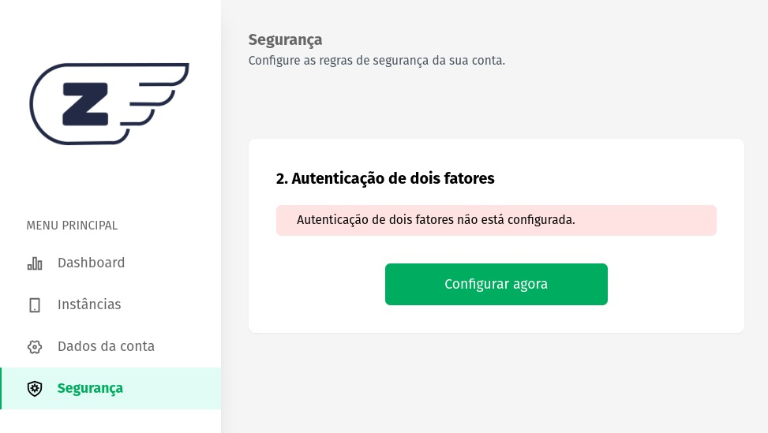

### **Segurança de Dois Fatores:**
A implementação de uma etapa adicional de autenticação, conhecida como autenticação de dois fatores (2FA), no painel Z-API é uma medida de segurança essencial para proteger suas informações e instâncias contra acessos não autorizados. Esta camada extra de proteção exige que, além de sua senha normal, você forneça um segundo fator de autenticação ao fazer login.

### **Ativando o Recurso:**
Para ativar a autenticação de dois fatores no painel da Z-API, siga os seguintes passos:

1. Acesse o painel da Z-API e faça login com suas credenciais existentes.
2. Navegue até a seção de "Segurança".
3. Localize a opção "Autenticação de Dois Fatores" e clique em "Configurar Agora".

Após clicar em "Configurar Agora", o sistema gerará um código QR exclusivo. Esse QR code deve ser sincronizado com um aplicativo autenticador, como o 1Password, Google Authenticator ou Microsoft Authenticator, em seu dispositivo móvel. O 
aplicativo autenticador será usado como o segundo fator de autenticação.

### **Funcionamento**
1. Abra o aplicativo autenticador em seu dispositivo móvel.
2. Adicione uma nova conta manualmente ou escaneie o código QR gerado pelo painel Z-API.
3. O aplicativo autenticador vinculará sua conta Z-API ao seu dispositivo.
4. Agora, cada vez que você fizer login no painel Z-API, será solicitado que você forneça um código de uso único gerado pelo aplicativo autenticador.
5. Esse código de uso único é gerado a cada poucos segundos e é único para sua conta, o que significa que ninguém mais pode acessar sua conta, mesmo que conheça sua senha.

---

### **Benefícios do uso do 2FA**

A implementação da autenticação de dois fatores traz diversos benefícios para a segurança de sua conta Z-API:

1. **Proteção Adicional:** Mesmo se alguém souber sua senha, eles não poderão acessar sua conta sem o segundo fator de autenticação.

2. **Prevenção contra Acesso Não Autorizado:** 2FA dificulta significativamente as tentativas de acesso não autorizado, pois requer um elemento adicional que apenas o titular da conta possui (seu dispositivo móvel).

3. **Segurança de Dados Sensíveis:** Se você está lidando com informações confidenciais ou críticas, a autenticação de dois fatores é uma medida fundamental para garantir a integridade desses dados.

4. **Conformidade com Padrões de Segurança:** Em muitos setores e regulamentações, a autenticação de dois fatores é uma exigência para cumprir os padrões de segurança.

A autenticação de dois fatores é uma camada vital de segurança que protege suas contas e informações no painel Z-API contra ameaças cibernéticas, tornando o acesso não autorizado muito mais difícil e garantindo a integridade de seus dados. É altamente recomendável ativar essa funcionalidade para melhorar a segurança de suas operações.