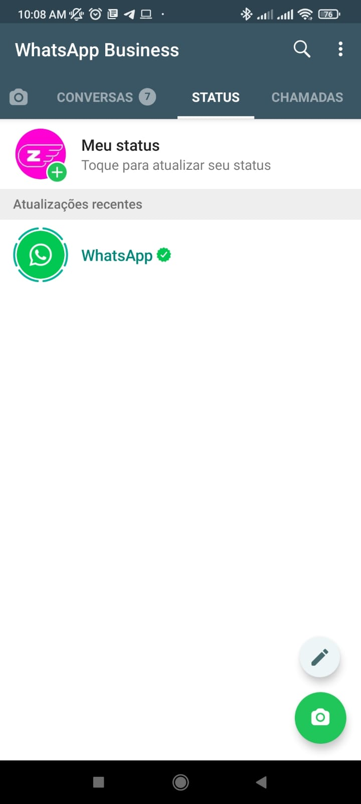
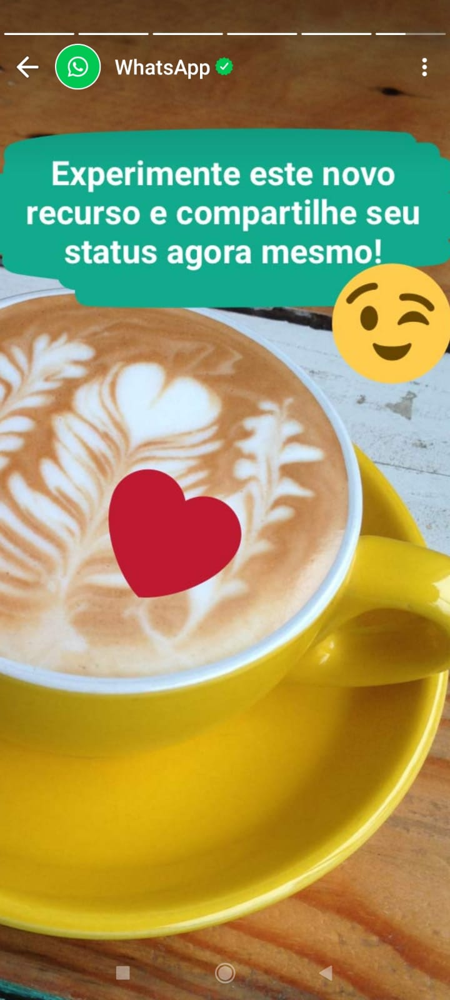

### Conceituação

Tópico dificil este rsrsr, talvez por nunca ter utilizado o recurso eu nunca percebi muito valor nele, também não olho muito os status das pessoas talvez por utlizar o Whatsapp apenas para comunicação, mas enfim o recurso esta disponivel e cada um usa da forma que achar melhor. Se você como eu mal conhece este recurso ele fica "perdidinho" em uma aba entre Conversas e Chamadas, abaixo vou listar algumas imagens que explicam, segundo o proprio Whatsappp o para que serve o recurso

 

 

