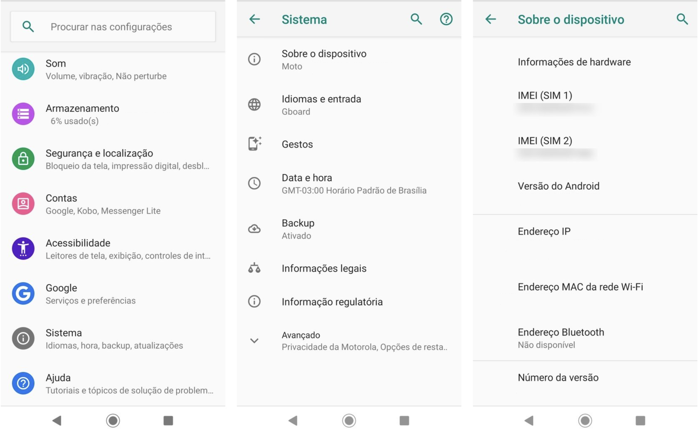
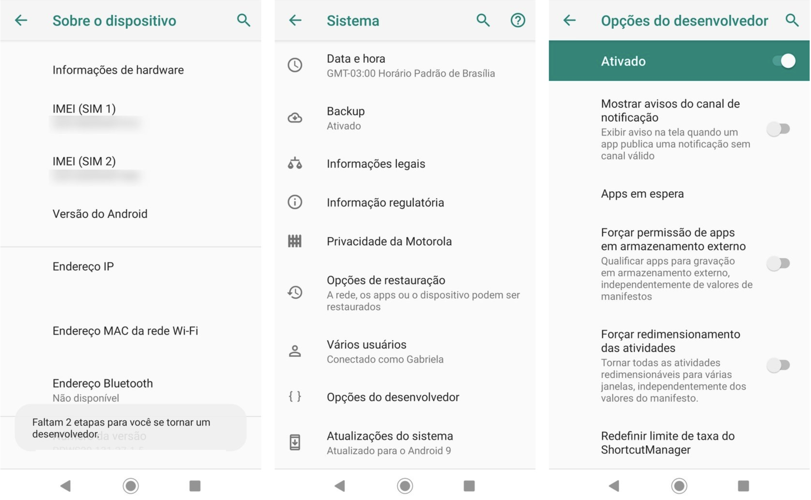
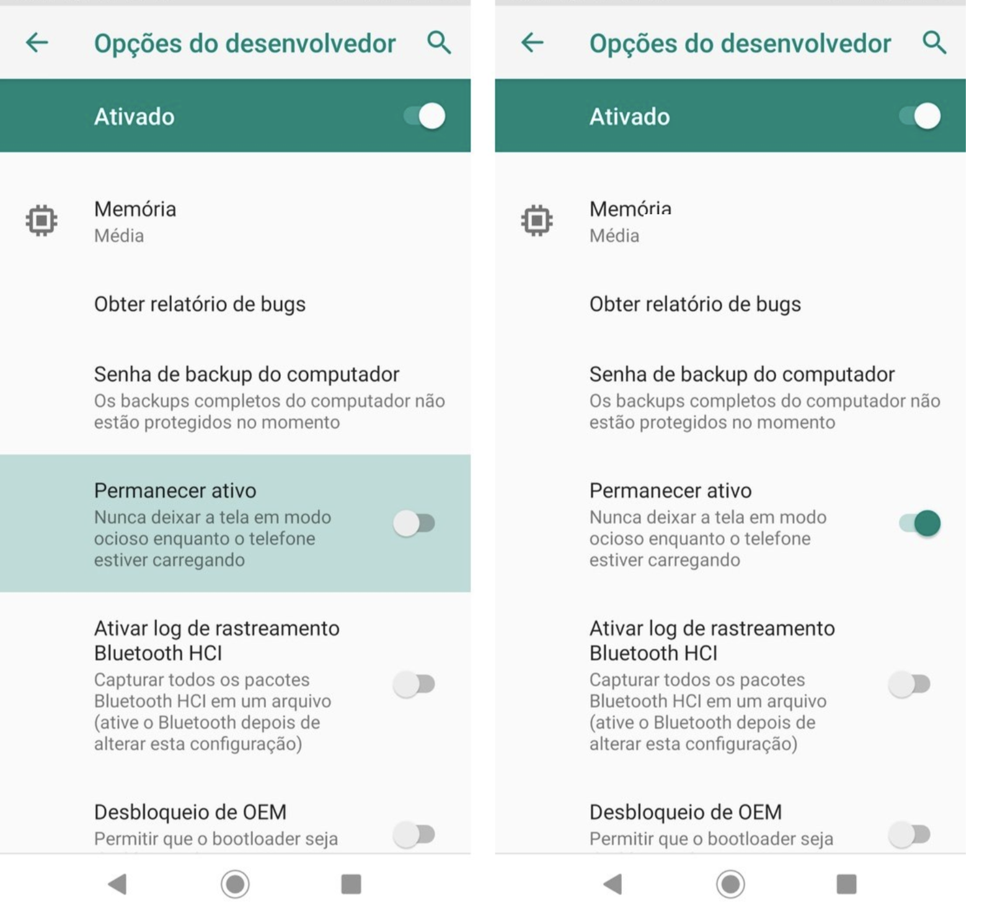

## Introdução

Como todo bom dev você sabe o quanto a Apple dificulta nossa vida não é mesmo ? Logo não temos um tutorial como manter o IOS sempre ativo infelizmente, se você descobrir como fazer isso no IOS não esqueça de nos avisar, teremos prazer em retificar este tópico :)

Voltando para o tópico Android, abaixo listamos em 3 passos como você manter seu Android sempre ativo e manter sua conexão com o Z-API "tinindo".

### Primeiro passo

Você vai precisar habilitar o modo desenvolvedor, para isso você precisa acessar as configurações do seu celular depois vá em Sistema e em seguida Sobre o dispositivo. Depois em número da versão e clique nele 7 vezes seguidas sobre ele, e pronto.

---

### Segundo passo

Depois de ativada as opções de desenvolvedor você vai receber um pedido para confirmar seu método de desbloqueio de tela. Quando voltar ao menu de anterior vai perceber que mais opções estarão disponíveis no final do menu.

---

### Terceiro passo

Agora já temos as opções de desenvolvedor. Dentro dela escolha a opção Manter a tela sempre ativa, e com a opção ativa o dispositivo permanecerá com a tela ligada mesmo durante o carregamento da bateria ;)

