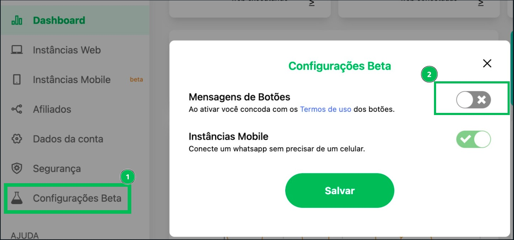

## Introdução

Nas ultimas semanas as mensagens contendo botões estão sofrendo uma instabilidade em seu funcionamento.

**É importante lembrar que isso não se trata de um problema exclusivo da Z-API.**

Este tópico descreve como está o comportamento dos botões no WhatsApp em diferentes cenários.

---

:::danger Atenção

Essa documentação foi atualizada no dia 27/08/2024 então os fatos sobre o funcionamento dos botões estão baseados na realidade deste dia. Importante lembrar que a cada atualização do whatsapp os botões podem sofrer alterações.

:::

## Fatores decisivos:

#### Para o funcionamento dos botões no WhatsApp, são dois fatores decisivos:

- Se o WhatsApp que está disparando a mensagem é business ou normal
- Se a mensagem está sendo enviada para chat normal ou para um grupo.
- Aceitar os termos de uso dos botões

## Aceite dos termos de uso dos botões

Para utilizar a funcionalidade dos botões, é necessário que você aceite os termos de uso, reconhecendo que está ciente de que futuras atualizações do WhatsApp podem causar instabilidades nessa funcionalidade.

## Tipos de botões

#### Existem quatro tipos de botões no WhatsApp:

- Botão simples com texto (/send-button-list)
- Botão simples com imagem (/send-button-list-image)
- Botão simples com video (/send-button-list-video)
- Lista de opções (/send-option-list)
- Botões de ações (/send-button-actions)
- Botão de cópia (/send-button-otp)

---

## Comportamento dos botões:

### [Botão simples com texto:](https://developer.z-api.io/message/send-button-list)

- Enviando de WhatsApp Normal para Grupo: **FUNCIONA**
- Enviando de WhatsApp Normal para Chat Normal: **FUNCIONA**
- Enviando de WhatsApp Business para Chat Normal: **FUNCIONA**
- Enviando de WhatsApp Business para Grupo: **FUNCIONA**

### [Botão simples com imagem:](https://developer.z-api.io/message/send-button-list-image)

- Enviando de WhatsApp Normal para Chat Normal: **FUNCIONA**
- Enviando de WhatsApp Normal para Grupo: **FUNCIONA**
- Enviando de WhatsApp Business para Chat Normal: **FUNCIONA**
- Enviando de WhatsApp Business para Grupo: **FUNCIONA**

### [Botão simples com video:](https://developer.z-api.io/message/send-button-list-video)

- Enviando de WhatsApp Normal para Chat Normal: **FUNCIONA**
- Enviando de WhatsApp Normal para Grupo: **FUNCIONA**
- Enviando de WhatsApp Business para Chat Normal: **FUNCIONA**
- Enviando de WhatsApp Business para Grupo: **FUNCIONA**

### [Lista de opções:](https://developer.z-api.io/message/send-option-list)

- Enviando de WhatsApp Normal para Chat Normal: **FUNCIONA**
- Enviando de WhatsApp Normal para Grupo: **FUNCIONA**
- Enviando de WhatsApp Business para Chat Normal: **FUNCIONA**
- Enviando de WhatsApp Business para Grupo: **FUNCIONA**

### [Botões de ações:](https://developer.z-api.io/message/send-button-actions)

- Enviando de WhatsApp Normal para Chat Normal: **FUNCIONA**
- Enviando de WhatsApp Normal para Grupo: **FUNCIONA**
- Enviando de WhatsApp Business para Chat Normal: **FUNCIONA**
- Enviando de WhatsApp Business para Grupo: **FUNCIONA**

### [Botão de cópia:](https://developer.z-api.io/message/send-button-otp)

- Enviando de WhatsApp Normal para Chat Normal: **FUNCIONA**
- Enviando de WhatsApp Normal para Grupo: **FUNCIONA**
- Enviando de WhatsApp Business para Chat Normal: **FUNCIONA**
- Enviando de WhatsApp Business para Grupo: **FUNCIONA**

## Resumo

Em resumo, o uso dos recursos de botões no WhatsApp está sujeito a problemas. tffTanto para o WhatsApp normal quanto para o WhatsApp Business, há dificuldades no envio desses tipos de botões em chats normais e grupos. Lista de opções para chat normal funcionam. Se você estiver usando o WhatsApp Business, a única coisa que está funcionando é a lista de opções para chat normal, com problemas para grupos.
