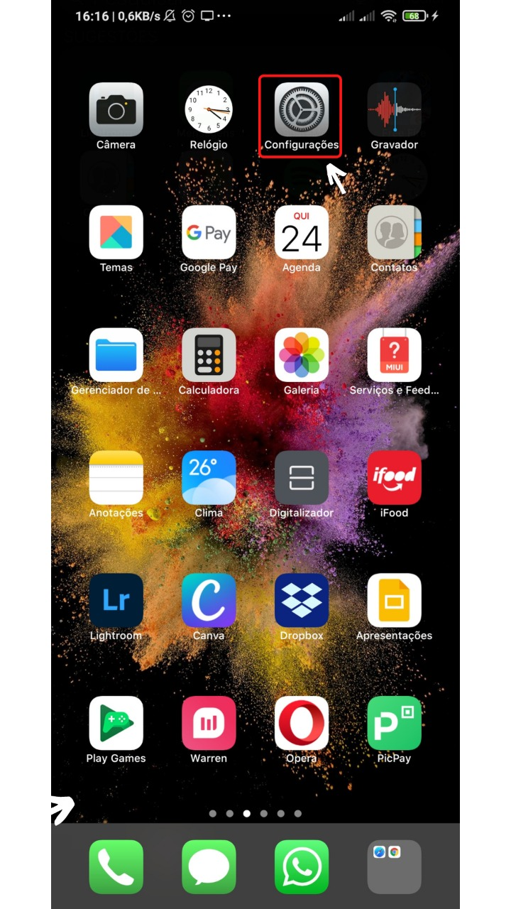
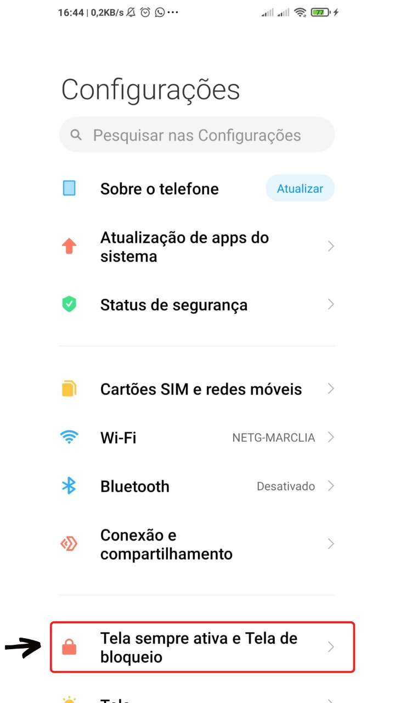
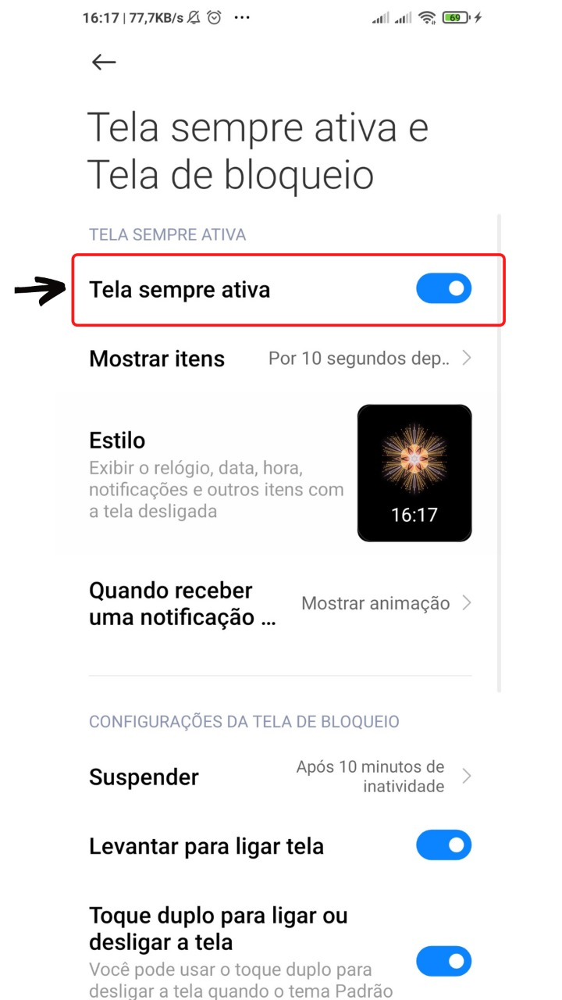
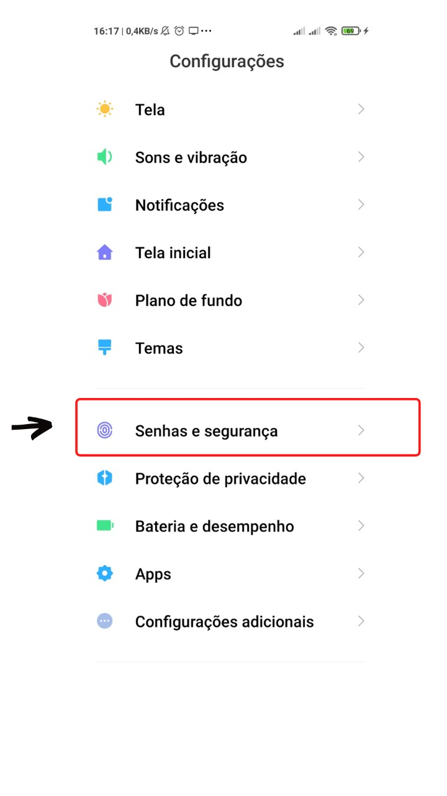
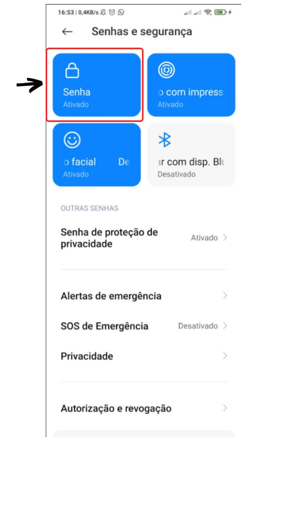
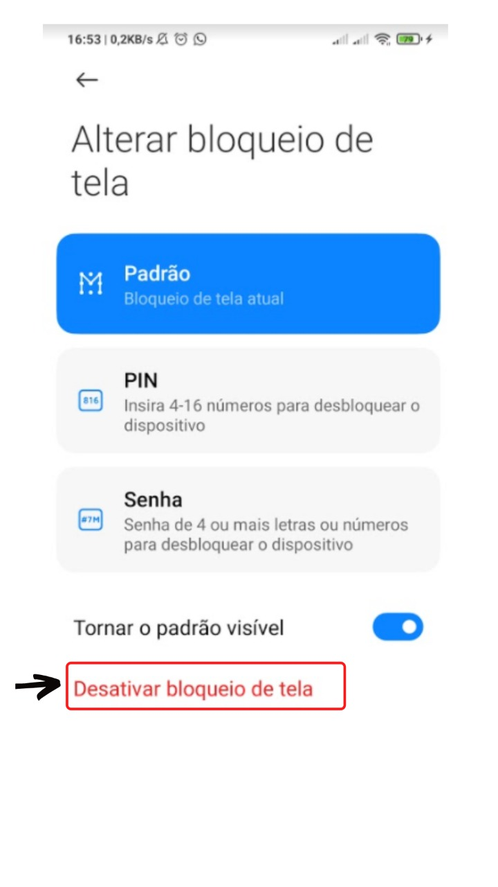
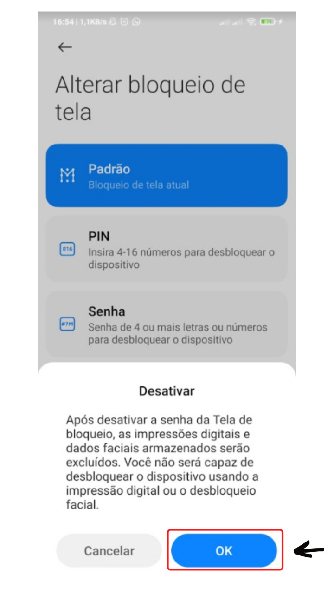
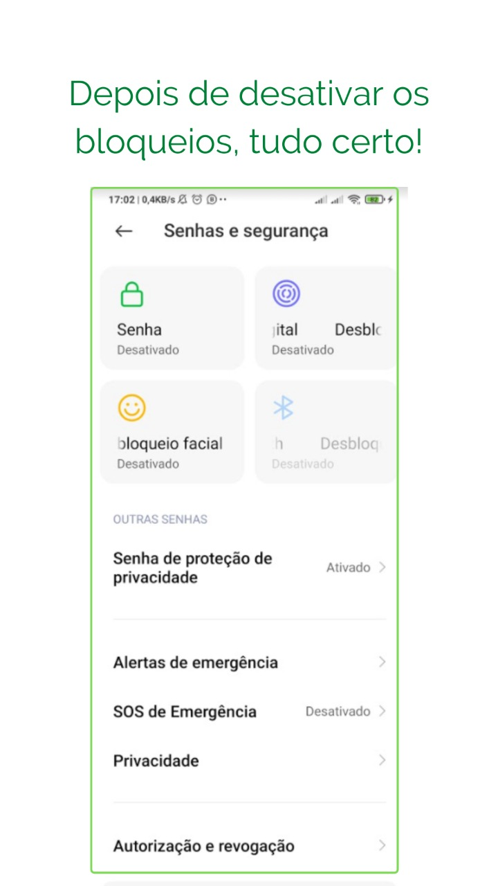

## Introdução

Como você ja deve ter percebido quando seu celular bloqueia a tela o whatsapp para de rodar em segundo plano o que pode ocasionar em perda de conexão com a internet, fazendo com que sua conexão como o Whatsapp Web seja interrompida consequentemente caso esteja conectado ao Z-API seu serviço pode ser afetado. Por isso fizemos um passo a passo ensinado como mitigar este problema.

**Os exemplos abaixo foram realizados com celular Android**

### Primeiro passo

Acesse as configurações do Android

### Segundo passo

Depois acesse “Bloqueio de tela e senhas”

---

### Terceiro passo

Selecione a opção sempre ativa.

---

### Quarto passo

Em seguinda vá em Senhas e Segurança.

---

### Quinto passo

Escolha a opçao senhas

---

### Sexto passo

Desative o bloqueio de telas.

---

### Sétimo passo

Seja feliz !

