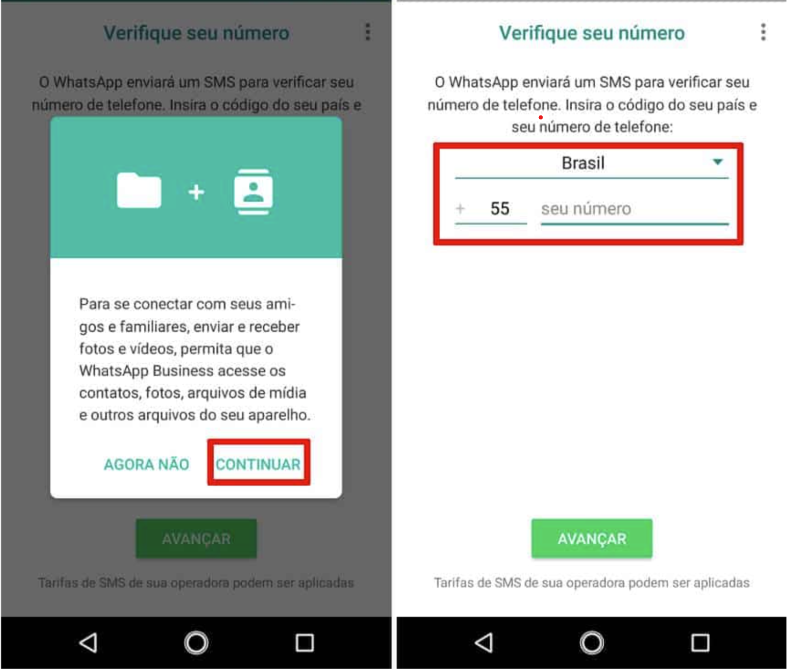
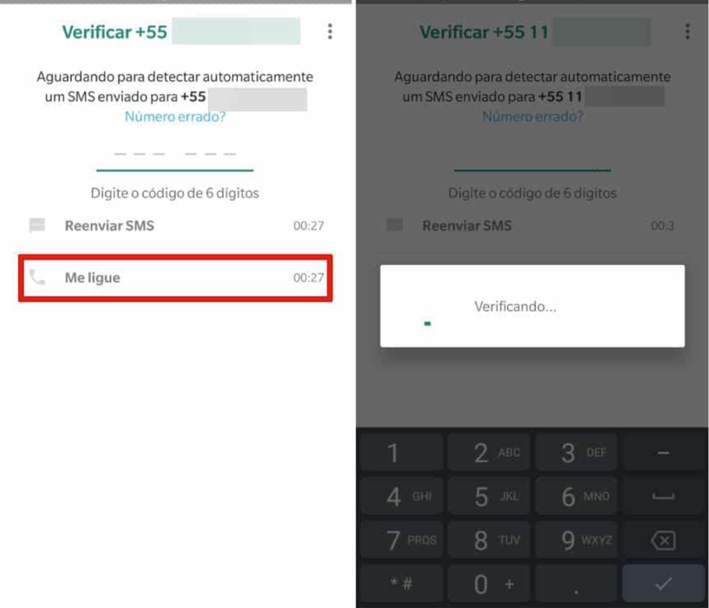

## Introdução

Para habilitar um número fixo, você vai precisar ter um aparelho celular para hospedar seu número fixo. (esta opção fica disponível no Whatsapp Business). No passo a passo que criamos utilizamos um celular com Android.

### Primeiro passo

Baixe o aplicativo Whatsapp Business em um celular

[Android]

[IOS]

[android]: https://play.google.com/store/apps/details?id=com.whatsapp.w4b&hl=pt_BR&gl=US
[ios]: https://apps.apple.com/us/app/whatsapp-business/id1386412985

---

### Segundo passo

O WhatsApp Business vai pedir autorização para acessar os arquivos do celular, escolha a opção continuar para liberar o acesso. Na tela seguinte, escolha o país e informe o número do seu telefone fixo.

---

### Terceiro passo

Você receberá um código, mas como não é possivel receber um SMS em um telefone fixo, aguarde até que a contagem e escolha a opção **Me ligue**

E pronto você receberá uma ligação do WhatsApp Business que falará o código de ativação, ai é só digitar no campo indicado ;)

---

### Quarto passo

Seja Feliz !

Faça as configurações no app Whatsapp Bussines e leia o QrCode Z-API para dar Asas para sua imaginação !
