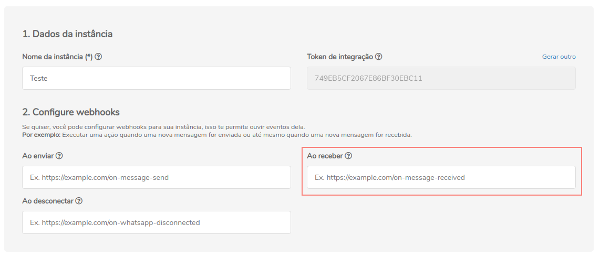

## Conceituação

Esse é o webhook de retorno de mensagens recebidas

:::caution Atenção

O Z-API não aceita webhooks que não sejam HTTPS

:::

---

## Atualizando Webhook

Para atualizar a rota do webhook é possível fazer isso pela API ou pelo painel administrativo.

### API

#### /update-webhook-received

`PUT` https://api.z-api.io/instances/SUA_INSTANCIA/token/SEU_TOKEN/update-webhook-received

#### Request Body

```json
{
  "value": "https://endereco-do-seu-sistema.com.br/instancia/SUA_INSTANCIA/receive"
}
```

---

### Painel Administrativo



---

## Retornos dos webhooks

Os possíveis retornos do webhook **on-message-received** estão cadastrado logo abaixo:

## Response

| Atributos | Tipo | Descrição |
| :-- | :-: | :-- |
| waitingMessage | string | Identifica se a sua mensagem está com status de "Aguardando a mensagem"|
| phone | string | Número de telefone, ou do grupo que enviou a mensagem. |
| participantPhone | string | Número de telefone do membro do grupo que enviou a mensagem. |
| messageId | string | Idetificador da mensagem na conversa. |
| status | string | Status que a mensagem se encontra no momento do envio (PENDING, SENT, RECEIVED, READ ou PLAYED). |
| referenceMessageId | string | Referência a mensagem que foi respondida para o caso da mensagem recebida ser uma resposta a uma mensagem da conversa. |
| momment | integer | Momento em que a mensagem foi recebida ou do erro. |
| type | string | Tipo do evento da instância, nesse caso será "ReceivedCallBack". |
| photo | string | Url da foto do usuário que enviou a mensagem. |
| text.message | string | Texto da mensagem. |
| image.caption | string | Leganda da foto. |
| image.imageUrl | string | Url da foto. |
| image.thumbnailUrl | string | Url da thumbnail da foto. |
| image.mimeType | string | MimeType da imagem. |
| audio.mimeType | string | MimeType do áudio. |
| audio.audioUrl | string | Url do áudio. |
| video.caption | string | Legenda do vídeo. |
| video.videoUrl | string | Url do vídeo. |
| video.mimeType | string | MimeType do vídeo. |
| contact.displayName | string | Nome do contato. |
| contact.vCard | string | VCard contendo as informações do contato. |
| document.mimeType | string | MimeType do documento. |
| document.fileName | string | Nome do documento. |
| document.title | string | Título do documento. |
| document.pageCount | string | Número de páginas do documento. |
| document.thumbnailUrl | string | Url da thumbnail do documento. |
| document.documentUrl | string | Url do documento. |
| location.thumbnailUrl | string | Url da thumbnail da localização. |
| location.longitude | float | Longitude da localização. |
| location.latitude | float | Latitude da localização. |
| location.url | string | Url da localização. |
| location.name | string | Nome da localização. |
| location.address | string | Endereço da localização. |
| sticker.mimeType | string | MimeType do sticker. |
| sticker.stickerUrl | string | Url do sticker. |

---

### 200

### Exemplo de retorno de texto

```json
{
  "waitingMessage": false,
  "isGroup": false,
  "instanceId": "A20DA9C0183A2D35A260F53F5D2B9244",
  "messageId": "A20DA9C0183A2D35A260F53F5D2B9244",
  "phone": "5544999999999",
  "fromMe": false,
  "momment": 1632228638000,
  "status": "RECEIVED",
  "chatName": "name",
  "senderPhoto": "https://",
  "senderName": "name",
  "participantPhone": null,
  "photo": "https://",
  "broadcast": false,
  "type": "ReceivedCallback",
  "text": {
    "message": "teste"
  },
  "instanceId": "instance.id"
}
```

### Exemplo de retorno de texto (Lista de Botão)

```json
{
  "waitingMessage": false,
  "isGroup": false,
  "instanceId": "A20DA9C0183A2D35A260F53F5D2B9244",
  "messageId": "A20DA9C0183A2D35A260F53F5D2B9244",
  "phone": "5544999999999",
  "fromMe": false,
  "momment": 1634645380000,
  "status": "RECEIVED",
  "chatName": "Nome",
  "senderPhoto": "https://",
  "senderName": "Nome",
  "participantPhone": null,
  "photo": "https://",
  "broadcast": false,
  "referenceMessageId": "A20DA9C0183A2D35A260F53F5D2B9244",
  "forwarded": false,
  "type": "ReceivedCallback",
  "buttonsResponseMessage": {
    "buttonId": "1",
    "message": "Ótimo"
  },
  "instanceId": "instance.id"
}
```

### Exemplo de retorno de texto (Lista de Opcão)

```json
{
  "waitingMessage": false,
  "isGroup": false,
  "instanceId": "A20DA9C0183A2D35A260F53F5D2B9244",
  "messageId": "A20DA9C0183A2D35A260F53F5D2B9244",
  "phone": "5544999999999",
  "fromMe": false,
  "momment": 1634645683000,
  "status": "RECEIVED",
  "chatName": "Nome",
  "senderPhoto": "https://",
  "senderName": "Nome",
  "participantPhone": null,
  "photo": "https://",
  "broadcast": false,
  "referenceMessageId": "A20DA9C0183A2D35A260F53F5D2B9244",
  "forwarded": false,
  "type": "ReceivedCallback",
  "listResponseMessage": {
    "message": "Z-API Asas para sua imaginação",
    "title": "Z-API",
    "selectedRowId": "1"
  },
  "instanceId": "instance.id"
}
```

### Exemplo de retorno de foto

```json
{
  "waitingMessage": false,
  "isGroup": false,
  "instanceId": "A20DA9C0183A2D35A260F53F5D2B9244",
  "messageId": "A20DA9C0183A2D35A260F53F5D2B9244",
  "phone": "5544999999999",
  "fromMe": false,
  "momment": 1632228828000,
  "status": "RECEIVED",
  "chatName": "name",
  "senderPhoto": "https://",
  "senderName": "name",
  "participantPhone": null,
  "photo": "https://",
  "broadcast": false,
  "type": "ReceivedCallback",
  "image": {
    "mimeType": "image/jpeg",
    "imageUrl": "https://",
    "thumbnailUrl": "https://",
    "caption": ""
  },
  "instanceId": "instance.id"
}
```

### Exemplo de retorno de áudio

```json
{
  "waitingMessage": false,
  "isGroup": false,
  "instanceId": "A20DA9C0183A2D35A260F53F5D2B9244",
  "messageId": "A20DA9C0183A2D35A260F53F5D2B9244",
  "phone": "5544999999999",
  "fromMe": false,
  "momment": 1632228849000,
  "status": "RECEIVED",
  "chatName": "name",
  "senderPhoto": "https://",
  "senderName": "name",
  "participantPhone": null,
  "photo": "https://",
  "broadcast": false,
  "type": "ReceivedCallback",
  "audio": {
    "audioUrl": "https://",
    "mimeType": "audio/ogg; codecs=opus"
  },
  "instanceId": "instance.id"
}
```

### Exemplo de retorno de vídeo

```json
{
  "waitingMessage": false,
  "isGroup": false,
  "instanceId": "A20DA9C0183A2D35A260F53F5D2B9244",
  "messageId": "A20DA9C0183A2D35A260F53F5D2B9244",
  "phone": "5544999999999",
  "fromMe": false,
  "momment": 1632228889000,
  "status": "RECEIVED",
  "chatName": "name",
  "senderPhoto": "https://",
  "senderName": "name",
  "participantPhone": null,
  "photo": "https://",
  "broadcast": false,
  "type": "ReceivedCallback",
  "video": {
    "videoUrl": "https://",
    "mimeType": "video/mp4",
    "caption": ""
  },
  "instanceId": "instance.id"
}
```

### Exemplo de retorno de contato

```json
{
  "waitingMessage": false,
  "isGroup": false,
  "instanceId": "A20DA9C0183A2D35A260F53F5D2B9244",
  "messageId": "A20DA9C0183A2D35A260F53F5D2B9244",
  "phone": "5544999999999",
  "fromMe": false,
  "momment": 1632228925000,
  "status": "RECEIVED",
  "chatName": "name",
  "senderPhoto": "https://",
  "senderName": "name",
  "participantPhone": null,
  "photo": "https://",
  "broadcast": false,
  "type": "ReceivedCallback",
  "contact": {
    "displayName": "Cesar Baleco",
    "vCard": "BEGIN:VCARD\nVERSION:3.0\nN:;nome;;;\nFN:nome\nTEL;type=CELL;type=VOICE;waid=5544999999999:+55 44 9999-9999\nEND:VCARD",
    "phones": ["5544999999999"]
  },
  "instanceId": "instance.id"
}
```

### Exemplo de retorno de documento

```json
{
  "waitingMessage": false,
  "isGroup": false,
  "instanceId": "A20DA9C0183A2D35A260F53F5D2B9244",
  "messageId": "A20DA9C0183A2D35A260F53F5D2B9244",
  "phone": "5544999999999",
  "fromMe": false,
  "momment": 1632228955000,
  "status": "RECEIVED",
  "chatName": "name",
  "senderPhoto": "https://",
  "senderName": "name",
  "participantPhone": null,
  "photo": "https://",
  "broadcast": false,
  "type": "ReceivedCallback",
  "document": {
    "documentUrl": "https://",
    "mimeType": "application/pdf",
    "title": "nome",
    "pageCount": 1,
    "fileName": "nome.pdf"
  },
  "instanceId": "instance.id"
}
```

### Exemplo de retorno de localização

```json
{
  "waitingMessage": false,
  "isGroup": false,
  "instanceId": "A20DA9C0183A2D35A260F53F5D2B9244",
  "messageId": "A20DA9C0183A2D35A260F53F5D2B9244",
  "phone": "5544999999999",
  "fromMe": false,
  "momment": 1632228970000,
  "status": "RECEIVED",
  "chatName": "name",
  "senderPhoto": "https://",
  "senderName": "name",
  "participantPhone": null,
  "photo": "https://",
  "broadcast": false,
  "type": "ReceivedCallback",
  "location": {
    "longitude": -99.999999999999999,
    "latitude": -99.9999999999999999,
    "address": "",
    "url": ""
  },
  "instanceId": "instance.id"
}
```

### Exemplo de retorno de sticker

```json
{
  "waitingMessage": false,
  "isGroup": false,
  "instanceId": "A20DA9C0183A2D35A260F53F5D2B9244",
  "messageId": "A20DA9C0183A2D35A260F53F5D2B9244",
  "phone": "5544999999999",
  "fromMe": false,
  "momment": 1632228982000,
  "status": "RECEIVED",
  "chatName": "name",
  "senderPhoto": "https://",
  "senderName": "name",
  "participantPhone": null,
  "photo": "https://",
  "broadcast": false,
  "type": "ReceivedCallback",
  "sticker": {
    "stickerUrl": "https://",
    "mimeType": "image/webp"
  },
  "instanceId": "instance.id"
}
```

### Exemplo de retorno de pagamento feito

```json
{
  "waitingMessage": false,
  "isGroup": false,
  "instanceId": "A20DA9C0183A2D35A260F53F5D2B9244",
  "messageId": "A20DA9C0183A2D35A260F53F5D2B9244",
  "phone": "5544999999999",
  "fromMe": false,
  "momment": 1632229683000,
  "status": "RECEIVED",
  "chatName": "name",
  "senderPhoto": "https://",
  "senderName": "name",
  "participantPhone": null,
  "photo": "https://",
  "broadcast": false,
  "type": "ReceivedCallback",
  "requestPayment": {
    "value": 1,
    "currencyCode": "BRL",
    "expiration": 1632834482000,
    "requestPhone": "5544999999999",
    "paymentInfo": {
      "receiverPhone": "5544999999999",
      "value": 1,
      "currencyCode": "BRL",
      "status": "WAITING",
      "transactionStatus": "COLLECT_SUCCESS"
    }
  },
  "instanceId": "instance.id"
}
```

### Exemplo de retorno de pedido de pagamento

```json
{
  "waitingMessage": false,
  "isGroup": false,
  "instanceId": "A20DA9C0183A2D35A260F53F5D2B9244",
  "messageId": "A20DA9C0183A2D35A260F53F5D2B9244",
  "phone": "5544999999999",
  "fromMe": true,
  "momment": 1632230332000,
  "status": "MESSAGE_RECEIVED",
  "chatName": "name",
  "senderName": "name",
  "participantPhone": "5544999999999",
  "photo": "https://",
  "broadcast": false,
  "type": "ReceivedCallback",
  "notification": "PAYMENT_ACTION_REQUEST_DECLINED",
  "notificationParameters": ["5544999999999", "BRL", "1000"],
  "instanceId": "instance.id"
}
```

### Exemplo de retorno de recebimento de pagamento

```json
{
  "waitingMessage": false,
  "isGroup": false,
  "instanceId": "A20DA9C0183A2D35A260F53F5D2B9244",
  "messageId": "A20DA9C0183A2D35A260F53F5D2B9244",
  "phone": "5544999999999",
  "fromMe": false,
  "momment": 1632230512000,
  "status": "RECEIVED",
  "chatName": "name",
  "senderPhoto": "https://",
  "senderName": "name",
  "participantPhone": null,
  "photo": "https://",
  "broadcast": false,
  "type": "ReceivedCallback",
  "sendPayment": {
    "paymentInfo": {
      "receiverPhone": "5544999999999",
      "value": 1,
      "currencyCode": "BRL",
      "status": "COMPLETE",
      "transactionStatus": "SUCCESS"
    }
  },
  "instanceId": "instance.id"
}
```

### Exemplo de retorno de produto

```json
{
  "waitingMessage": false,
  "isGroup": false,
  "instanceId": "A20DA9C0183A2D35A260F53F5D2B9244",
  "messageId": "A20DA9C0183A2D35A260F53F5D2B9244",
  "phone": "5544999999999",
  "fromMe": false,
  "momment": 1632233527000,
  "status": "RECEIVED",
  "senderPhoto": "https://",
  "senderName": "5544999999999",
  "participantPhone": null,
  "photo": "https://",
  "broadcast": false,
  "type": "ReceivedCallback",
  "product": {
    "productImage": "https://",
    "businessOwnerJid": "5544999999999",
    "currencyCode": "BRL",
    "productId": "99999999999999999999",
    "description": "",
    "productImageCount": 1,
    "price": 1,
    "url": "",
    "retailerId": "",
    "firstImageId": "",
    "title": "name"
  },
  "instanceId": "instance.id"
}
```

##

### Exemplo de retorno de carrinho

```json
{
  "waitingMessage": false,
  "isGroup": false,
  "instanceId": "A20DA9C0183A2D35A260F53F5D2B9244",
  "messageId": "A20DA9C0183A2D35A260F53F5D2B9244",
  "phone": "5544999999999",
  "fromMe": false,
  "momment": 1632233527000,
  "status": "RECEIVED",
  "chatName": "name",
  "senderPhoto": null,
  "senderName": "name",
  "photo": "https://",
  "broadcast": false,
  "forwarded": false,
  "type": "ReceivedCallback",
  "order": {
    "itemCount": 1,
    "orderId": "422508169684569",
    "message": "",
    "orderTitle": "name",
    "sellerJid": "5544999999999",
    "thumbnailUrl": "https://",
    "token": "AR5d4yUr+DmSzeCR2kUtPEeMfS+eG0O+S/T/17B+oY1mfA==",
    "currency": "BRL",
    "total": 2000,
    "subTotal": 2000,
    "products": [
      {
        "quantity": 1,
        "name": "nameProduct",
        "productId": "5338924696127051",
        "retailerId": "1242",
        "price": 2000,
        "currencyCode": "BRL"
      }
    ]
  }
}
```

### 405

Neste caso certifique que esteja enviando o corretamente a especificação do método, ou seja verifique se você enviou o POST ou GET conforme especificado no inicio deste tópico.

### 415

Caso você receba um erro 415, certifique de adicionar na headers da requisição o "Content-Type" do objeto que você está enviando, em sua grande maioria "application/json"

---

## Notification Response

### Conceituação

As notificações são mensagens de WhatsApp que se baseiam em modelos de mensagens prévias do WhatsApp.

Posto dessa forma, aqui estão documentadas as notificações que recebemos, caso não queira receber essas notificações é necessário ignorar a mensagem quando ela chegar com o atributo notification.

### Exemplos

```json
case 'GROUP_PARTICIPANT_LEAVE':
campo_html = "<div align='center'><div class='alert alert-primary' role='alert'><span>Participante " + valor2.notificationparameters + " saiu do grupo!<br><br></span>" + campohora + "</div></div>"
break;
```

```json
case 'E2E_ENCRYPTED':
// code block
campo_html = "<div align='center'><div class='alert alert-primary' role='alert'><span>As mensagens são protegidas com a criptografia<br><br></span>" + campohora + "</div></div>"
break;
```

```json
case 'GROUP_CREATE':
campo_html = "<div align='center'><div class='alert alert-primary' role='alert'><span>Criou o grupo \'" + valor2.notificationparameters + "\'<br><br></span>" + campohora + "</div></div>"
break;
```

```json
case 'GROUP_PARTICIPANT_ADD':
campo_html = "<div align='center'><div class='alert alert-primary' role='alert'><span>Participante " + valor2.notificationparameters + " adicionado.<br><br></span>" + campohora + "</div></div>"
break;
```

```json
case "CALL_MISSED_VOICE":
campo_html = "<div align='center'><div class='alert alert-primary' role='alert'><span>Chamada de voz perdida!<br><br></span>" + campohora + "</div></div>"
break
```

```json
case "CALL_MISSED_VIDEO":
campo_html = "<div align='center'><div class='alert alert-primary' role='alert'><span>Chamada de vídeo perdida!<br><br></span>" + campohora + "</div></div>"
break;
```

```json
case 'GROUP_PARTICIPANT_REMOVE':
campo_html = "<div align='center'><div class='alert alert-primary' role='alert'><span>Participante " + valor2.notificationparameters + " foi removido.<br><br></span>" + campohora + "</div></div>"
break;
```

```json
case "CIPHERTEXT":
campo_html = "<div align='center'><div class='alert alert-primary' role='alert'><span>As mensagens são protegidas com a criptografia de ponta.<br><br></span>" + campohora + "</div></div>"
break;
```

```json
case "BLUE_MSG_SELF_PREMISE_UNVERIFIED":
campo_html = "<div align='center'><div class='alert alert-primary' role='alert'><span>Você está conversando com uma conta comercial, mas ainda não foi confirmada pelo WhatsApp.<br><br></span>" + campohora + "</div></div>"
break;
```

```json
case "BLUE_MSG_SELF_PREMISE_VERIFIED":
campo_html = "<div align='center'><div class='alert alert-primary' role='alert'><span>Você está conversando com uma conta comercial verificada pelo WhatsApp.<br><br></span>" + campohora + "</div></div>"
break;
```

```json
case "BIZ_MOVE_TO_CONSUMER_APP":
campo_html = "<div align='center'><div class='alert alert-primary' role='alert'><span>Esta conta comercial agora está registrada como uma conta pessoal e pode não mais pertencer a uma empresa.<br><br></span>" + campohora + "</div></div>"
break;
```

```json
case "REVOKE":
campo_html = "<div align='center'><div class='alert alert-primary' role='alert'><span>Apagou uma mensagem.<br><br></span>" + campohora + "</div></div>"
break;
```

<!-- ## Code

<iframe src="//api.apiembed.com/?source=https://raw.githubusercontent.com/Z-API/z-api-docs/main/json-examples/on-message-received.json&targets=all" frameborder="0" scrolling="no" width="100%" height="500px" seamless></iframe> -->
