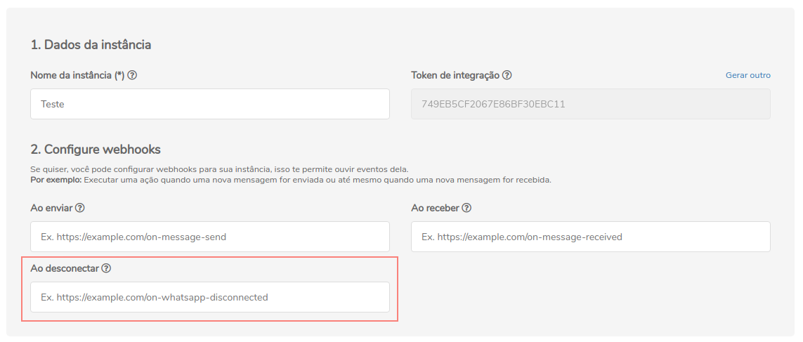

## Conceituação

Esse é o webhook de resposta de desconexão

:::caution Atenção

O Z-API não aceita webhooks que não sejam HTTPS

:::

---

## Atualizando Webhook

Para atualizar a rota do webhook é possível fazer isso pela API ou pelo painel administrativo.

### API

#### /update-webhook-disconnected

`PUT` https://api.z-api.io/instances/SUA_INSTANCIA/token/SEU_TOKEN/update-webhook-disconnected

### Header

|      Key       |            Value            |
| :------------: |     :-----------------:     |
|  Client-Token  | **[TOKEN DE SEGURANÇA DA CONTA](https://developer.z-api.io/security/client-token)** |
---

#### Request Body

```json
{
  "value": "https://endereco-do-seu-sistema.com.br/instancia/SUA_INSTANCIA/disconnected"
}
```

---

### Painel Administrativo



---

## Retornos dos webhooks

Os possíveis retornos do webhook **on-whatsapp-disconnected** estão cadastrado logo abaixo:

## Response

| Atributos | Tipo | Descrição |
| :-- | :-: | :-- |
| momment | integer | Momento em que a instância foi desconectada do número. |
| error | string | Descrição do erro. |
| disconnected | boolean | Indicação se a instância está conectada com o número ou não. |
| type | string | Tipo do evento da instância, nesse caso será "DisconnectedCallback". |

---

### 200

```json
{
  "momment": 1580163342,
  "error": "Device has been disconnected",
  "disconnected": true,
  "type": "DisconnectedCallback",
  "instanceId": "instance.id"
}
```

### 405

Neste caso certifique que esteja enviando o corretamente a especificação do método, ou seja verifique se você enviou o POST ou PUT conforme especificado no inicio deste tópico.

### 415

Caso você receba um erro 415, certifique de adicionar na headers da requisição o "Content-Type" do objeto que você está enviando, em sua grande maioria "application/json"

<!--
## Code

<iframe src="//api.apiembed.com/?source=https://raw.githubusercontent.com/Z-API/z-api-docs/main/json-examples/on-whatsapp-disconnected.json&targets=all" frameborder="0" scrolling="no" width="100%" height="500px" seamless></iframe> -->
