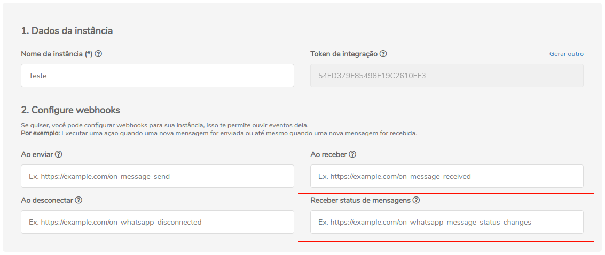

## Método

## `POST` on-whatsapp-message-status-changes

## Conceituação

Esse é o webhook de retorno do status da mensagem

:::caution Atenção

O Z-API não aceita webhooks que não sejam HTTPS

:::

---



---

## Atributos

### Obrigatórios

| Atributos | Tipo | Descrição |
| :-- | :-: | :-- |
| status | string | Tipo do status no qual a mensagem se encontra. |
| id | string | Identificador(es) da(s) mensagem(ns). |
| phone | string | Número de telefone de destino da mensagem. |
| momment | string | Momento em que a instância foi desconectada do número. |
| type | string | Tipo do evento da instância, nesse caso será "MessageStatusCallback". |

---

## Response

### 200

```json
{
  "status": "MESSAGE_RECEIVED",
  "ids": ["999999999999999999999"],
  "momment": 1632234645000,
  "phone": "5544999999999",
  "type": "MessageStatusCallback"
}
```

### 405

Neste caso certifique que esteja enviando o corretamente a especificação do método, ou seja verifique se você enviou o POST ou GET conforme especificado no inicio deste tópico.

### 415

Caso você receba um erro 415, certifique de adicionar na headers da requisição o "Content-Type" do objeto que você está enviando, em sua grande maioria "application/json"

---

## Code

<iframe src="//api.apiembed.com/?source=https://raw.githubusercontent.com/Z-API/z-api-docs/main/json-examples/on-whatsapp-message-status-changes.json&targets=all" frameborder="0" scrolling="no" width="100%" height="500px" seamless></iframe>
