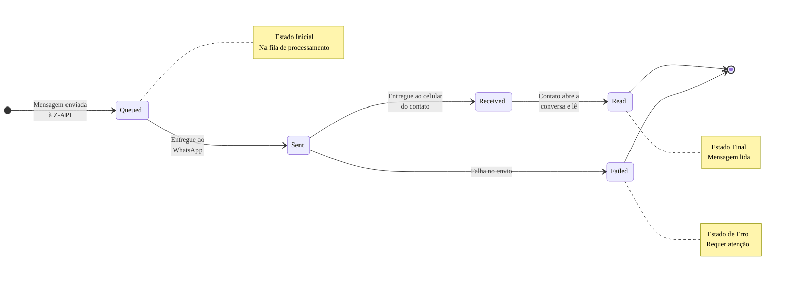

---
id: status-mensagem
title: 'Evento: Status da Mensagem'
sidebar_position: 3
---

import Tabs from '@theme/Tabs';
import TabItem from '@theme/TabItem';

# Webhook: Status da Mensagem

Saber o que aconteceu com uma mensagem *depois* que você a enviou é tão importante quanto o envio em si. Este webhook notifica seu sistema sobre cada etapa do ciclo de vida da mensagem, permitindo que você crie automações mais robustas e inteligentes.

Ele é acionado para **mensagens que você envia**, informando se elas foram enfileiradas, enviadas, entregues, lidas ou se falharam.

---

## Quando este webhook é chamado {#quando-este-webhook-e-chamado}

O evento `MessageStatusCallback` é disparado **toda vez que o status de uma mensagem que você enviou muda**:

- Quando a mensagem é **enviada** (`SENT`)
- Quando a mensagem é **recebida** (`RECEIVED`)
- Quando a mensagem é **lida** (`READ`)
- Quando a mensagem é **lida por você** (`READ_BY_ME`)
- Quando a mensagem de áudio é **ouvida** (`PLAYED`)

> > Uma mesma mensagem pode gerar **múltiplos eventos** de status conforme ela progride no ciclo de vida. Por exemplo, uma mensagem pode gerar eventos na seguinte ordem: `SENT` → `RECEIVED` → `READ`. Sempre use o `id` da mensagem para rastrear e atualizar o status correto no seu sistema.

---

## Por Que Rastrear o Status da Mensagem?

- **Confiabilidade:** Confirme que suas mensagens importantes (como códigos de verificação ou faturas) foram realmente **entregues** ao destinatário.
- **Inteligência de Automação:** Crie fluxos que reagem ao comportamento do usuário. Por exemplo, se uma mensagem de promoção foi **lida** mas o cliente não clicou no link, você pode agendar um lembrete para o dia seguinte.
- **Monitoramento de Falhas:** Seja notificado imediatamente se uma mensagem **falhar**, permitindo que você tente reenviá-la ou alerte sua equipe de suporte.

---

## O Ciclo de Vida de uma Mensagem

Uma mensagem que você envia passa por vários estágios. O webhook de status irá notificá-lo a cada passo.



---

## Para Usuários No-Code

Em sua ferramenta de automação, você pode criar fluxos de trabalho que usam o status da mensagem como gatilho ou como uma condição.

**Exemplo de fluxo de lembrete:**

1. **Gatilho (Webhook):** Um gatilho escuta os eventos de `message-status`.
2. **Nó "IF" (Condicional):**
   - **Se** o campo `status` for igual a `failed`,
   - **Então** envie uma notificação para sua equipe de suporte no Slack ou Discord.
3. **Outro Nó "IF":**
   - **Se** o campo `status` for igual a `read`,
   - **Então** atualize um campo em seu CRM ou planilha para "Contato Engajado".

---

## Para Desenvolvedores

O evento disparado é o `MessageStatusCallback`. O payload conterá o `id` da mensagem original que você enviou, permitindo que você a rastreie em seu sistema.

### Estrutura do Payload

```json
{
  "instanceId": "instance.id",
  "status": "SENT",
  "ids": ["999999999999999999999"],
  "momment": 1632234645000,
  "phoneDevice": 0,
  "phone": "5544999999999",
  "type": "MessageStatusCallback",
  "isGroup": false
}

{
  "instanceId": "instance.id",
  "status": "RECEIVED",
  "ids": ["999999999999999999999"],
  "momment": 1632234655000,
  "phoneDevice": 0,
  "phone": "5544999999999",
  "type": "MessageStatusCallback",
  "isGroup": false
}

{
  "instanceId": "instance.id",
  "status": "READ",
  "ids": ["999999999999999999999"],
  "momment": 1632234665000,
  "phoneDevice": 0,
  "phone": "5544999999999",
  "type": "MessageStatusCallback",
  "isGroup": false
}

{
  "instanceId": "instance.id",
  "status": "PLAYED",
  "ids": ["999999999999999999999"],
  "momment": 1632234675000,
  "phoneDevice": 0,
  "phone": "5544999999999",
  "type": "MessageStatusCallback",
  "isGroup": false
}

{
  "instanceId": "instance.id",
  "status": "READ_BY_ME",
  "ids": ["999999999999999999999"],
  "momment": 1632234685000,
  "phoneDevice": 0,
  "phone": "5544999999999",
  "type": "MessageStatusCallback",
  "isGroup": false
}
```

#### Atributos

| Atributos | Tipo | Descrição |
|:---------- |:----- |:----------------------------------------------------------------------------------------------------------- |
| `status` | string | Status da mensagem (SENT - se foi enviada, RECEIVED - se foi recebida, READ - se foi lida, READ_BY_ME - se foi lida por você (número conectado na sua instância), PLAYED - se foi ouvida ) |
| `ids` | array | Lista de identificadores da(s) mensagem(ns). |
| `momment` | integer | Momento em que a instância foi desconectada do número. (Nota: Embora a descrição oficial mencione desconexão, neste contexto representa o timestamp do evento). |
| `phoneDevice` | integer | Indica o dispositivo que ocorreu o evento (0 - Celular). |
| `phone` | string | Número de telefone de destino da mensagem. |
| `type` | string | Tipo do evento da instância, nesse caso será "MessageStatusCallback". |
| `isGroup` | boolean | Indica se o chat é um grupo. |
| `instanceId` | string | Identificador da instância. |

---

## Exemplos de Código

<Tabs>
<TabItem value="javascript" label="JavaScript (Fetch)" default>

```javascript
// ⚠️ SEGURANÇA: Use variáveis de ambiente para credenciais
// Nunca commite tokens no código-fonte
const webhookToken = process.env.ZAPI_WEBHOOK_TOKEN || 'SEU_TOKEN_DE_SEGURANCA';

// Validação de entrada (segurança)
function validateWebhookPayload(payload) {
  if (!payload || typeof payload !== 'object') {
    throw new Error('Payload inválido');
  }
  if (!payload.type || typeof payload.type !== 'string') {
    throw new Error('Tipo de evento inválido');
  }
  return true;
}

function validateMessageId(messageId) {
  if (!messageId || typeof messageId !== 'string' || messageId.trim().length === 0) {
    throw new Error('MessageId inválido');
  }
  return messageId.trim();
}

function validateStatus(status) {
  const validStatuses = ['SENT', 'RECEIVED', 'READ', 'READ_BY_ME', 'PLAYED'];
  if (!validStatuses.includes(status)) {
    throw new Error(`Status inválido. Valores válidos: ${validStatuses.join(', ')}`);
  }
  return status;
}

// Processar webhook de status
async function handleStatusWebhook(request) {
  try {
    // ⚠️ SEGURANÇA: Validar token do webhook
    const receivedToken = request.headers.get('x-token');
    if (receivedToken !== webhookToken) {
      return new Response('Unauthorized', { status: 401 });
    }

    const payload = await request.json();
    validateWebhookPayload(payload);

    if (payload.type === 'MessageStatusCallback') {
      // O campo ids é um array, pegamos o primeiro ID para simplificar
      const messageId = payload.ids && payload.ids.length > 0 ? validateMessageId(payload.ids[0]) : null;
      const status = validateStatus(payload.status);
      const phone = payload.phone;
      const momment = payload.momment;

      if (!messageId) {
        console.warn('Webhook recebido sem messageId válido');
        return new Response(JSON.stringify({ status: 'Ignored' }), { status: 200 });
      }

      // ⚠️ SEGURANÇA: Não logue dados sensíveis
      console.log(`Status da mensagem ${messageId} atualizado para: ${status}`);

      // Atualizar status no banco de dados (exemplo)
      // Em produção, use um ORM como Prisma ou Sequelize
      await updateMessageStatus(messageId, status, phone, momment);

      // Lógica baseada no status
      switch (status) {
        case 'READ':
          console.log('Mensagem foi lida pelo destinatário');
          // Implementar lógica de engajamento
          break;
        case 'RECEIVED':
          console.log('Mensagem foi entregue ao destinatário');
          break;
      }
    }

    // Sempre responda rápido para não bloquear o Z-API
    return new Response(JSON.stringify({ status: 'OK' }), {
      status: 200,
      headers: { 'Content-Type': 'application/json' },
    });
  } catch (error) {
    // ⚠️ SEGURANÇA: Tratamento genérico de erro
    console.error('Erro ao processar webhook:', error.message);
    return new Response(JSON.stringify({ error: 'Erro ao processar webhook' }), {
      status: 500,
      headers: { 'Content-Type': 'application/json' },
    });
  }
}

// Função auxiliar para atualizar status (exemplo)
async function updateMessageStatus(messageId, status, phone, momment) {
  // Em produção, substitua por chamada real ao banco de dados
  // Exemplo: await db.messages.update({ where: { id: messageId }, data: { status } });
  console.log(`Atualizando mensagem ${messageId} para status ${status}`);
}

// Exemplo de uso (Cloudflare Workers, Vercel, etc.)
export default {
  async fetch(request) {
    if (request.method === 'POST' && request.url.endsWith('/webhook')) {
      return handleStatusWebhook(request);
    }
    return new Response('Not Found', { status: 404 });
  },
};
```

</TabItem>
<TabItem value="typescript" label="TypeScript">

```typescript
// Tipos para melhor type safety
type MessageStatus = 'SENT' | 'RECEIVED' | 'READ' | 'READ_BY_ME' | 'PLAYED';

interface StatusWebhookPayload {
  instanceId: string;
  status: MessageStatus;
  ids: string[];
  momment: number;
  phoneDevice: number;
  phone: string;
  type: 'MessageStatusCallback';
  isGroup: boolean;
}

// ⚠️ SEGURANÇA: Use variáveis de ambiente para credenciais
const webhookToken: string = process.env.ZAPI_WEBHOOK_TOKEN || 'SEU_TOKEN_DE_SEGURANCA';

// Validação de entrada (segurança)
function validateMessageId(messageId: string): string {
  if (!messageId || messageId.trim().length === 0) {
    throw new Error('MessageId inválido');
  }
  return messageId.trim();
}

function validateStatus(status: string): MessageStatus {
  const validStatuses: MessageStatus[] = ['SENT', 'RECEIVED', 'READ', 'READ_BY_ME', 'PLAYED'];
  if (!validStatuses.includes(status as MessageStatus)) {
    throw new Error(`Status inválido. Valores válidos: ${validStatuses.join(', ')}`);
  }
  return status as MessageStatus;
}

// Processar webhook de status
async function handleStatusWebhook(request: Request): Promise<Response> {
  try {
    // ⚠️ SEGURANÇA: Validar token do webhook
    const receivedToken = request.headers.get('x-token');
    if (receivedToken !== webhookToken) {
      return new Response('Unauthorized', { status: 401 });
    }

    const payload: StatusWebhookPayload = await request.json();

    if (payload.type === 'MessageStatusCallback') {
      const messageId = payload.ids && payload.ids.length > 0 ? validateMessageId(payload.ids[0]) : '';
      const status = validateStatus(payload.status);

      if (!messageId) {
        console.warn('Webhook sem ID válido');
        return new Response(JSON.stringify({ status: 'Ignored' }), { status: 200 });
      }

      console.log(`Status da mensagem ${messageId} atualizado para: ${status}`);

      // Atualizar status no banco de dados
      await updateMessageStatus(messageId, status, payload.phone, payload.momment);
    }

    return new Response(JSON.stringify({ status: 'OK' }), {
      status: 200,
      headers: { 'Content-Type': 'application/json' },
    });
  } catch (error) {
    console.error('Erro ao processar webhook:', error instanceof Error ? error.message : 'Erro desconhecido');
    return new Response(JSON.stringify({ error: 'Erro ao processar webhook' }), {
      status: 500,
      headers: { 'Content-Type': 'application/json' },
    });
  }
}

// Função auxiliar para atualizar status
async function updateMessageStatus(
  messageId: string,
  status: MessageStatus,
  phone: string,
  momment: number
): Promise<void> {
  // Em produção, substitua por chamada real ao banco de dados
  console.log(`Atualizando mensagem ${messageId} para status ${status}`);
}
```

</TabItem>
<TabItem value="python" label="Python (Requests)">

```python
import os
from flask import Flask, request, jsonify
from typing import Dict, Any, Literal

# ⚠️ SEGURANÇA: Use variáveis de ambiente para credenciais
webhook_token = os.getenv('ZAPI_WEBHOOK_TOKEN', 'SEU_TOKEN_DE_SEGURANCA')

app = Flask(__name__)

# Validação de entrada (segurança)
def validate_message_id(message_id: str) -> str:
    if not message_id or not isinstance(message_id, str) or not message_id.strip():
        raise ValueError('MessageId inválido')
    return message_id.strip()

def validate_status(status: str) -> Literal['SENT', 'RECEIVED', 'READ', 'READ_BY_ME', 'PLAYED']:
    valid_statuses = ['SENT', 'RECEIVED', 'READ', 'READ_BY_ME', 'PLAYED']
    if status not in valid_statuses:
        raise ValueError(f'Status inválido. Valores válidos: {", ".join(valid_statuses)}')
    return status  # type: ignore

@app.route('/webhook', methods=['POST'])
def webhook():
    try:
        # ⚠️ SEGURANÇA: Validar token do webhook
        received_token = request.headers.get('x-token')
        if received_token != webhook_token:
            return jsonify({'error': 'Unauthorized'}), 401

        payload = request.json
        if not payload or payload.get('type') != 'MessageStatusCallback':
            return jsonify({'error': 'Evento inválido'}), 400

        # Lidar com lista de IDs
        ids = payload.get('ids', [])
        message_id = validate_message_id(ids[0] if ids else None)
        
        status = validate_status(payload.get('status'))
        phone = payload.get('phone')
        momment = payload.get('momment')

        # ⚠️ SEGURANÇA: Não logue dados sensíveis
        print(f'Status da mensagem {message_id} atualizado para: {status}')

        # Atualizar status no banco de dados
        update_message_status(message_id, status, phone, momment)

        # Lógica baseada no status
        if status == 'READ':
            print('Mensagem foi lida pelo destinatário')
        elif status == 'RECEIVED':
            print('Mensagem falhou ao ser enviada')

        # Sempre responda rápido para não bloquear o Z-API
        return jsonify({'status': 'OK'}), 200
    except Exception as e:
        # ⚠️ SEGURANÇA: Tratamento genérico de erro
        print(f'Erro ao processar webhook: {str(e)}')
        return jsonify({'error': 'Erro ao processar webhook'}), 500

def update_message_status(message_id: str, status: str, phone: str, momment: int):
    # Em produção, substitua por chamada real ao banco de dados
    print(f'Atualizando mensagem {message_id} para status {status}')

if __name__ == '__main__':
    app.run(port=3000)
```

</TabItem>
<TabItem value="curl" label="cURL">

```bash
# ⚠️ SEGURANÇA: Use variáveis de ambiente para credenciais
# Configure via: export ZAPI_WEBHOOK_TOKEN="seu-token"
WEBHOOK_TOKEN="${ZAPI_WEBHOOK_TOKEN:-SEU_TOKEN_DE_SEGURANCA}"

# Exemplo de teste do webhook (simulando requisição do Z-API)
# ⚠️ SEGURANÇA: Sempre use HTTPS (nunca HTTP)
curl -X POST "https://seu-servidor.com/webhook" \
  -H "Content-Type: application/json" \
  -H "x-token: ${WEBHOOK_TOKEN}" \
  -d '{
    "type": "MessageStatusCallback",
    "instanceId": "instance.id",
    "ids": ["3EB0C767F26A"],
    "status": "READ",
    "phone": "5511999999999",
    "momment": 1632234645000,
    "phoneDevice": 0,
    "isGroup": false
  }' \
  --fail-with-body \
  --max-time 30

# ⚠️ SEGURANÇA: Limpe variáveis sensíveis após uso (opcional)
unset WEBHOOK_TOKEN
```

</TabItem>
<TabItem value="nodejs" label="Node.js (Native HTTPS)">

```javascript
const http = require('http');
const crypto = require('crypto');

// ⚠️ SEGURANÇA: Use variáveis de ambiente para credenciais
const webhookToken = process.env.ZAPI_WEBHOOK_TOKEN || 'SEU_TOKEN_DE_SEGURANCA';

// Validação de entrada (segurança)
function validateMessageId(messageId) {
  if (!messageId || typeof messageId !== 'string' || messageId.trim().length === 0) {
    throw new Error('MessageId inválido');
  }
  return messageId.trim();
}

function validateStatus(status) {
  const validStatuses = ['SENT', 'RECEIVED', 'READ', 'READ_BY_ME', 'PLAYED'];
  if (!validStatuses.includes(status)) {
    throw new Error(`Status inválido. Valores válidos: ${validStatuses.join(', ')}`);
  }
  return status;
}

// Função auxiliar para atualizar status (exemplo)
function updateMessageStatus(messageId, status, phone, momment) {
  // Em produção, substitua por chamada real ao banco de dados
  // Exemplo: await db.messages.update({ where: { id: messageId }, data: { status } });
  console.log(`Atualizando mensagem ${messageId} para status ${status}`);
}

const server = http.createServer((req, res) => {
  if (req.method === 'POST' && req.url === '/webhook') {
    let body = '';

    req.on('data', (chunk) => {
      body += chunk.toString();
    });

    req.on('end', () => {
      try {
        // ⚠️ SEGURANÇA: Validar token do webhook (usando timing-safe comparison)
        const providedToken = req.headers['x-token'];
        if (!providedToken || !crypto.timingSafeEqual(
          Buffer.from(providedToken),
          Buffer.from(webhookToken)
        )) {
          res.writeHead(401, { 'Content-Type': 'application/json' });
          res.end(JSON.stringify({ error: 'Unauthorized' }));
          return;
        }

        const payload = JSON.parse(body);

        if (payload.type === 'MessageStatusCallback') {
          const messageId = payload.ids && payload.ids.length > 0 ? validateMessageId(payload.ids[0]) : null;
          const status = validateStatus(payload.status);
          const phone = payload.phone;
          const momment = payload.momment;

          if (messageId) {
            // ⚠️ SEGURANÇA: Não logue dados sensíveis
            console.log(`Status da mensagem ${messageId} atualizado para: ${status}`);

            // Atualizar status no banco de dados
            updateMessageStatus(messageId, status, phone, momment);
          }

          // Lógica baseada no status
          switch (status) {
            case 'READ':
              console.log('Mensagem foi lida pelo destinatário');
              break;
            case 'PLAYED':
              console.log('Áudio ouvido');
              break;
          }
        }

        // Sempre responda rápido para não bloquear o Z-API
        res.writeHead(200, { 'Content-Type': 'application/json' });
        res.end(JSON.stringify({ status: 'OK' }));
      } catch (error) {
        // ⚠️ SEGURANÇA: Tratamento genérico de erro
        console.error('Erro ao processar webhook:', error.message);
        res.writeHead(500, { 'Content-Type': 'application/json' });
        res.end(JSON.stringify({ error: 'Erro ao processar webhook' }));
      }
    });
  } else {
    res.writeHead(404, { 'Content-Type': 'application/json' });
    res.end(JSON.stringify({ error: 'Not Found' }));
  }
});

server.listen(3000, () => {
  console.log('Webhook server rodando na porta 3000');
});
```

</TabItem>
<TabItem value="nodejs-express" label="Node.js (Express)">

```javascript
const express = require('express');
const app = express();

app.use(express.json());

// ⚠️ SEGURANÇA: Use variáveis de ambiente para credenciais
const webhookToken = process.env.ZAPI_WEBHOOK_TOKEN || 'SEU_TOKEN_DE_SEGURANCA';

// Validação de entrada (segurança)
function validateMessageId(messageId) {
  if (!messageId || typeof messageId !== 'string' || messageId.trim().length === 0) {
    throw new Error('MessageId inválido');
  }
  return messageId.trim();
}

function validateStatus(status) {
  const validStatuses = ['SENT', 'RECEIVED', 'READ', 'READ_BY_ME', 'PLAYED'];
  if (!validStatuses.includes(status)) {
    throw new Error(`Status inválido. Valores válidos: ${validStatuses.join(', ')}`);
  }
  return status;
}

app.post('/webhook', (req, res) => {
  try {
    // ⚠️ SEGURANÇA: Validar token do webhook
    const receivedToken = req.headers['x-token'];
    if (receivedToken !== webhookToken) {
      return res.status(401).json({ error: 'Unauthorized' });
    }

    const payload = req.body;

    if (payload.type === 'MessageStatusCallback') {
      const messageId = payload.ids && payload.ids.length > 0 ? validateMessageId(payload.ids[0]) : null;
      const status = validateStatus(payload.status);
      const phone = payload.phone;
      const momment = payload.momment;

      if (messageId) {
        // ⚠️ SEGURANÇA: Não logue dados sensíveis
        console.log(`Status da mensagem ${messageId} atualizado para: ${status}`);

        // Atualizar status no banco de dados
        updateMessageStatus(messageId, status, phone, momment);
      }
    }

    // Sempre responda rápido para não bloquear o Z-API
    res.status(200).json({ status: 'OK' });
  } catch (error) {
    // ⚠️ SEGURANÇA: Tratamento genérico de erro
    console.error('Erro ao processar webhook:', error.message);
    res.status(500).json({ error: 'Erro ao processar webhook' });
  }
});

// Função auxiliar para atualizar status (exemplo)
function updateMessageStatus(messageId, status, phone, momment) {
  // Em produção, substitua por chamada real ao banco de dados
  // Exemplo: await db.messages.update({ where: { id: messageId }, data: { status } });
  console.log(`Atualizando mensagem ${messageId} para status ${status}`);
}

app.listen(3000, () => {
  console.log('Webhook server rodando na porta 3000');
});
```

</TabItem>
<TabItem value="nodejs-koa" label="Node.js (Koa)">

```javascript
const Koa = require('koa');
const Router = require('@koa/router');

const app = new Koa();
const router = new Router();

// ⚠️ SEGURANÇA: Use variáveis de ambiente para credenciais
const webhookToken = process.env.ZAPI_WEBHOOK_TOKEN || 'SEU_TOKEN_DE_SEGURANCA';

// Middleware para parsing JSON
app.use(require('koa-bodyparser')());

// Validação de entrada (segurança)
function validateMessageId(messageId) {
  if (!messageId || typeof messageId !== 'string' || messageId.trim().length === 0) {
    throw new Error('MessageId inválido');
  }
  return messageId.trim();
}

function validateStatus(status) {
  const validStatuses = ['SENT', 'RECEIVED', 'READ', 'READ_BY_ME', 'PLAYED'];
  if (!validStatuses.includes(status)) {
    throw new Error(`Status inválido. Valores válidos: ${validStatuses.join(', ')}`);
  }
  return status;
}

// Rota para receber webhook
router.post('/webhook', async (ctx) => {
  try {
    // ⚠️ SEGURANÇA: Validar token do webhook
    const receivedToken = ctx.request.headers['x-token'];
    if (receivedToken !== webhookToken) {
      ctx.status = 401;
      ctx.body = { error: 'Unauthorized' };
      return;
    }

    const payload = ctx.request.body;

    if (payload.type === 'MessageStatusCallback') {
      const messageId = payload.ids && payload.ids.length > 0 ? validateMessageId(payload.ids[0]) : null;
      const status = validateStatus(payload.status);
      const phone = payload.phone;
      const momment = payload.mommment;

      if (messageId) {
        console.log(`Status da mensagem ${messageId} atualizado para: ${status}`);
        updateMessageStatus(messageId, status, phone, momment);
      }
    }

    // Sempre responda rápido para não bloquear o Z-API
    ctx.status = 200;
    ctx.body = { status: 'OK' };
  } catch (error) {
    // ⚠️ SEGURANÇA: Tratamento genérico de erro
    ctx.app.emit('error', error, ctx);
    ctx.status = 500;
    ctx.body = { error: 'Erro ao processar webhook' };
  }
});

// Função auxiliar para atualizar status (exemplo)
function updateMessageStatus(messageId, status, phone, momment) {
  // Em produção, substitua por chamada real ao banco de dados
  // Exemplo: await db.messages.update({ where: { id: messageId }, data: { status } });
  console.log(`Atualizando mensagem ${messageId} para status ${status}`);
}

app.use(router.routes());
app.use(router.allowedMethods());

// Error handler
app.on('error', (err, ctx) => {
  console.error('Erro ao processar webhook:', err.message);
});

app.listen(3000, () => {
  console.log('Webhook server rodando na porta 3000');
});
```

</TabItem>
<TabItem value="java" label="Java">

```java
import com.sun.net.httpserver.HttpServer;
import com.sun.net.httpserver.HttpHandler;
import com.sun.net.httpserver.HttpExchange;
import java.io.*;
import java.net.InetSocketAddress;
import java.nio.charset.StandardCharsets;
import java.util.Arrays;
import java.util.List;
import com.google.gson.Gson;
import com.google.gson.JsonObject;
import com.google.gson.JsonArray;

// ⚠️ SEGURANÇA: Use variáveis de ambiente para credenciais
class StatusWebhookHandler implements HttpHandler {
    private static final String WEBHOOK_TOKEN = System.getenv("ZAPI_WEBHOOK_TOKEN") != null 
        ? System.getenv("ZAPI_WEBHOOK_TOKEN") : "SEU_TOKEN_DE_SEGURANCA";
    private static final Gson gson = new Gson();
    private static final List<String> VALID_STATUSES = Arrays.asList(
        "SENT", "RECEIVED", "READ", "READ_BY_ME", "PLAYED"
    );

    // Validação de entrada (segurança)
    private String validateMessageId(String messageId) {
        if (messageId == null || messageId.trim().isEmpty()) {
            throw new IllegalArgumentException("MessageId inválido");
        }
        return messageId.trim();
    }

    private String validateStatus(String status) {
        if (!VALID_STATUSES.contains(status)) {
            throw new IllegalArgumentException(
                "Status inválido. Valores válidos: " + String.join(", ", VALID_STATUSES)
            );
        }
        return status;
    }

    @Override
    public void handle(HttpExchange exchange) throws IOException {
        if (!"POST".equals(exchange.getRequestMethod())) {
            sendResponse(exchange, 405, "{\"error\":\"Método não permitido\"}");
            return;
        }

        try {
            // ⚠️ SEGURANÇA: Validar token do webhook
            String receivedToken = exchange.getRequestHeaders().getFirst("x-token");
            if (receivedToken == null || !receivedToken.equals(WEBHOOK_TOKEN)) {
                sendResponse(exchange, 401, "{\"error\":\"Unauthorized\"}");
                return;
            }

            // Ler payload
            String requestBody = new String(exchange.getRequestBody().readAllBytes(), StandardCharsets.UTF_8);
            JsonObject payload = gson.fromJson(requestBody, JsonObject.class);
            
            // Verificar tipo de evento
             if (payload.has("type") && "MessageStatusCallback".equals(payload.get("type").getAsString())) {
                JsonArray ids = payload.getAsJsonArray("ids");
                String messageId = (ids != null && ids.size() > 0) ? validateMessageId(ids.get(0).getAsString()) : null;
                
                String status = validateStatus(payload.get("status").getAsString());
                String phone = payload.get("phone").getAsString();
                long momment = payload.get("momment").getAsLong();

                if (messageId != null) {
                    System.out.println("Status da mensagem " + messageId + " atualizado para: " + status);
                    updateMessageStatus(messageId, status, phone, momment);
                }

                // Lógica baseada no status
                switch (status) {
                    case "READ":
                        System.out.println("Mensagem foi lida pelo destinatário");
                        break;
                    case "PLAYED":
                        System.out.println("Áudio ouvido");
                        break;
                }
            }

            // Sempre responda rápido para não bloquear o Z-API
            sendResponse(exchange, 200, "{\"status\":\"OK\"}");
        } catch (Exception e) {
            System.err.println("Erro ao processar webhook: " + e.getMessage());
            sendResponse(exchange, 500, "{\"error\":\"Erro ao processar webhook\"}");
        }
    }

    private void updateMessageStatus(String messageId, String status, String phone, long momment) {
        // Em produção, substitua por chamada real ao banco de dados
        System.out.println("Atualizando mensagem " + messageId + " para status " + status);
    }

    private void sendResponse(HttpExchange exchange, int statusCode, String response) throws IOException {
        exchange.getResponseHeaders().set("Content-Type", "application/json");
        exchange.sendResponseHeaders(statusCode, response.getBytes().length);
        try (OutputStream os = exchange.getResponseBody()) {
            os.write(response.getBytes());
        }
    }
}

public class WebhookServer {
    public static void main(String[] args) throws IOException {
        HttpServer server = HttpServer.create(new InetSocketAddress(3000), 0);
        server.createContext("/webhook", new StatusWebhookHandler());
        server.setExecutor(null);
        server.start();
        System.out.println("Webhook server rodando na porta 3000");
    }
}
```

</TabItem>
<TabItem value="csharp" label="C#">

```csharp
using System;
using System.IO;
using System.Net;
using System.Text;
using System.Threading.Tasks;
using Newtonsoft.Json;
using Newtonsoft.Json.Linq;

// ⚠️ SEGURANÇA: Use variáveis de ambiente para credenciais
public class StatusWebhookHandler
{
    private static readonly string WebhookToken = Environment.GetEnvironmentVariable("ZAPI_WEBHOOK_TOKEN") 
        ?? "SEU_TOKEN_DE_SEGURANCA";
    private static readonly string[] ValidStatuses = { "queued", "sent", "received", "read", "failed" };

    // Validação de entrada (segurança)
    private static string ValidateMessageId(string messageId)
    {
        if (string.IsNullOrWhiteSpace(messageId))
        {
            throw new ArgumentException("MessageId inválido");
        }
        return messageId.Trim();
    }

    private static string ValidateStatus(string status)
    {
        if (!Array.Exists(ValidStatuses, s => s == status))
        {
            throw new ArgumentException($"Status inválido. Valores válidos: {string.Join(", ", ValidStatuses)}");
        }
        return status;
    }

    public static async Task HandleRequest(HttpListenerContext context)
    {
        var request = context.Request;
        var response = context.Response;

        if (request.HttpMethod != "POST")
        {
            SendResponse(response, 405, "{\"error\":\"Método não permitido\"}");
            return;
        }

        try
        {
            // ⚠️ SEGURANÇA: Validar token do webhook
            string receivedToken = request.Headers["x-token"];
            if (string.IsNullOrEmpty(receivedToken) || receivedToken != WebhookToken)
            {
                SendResponse(response, 401, "{\"error\":\"Unauthorized\"}");
                return;
            }

            // Ler payload
            string requestBody;
            using (var reader = new StreamReader(request.InputStream, Encoding.UTF8))
            {
                requestBody = await reader.ReadToEndAsync();
            }

            JObject payload = JObject.Parse(requestBody);
            string eventType = payload["event"].ToString();
            JObject data = payload["data"] as JObject;

            if (eventType == "message-status" && data != null)
            {
                string messageId = ValidateMessageId(data["messageId"].ToString());
                string status = ValidateStatus(data["status"].ToString());
                string phone = data["phone"].ToString();
                long timestamp = data["timestamp"].Value<long>();

                Console.WriteLine($"Status da mensagem {messageId} atualizado para: {status}");

                // Atualizar status no banco de dados
                UpdateMessageStatus(messageId, status, phone, timestamp);

                // Lógica baseada no status
                switch (status)
                {
                    case "read":
                        Console.WriteLine("Mensagem foi lida pelo destinatário");
                        break;
                    case "failed":
                        Console.WriteLine("Mensagem falhou ao ser enviada");
                        break;
                }
            }

            // Sempre responda rápido para não bloquear o Z-API
            SendResponse(response, 200, "{\"status\":\"OK\"}");
        }
        catch (Exception ex)
        {
            Console.Error.WriteLine($"Erro ao processar webhook: {ex.Message}");
            SendResponse(response, 500, "{\"error\":\"Erro ao processar webhook\"}");
        }
    }

    private static void UpdateMessageStatus(string messageId, string status, string phone, long timestamp)
    {
        // Em produção, substitua por chamada real ao banco de dados
        Console.WriteLine($"Atualizando mensagem {messageId} para status {status}");
    }

    private static void SendResponse(HttpListenerResponse response, int statusCode, string body)
    {
        response.StatusCode = statusCode;
        response.ContentType = "application/json";
        byte[] buffer = Encoding.UTF8.GetBytes(body);
        response.ContentLength64 = buffer.Length;
        response.OutputStream.Write(buffer, 0, buffer.Length);
        response.Close();
    }
}

// Exemplo de uso com HttpListener
class Program
{
    static void Main()
    {
        HttpListener listener = new HttpListener();
        listener.Prefixes.Add("http://localhost:3000/webhook/");
        listener.Start();
        Console.WriteLine("Webhook server rodando na porta 3000");

        while (true)
        {
            HttpListenerContext context = listener.GetContext();
            Task.Run(() => StatusWebhookHandler.HandleRequest(context));
        }
    }
}
```

</TabItem>
<TabItem value="go" label="Go">

```go
package main

import (
    "encoding/json"
    "fmt"
    "io"
    "net/http"
    "os"
    "strings"
)

// ⚠️ SEGURANÇA: Use variáveis de ambiente para credenciais
var webhookToken = getEnv("ZAPI_WEBHOOK_TOKEN", "SEU_TOKEN_DE_SEGURANCA")

func getEnv(key, defaultValue string) string {
    if value := os.Getenv(key); value != "" {
        return value
    }
    return defaultValue
}

// Estrutura do payload
type StatusWebhookPayload struct {
    Event      string `json:"event"`
    InstanceID string `json:"instanceId"`
    Data       struct {
        MessageID string `json:"messageId"`
        Phone     string `json:"phone"`
        Status    string `json:"status"`
        Timestamp int64  `json:"timestamp"`
    } `json:"data"`
}

// Validação de entrada (segurança)
func validateMessageID(messageID string) (string, error) {
    trimmed := strings.TrimSpace(messageID)
    if trimmed == "" {
        return "", fmt.Errorf("messageId inválido")
    }
    return trimmed, nil
}

func validateStatus(status string) (string, error) {
    validStatuses := []string{"queued", "sent", "received", "read", "failed"}
    for _, validStatus := range validStatuses {
        if status == validStatus {
            return status, nil
        }
    }
    return "", fmt.Errorf("status inválido. Valores válidos: %s", strings.Join(validStatuses, ", "))
}

func updateMessageStatus(messageID, status, phone string, timestamp int64) {
    // Em produção, substitua por chamada real ao banco de dados
    fmt.Printf("Atualizando mensagem %s para status %s\n", messageID, status)
}

func webhookHandler(w http.ResponseWriter, r *http.Request) {
    if r.Method != http.MethodPost {
        http.Error(w, "Método não permitido", http.StatusMethodNotAllowed)
        return
    }

    // ⚠️ SEGURANÇA: Validar token do webhook
    receivedToken := r.Header.Get("x-token")
    if receivedToken != webhookToken {
        http.Error(w, "Unauthorized", http.StatusUnauthorized)
        return
    }

    body, err := io.ReadAll(r.Body)
    if err != nil {
        http.Error(w, "Erro ao ler payload", http.StatusBadRequest)
        return
    }
    defer r.Body.Close()

    var payload StatusWebhookPayload
    if err := json.Unmarshal(body, &payload); err != nil {
        http.Error(w, "Erro ao processar JSON", http.StatusBadRequest)
        return
    }

    if payload.Event == "message-status" && payload.Data.MessageID != "" {
        messageID, err := validateMessageID(payload.Data.MessageID)
        if err != nil {
            http.Error(w, err.Error(), http.StatusBadRequest)
            return
        }

        status, err := validateStatus(payload.Data.Status)
        if err != nil {
            http.Error(w, err.Error(), http.StatusBadRequest)
            return
        }

        fmt.Printf("Status da mensagem %s atualizado para: %s\n", messageID, status)

        // Atualizar status no banco de dados
        updateMessageStatus(messageID, status, payload.Data.Phone, payload.Data.Timestamp)

        // Lógica baseada no status
        switch status {
        case "read":
            fmt.Println("Mensagem foi lida pelo destinatário")
        case "failed":
            fmt.Println("Mensagem falhou ao ser enviada")
        }
    }

    // Sempre responda rápido para não bloquear o Z-API
    w.Header().Set("Content-Type", "application/json")
    w.WriteHeader(http.StatusOK)
    json.NewEncoder(w).Encode(map[string]string{"status": "OK"})
}

func main() {
    http.HandleFunc("/webhook", webhookHandler)
    fmt.Println("Webhook server rodando na porta 3000")
    http.ListenAndServe(":3000", nil)
}
```

</TabItem>
<TabItem value="php" label="PHP">

```php
<?php
// ⚠️ SEGURANÇA: Use variáveis de ambiente para credenciais
$webhookToken = getenv('ZAPI_WEBHOOK_TOKEN') ?: 'SEU_TOKEN_DE_SEGURANCA';

// Validação de entrada (segurança)
function validateMessageId($messageId) {
    if (empty($messageId) || !is_string($messageId) || trim($messageId) === '') {
        throw new Exception('MessageId inválido');
    }
    return trim($messageId);
}

function validateStatus($status) {
    $validStatuses = ['queued', 'sent', 'received', 'read', 'failed'];
    if (!in_array($status, $validStatuses)) {
        throw new Exception('Status inválido. Valores válidos: ' . implode(', ', $validStatuses));
    }
    return $status;
}

// Processar webhook
if ($_SERVER['REQUEST_METHOD'] === 'POST') {
    try {
        // ⚠️ SEGURANÇA: Validar token do webhook
        $receivedToken = $_SERVER['HTTP_X_TOKEN'] ?? '';
        if ($receivedToken !== $webhookToken) {
            http_response_code(401);
            echo json_encode(['error' => 'Unauthorized']);
            exit;
        }

        // Ler payload
        $payload = json_decode(file_get_contents('php://input'), true);
        
        if (($payload['event'] ?? '') === 'message-status' && !empty($payload['data'])) {
            $data = $payload['data'];
            $messageId = validateMessageId($data['messageId']);
            $status = validateStatus($data['status']);
            $phone = $data['phone'] ?? '';
            $timestamp = $data['timestamp'] ?? 0;

            // ⚠️ SEGURANÇA: Não logue dados sensíveis
            error_log("Status da mensagem {$messageId} atualizado para: {$status}");

            // Atualizar status no banco de dados
            updateMessageStatus($messageId, $status, $phone, $timestamp);

            // Lógica baseada no status
            switch ($status) {
                case 'read':
                    error_log('Mensagem foi lida pelo destinatário');
                    break;
                case 'failed':
                    error_log('Mensagem falhou ao ser enviada');
                    break;
            }
        }

        // Sempre responda rápido para não bloquear o Z-API
        http_response_code(200);
        header('Content-Type: application/json');
        echo json_encode(['status' => 'OK']);
    } catch (Exception $e) {
        // ⚠️ SEGURANÇA: Tratamento genérico de erro
        error_log("Erro ao processar webhook: " . $e->getMessage());
        http_response_code(500);
        echo json_encode(['error' => 'Erro ao processar webhook']);
    }
} else {
    http_response_code(405);
    echo json_encode(['error' => 'Método não permitido']);
}

function updateMessageStatus($messageId, $status, $phone, $timestamp) {
    // Em produção, substitua por chamada real ao banco de dados
    error_log("Atualizando mensagem {$messageId} para status {$status}");
}
?>
```

</TabItem>
<TabItem value="ruby" label="Ruby">

```ruby
require 'sinatra'
require 'json'

# ⚠️ SEGURANÇA: Use variáveis de ambiente para credenciais
WEBHOOK_TOKEN = ENV['ZAPI_WEBHOOK_TOKEN'] || 'SEU_TOKEN_DE_SEGURANCA'

# Validação de entrada (segurança)
def validate_message_id(message_id)
  raise ArgumentError, 'MessageId inválido' if message_id.nil? || message_id.to_s.strip.empty?
  message_id.to_s.strip
end

def validate_status(status)
  valid_statuses = ['queued', 'sent', 'received', 'read', 'failed']
  unless valid_statuses.include?(status)
    raise ArgumentError, "Status inválido. Valores válidos: #{valid_statuses.join(', ')}"
  end
  status
end

def update_message_status(message_id, status, phone, timestamp)
  # Em produção, substitua por chamada real ao banco de dados
  puts "Atualizando mensagem #{message_id} para status #{status}"
end

post '/webhook' do
  begin
    # ⚠️ SEGURANÇA: Validar token do webhook
    received_token = request.env['HTTP_X_TOKEN']
    if received_token != WEBHOOK_TOKEN
      status 401
      return { error: 'Unauthorized' }.to_json
    end

    payload = JSON.parse(request.body.read)
    
    if payload['event'] == 'message-status' && payload['data']
      data = payload['data']
      message_id = validate_message_id(data['messageId'])
      status = validate_status(data['status'])
      phone = data['phone']
      timestamp = data['timestamp']

      # ⚠️ SEGURANÇA: Não logue dados sensíveis
      puts "Status da mensagem #{message_id} atualizado para: #{status}"

      # Atualizar status no banco de dados
      update_message_status(message_id, status, phone, timestamp)

      # Lógica baseada no status
      case status
      when 'read'
        puts 'Mensagem foi lida pelo destinatário'
      when 'failed'
        puts 'Mensagem falhou ao ser enviada'
      end
    end

    # Sempre responda rápido para não bloquear o Z-API
    status 200
    { status: 'OK' }.to_json
  rescue => e
    # ⚠️ SEGURANÇA: Tratamento genérico de erro
    puts "Erro ao processar webhook: #{e.message}"
    status 500
    { error: 'Erro ao processar webhook' }.to_json
  end
end

# Iniciar servidor
set :port, 3000
```

</TabItem>
<TabItem value="swift" label="Swift">

```swift
import Foundation
import Vapor

// ⚠️ SEGURANÇA: Use variáveis de ambiente para credenciais
let webhookToken = Environment.get("ZAPI_WEBHOOK_TOKEN") ?? "SEU_TOKEN_DE_SEGURANCA"

// Estrutura do payload
struct StatusWebhookPayload: Content {
    let event: String
    let instanceId: String
    let data: StatusData
}

struct StatusData: Content {
    let messageId: String
    let phone: String
    let status: String
    let timestamp: Int64
}

// Validação de entrada (segurança)
func validateMessageId(_ messageId: String) throws -> String {
    let trimmed = messageId.trimmingCharacters(in: .whitespacesAndNewlines)
    if trimmed.isEmpty {
        throw Abort(.badRequest, reason: "MessageId inválido")
    }
    return trimmed
}

func validateStatus(_ status: String) throws -> String {
    let validStatuses = ["queued", "sent", "received", "read", "failed"]
    guard validStatuses.contains(status) else {
        throw Abort(.badRequest, reason: "Status inválido. Valores válidos: \(validStatuses.joined(separator: ", "))")
    }
    return status
}

func updateMessageStatus(_ messageId: String, _ status: String, _ phone: String, _ timestamp: Int64, on app: Application) {
    // Em produção, substitua por chamada real ao banco de dados
    app.logger.info("Atualizando mensagem \(messageId) para status \(status)")
}

// Configurar rota
func configure(_ app: Application) throws {
    app.post("webhook") { req -> EventLoopFuture<Response> in
        // ⚠️ SEGURANÇA: Validar token do webhook
        guard let receivedToken = req.headers["x-token"].first,
              receivedToken == webhookToken else {
            throw Abort(.unauthorized, reason: "Token de segurança inválido")
        }

        return req.content.decode(StatusWebhookPayload.self).flatMap { payload in
            if payload.event == "message-status" {
                do {
                    let messageId = try validateMessageId(payload.data.messageId)
                    let status = try validateStatus(payload.data.status)

                    app.logger.info("Status da mensagem \(messageId) atualizado para: \(status)")

                    // Atualizar status no banco de dados
                    updateMessageStatus(messageId, status, payload.data.phone, payload.data.timestamp, on: app)

                    // Lógica baseada no status
                    switch status {
                    case "read":
                        app.logger.info("Mensagem foi lida pelo destinatário")
                    case "failed":
                        app.logger.info("Mensagem falhou ao ser enviada")
                    default:
                        break
                    }
                } catch {
                    app.logger.error("Erro de validação: \(error)")
                }
            }

            // Sempre responda rápido para não bloquear o Z-API
            return req.eventLoop.makeSucceededFuture(Response(status: .ok, body: .init(string: "{\"status\":\"OK\"}")))
        }
    }
}
```

</TabItem>
<TabItem value="powershell" label="PowerShell">

```powershell
# ⚠️ SEGURANÇA: Use variáveis de ambiente para credenciais
$webhookToken = if ($env:ZAPI_WEBHOOK_TOKEN) { $env:ZAPI_WEBHOOK_TOKEN } else { "SEU_TOKEN_DE_SEGURANCA" }

# Validação de entrada (segurança)
function Validate-MessageId {
    param($messageId)
    if ([string]::IsNullOrWhiteSpace($messageId)) {
        throw "MessageId inválido"
    }
    return $messageId.Trim()
}

function Validate-Status {
    param($status)
    $validStatuses = @('queued', 'sent', 'received', 'read', 'failed')
    if ($validStatuses -notcontains $status) {
        throw "Status inválido. Valores válidos: $($validStatuses -join ', ')"
    }
    return $status
}

function Update-MessageStatus {
    param($messageId, $status, $phone, $timestamp)
    # Em produção, substitua por chamada real ao banco de dados
    Write-Host "Atualizando mensagem $messageId para status $status"
}

# Criar listener HTTP
$listener = New-Object System.Net.HttpListener
$listener.Prefixes.Add("http://localhost:3000/webhook/")
$listener.Start()

Write-Host "Webhook server rodando na porta 3000"

while ($listener.IsListening) {
    $context = $listener.GetContext()
    $request = $context.Request
    $response = $context.Response

    try {
        if ($request.HttpMethod -ne "POST") {
            $response.StatusCode = 405
            $buffer = [System.Text.Encoding]::UTF8.GetBytes('{"error":"Método não permitido"}')
            $response.ContentLength64 = $buffer.Length
            $response.OutputStream.Write($buffer, 0, $buffer.Length)
            $response.Close()
            continue
        }

        # ⚠️ SEGURANÇA: Validar token do webhook
        $receivedToken = $request.Headers["x-token"]
        if ($receivedToken -ne $webhookToken) {
            $response.StatusCode = 401
            $buffer = [System.Text.Encoding]::UTF8.GetBytes('{"error":"Unauthorized"}')
            $response.ContentLength64 = $buffer.Length
            $response.OutputStream.Write($buffer, 0, $buffer.Length)
            $response.Close()
            continue
        }

        # Ler payload
        $reader = New-Object System.IO.StreamReader($request.InputStream)
        $body = $reader.ReadToEnd()
        $payload = $body | ConvertFrom-Json

        if ($payload.event -eq "message-status" -and $payload.data) {
            $messageId = Validate-MessageId -messageId $payload.data.messageId
            $status = Validate-Status -status $payload.data.status
            $phone = $payload.data.phone
            $timestamp = $payload.data.timestamp

            Write-Host "Status da mensagem $messageId atualizado para: $status"

            # Atualizar status no banco de dados
            Update-MessageStatus -messageId $messageId -status $status -phone $phone -timestamp $timestamp

            # Lógica baseada no status
            switch ($status) {
                "read" { Write-Host "Mensagem foi lida pelo destinatário" }
                "failed" { Write-Host "Mensagem falhou ao ser enviada" }
            }
        }

        # Sempre responda rápido para não bloquear o Z-API
        $response.StatusCode = 200
        $response.ContentType = "application/json"
        $buffer = [System.Text.Encoding]::UTF8.GetBytes('{"status":"OK"}')
        $response.ContentLength64 = $buffer.Length
        $response.OutputStream.Write($buffer, 0, $buffer.Length)
    } catch {
        Write-Host "Erro ao processar webhook: $($_.Exception.Message)"
        $response.StatusCode = 500
        $buffer = [System.Text.Encoding]::UTF8.GetBytes('{"error":"Erro ao processar webhook"}')
        $response.ContentLength64 = $buffer.Length
        $response.OutputStream.Write($buffer, 0, $buffer.Length)
    } finally {
        $response.Close()
    }
}
```

</TabItem>
<TabItem value="http" label="HTTP (Raw)">

```http
POST /webhook HTTP/1.1
Host: seu-servidor.com
Content-Type: application/json
x-token: SEU_TOKEN_DE_SEGURANCA
Content-Length: 185

{
  "event": "message-status",
  "instanceId": "instance.id",
  "data": {
    "messageId": "3EB0C767F26A",
    "phone": "5511999999999",
    "status": "read",
    "timestamp": 1704110400
  }
}
```

**Nota:** Este é um exemplo de requisição HTTP raw que o Z-API envia para seu webhook. Em produção:

- ⚠️ **SEGURANÇA:** Valide sempre o header `x-token` antes de processar o payload
- ⚠️ **SEGURANÇA:** Sempre use HTTPS (não HTTP)
- ⚠️ **Validação:** Valide o payload (event, messageId, status) antes de processar
- ⚠️ **Performance:** Responda com `200 OK` rapidamente para não bloquear o Z-API

</TabItem>
<TabItem value="cpp" label="C++">

```cpp
#include <iostream>
#include <string>
#include <cstdlib>
#include <curl/curl.h>
#include <json/json.h>

// ⚠️ SEGURANÇA: Use variáveis de ambiente para credenciais
std::string getEnv(const char* key, const std::string& defaultValue) {
    const char* value = std::getenv(key);
    return value ? std::string(value) : defaultValue;
}

std::string webhookToken = getEnv("ZAPI_WEBHOOK_TOKEN", "SEU_TOKEN_DE_SEGURANCA");

// Validação de entrada (segurança)
std::string validateMessageId(const std::string& messageId) {
    std::string trimmed = messageId;
    trimmed.erase(0, trimmed.find_first_not_of(" \t\n\r"));
    trimmed.erase(trimmed.find_last_not_of(" \t\n\r") + 1);
    
    if (trimmed.empty()) {
        throw std::invalid_argument("MessageId inválido");
    }
    return trimmed;
}

std::string validateStatus(const std::string& status) {
    std::vector<std::string> validStatuses = {"queued", "sent", "received", "read", "failed"};
    if (std::find(validStatuses.begin(), validStatuses.end(), status) == validStatuses.end()) {
        throw std::invalid_argument("Status inválido");
    }
    return status;
}

// Exemplo de processamento (usando libmicrohttpd ou similar)
// Este é um exemplo simplificado - em produção use uma biblioteca HTTP adequada
int main() {
    // Implementação do servidor HTTP aqui
    // Exemplo usando libmicrohttpd ou outra biblioteca
    
    std::cout << "Webhook server rodando na porta 3000" << std::endl;
    return 0;
}
```

**Compilação:**

```bash
# Requer libcurl-dev, libjsoncpp-dev e libmicrohttpd-dev
g++ -o webhook_server webhook_server.cpp -lcurl -ljsoncpp -lmicrohttpd
```

</TabItem>
<TabItem value="c" label="C">

```c
#include <stdio.h>
#include <stdlib.h>
#include <string.h>
#include <curl/curl.h>

// ⚠️ SEGURANÇA: Use variáveis de ambiente para credenciais
char* getEnv(const char* key, const char* defaultValue) {
    char* value = getenv(key);
    return value ? value : (char*)defaultValue;
}

char* webhookToken = getEnv("ZAPI_WEBHOOK_TOKEN", "SEU_TOKEN_DE_SEGURANCA");

// Exemplo de processamento (usando libmicrohttpd ou similar)
// Este é um exemplo simplificado - em produção use uma biblioteca HTTP adequada
int main() {
    // Implementação do servidor HTTP aqui
    // Exemplo usando libmicrohttpd ou outra biblioteca
    
    printf("Webhook server rodando na porta 3000\n");
    return 0;
}
```

**Compilação:**

```bash
# Requer libcurl-dev e libmicrohttpd-dev
gcc -o webhook_server webhook_server.c -lcurl -lmicrohttpd
```

</TabItem>
</Tabs>

---

## Veja Também

### Webhooks Relacionados

- **[Ao Receber Mensagem](./ao-receber)** - Webhook acionado quando você recebe uma nova mensagem
- **[Ao Conectar](./ao-conectar)** - Webhook acionado quando a instância se conecta ao WhatsApp
- **[Ao Desconectar](./ao-desconectar)** - Webhook acionado quando a instância se desconecta

### Documentação Relacionada

- **[Introdução aos Webhooks](./introducao)** - Conceitos fundamentais sobre webhooks
- **[Enviar Mensagens](/docs/messages/introducao)** - Aprenda a enviar mensagens através da API
- **[Segurança e Autenticação](/docs/security/introducao)** - Como proteger seus webhooks e validar tokens
