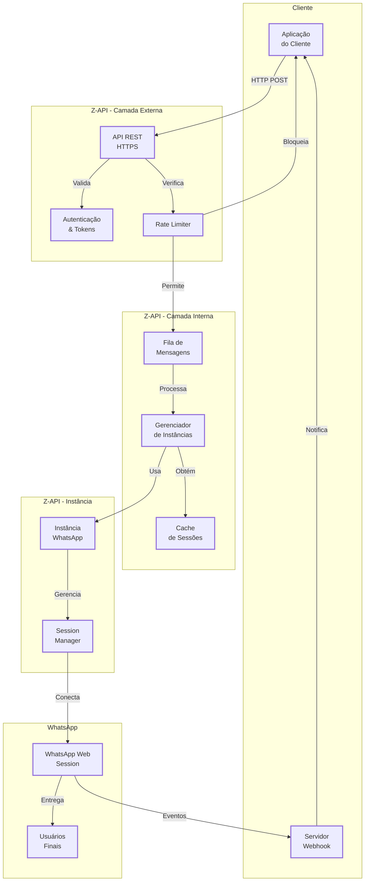

# <Icon name="Network" size="lg" /> System Architecture Z-API

This page provides an overview of the Z-API architecture, showing how the main components relate and interact.

## <Icon name="Info" size="md" /> Overview {#overview}

The Z-API is a platform that connects your application to WhatsApp through a RESTful API. The architecture was designed to be simple, scalable, and reliable.

## <Icon name="Network" size="md" /> Architecture Diagram {#architecture-diagram}

The diagram below shows the main components and how they communicate:

<ScrollRevealDiagram direction="up">

</ScrollRevealDiagram>

<strong>Legend of the Diagram</strong>

This diagram shows the layered architecture of Z-API and how the components communicate.

**Layers**: Client → External Z-API → Internal Z-API → Instance Z-API → WhatsApp

**Main Flows**:

- **Send**: Client → API → Rate Limiter → Queue → Instance → WhatsApp → User
- **Webhook**: WhatsApp → Instance → Webhook Server → Client

**Features**: Layered architecture, asynchronous processing, caching and rate limiting.

:::tip Learn to Read Diagrams
Not familiar with architecture diagrams? Read our [complete guide on how to interpret diagrams and flows](/blog/como-ler-diagramas-fluxos-decisao).
:::

## <Icon name="Layers" size="md" /> Main Components {#main-components}

### Client Application

Your application or backend that uses the Z-API API to send messages and receive notifications.

**Responsibilities**:

- Send HTTP requests to the API
- Receive and process webhooks
- Manage authentication with tokens

### REST API

Main communication interface with the Z-API.

**Responsibilities**:

- Receive HTTP requests
- Validate authentication
- Process and queue messages
- Return standardized responses

### Message Queue

Message queuing system that manages asynchronous message processing.

**Responsibilities**:

- Store pending messages
- Process messages in order
- Manage retries on failure
- Ensure reliable delivery

### WhatsApp Instance

Individual connection to a WhatsApp Web session.

**Responsibilities**:

- Maintain active connection with WhatsApp
- Send messages to WhatsApp
- Receive WhatsApp events
- Manage QR Code and authentication

### Webhook Server

Your server that receives notifications from Z-API.

**Responsibilities**:

- Receive POST requests from Z-API
- Validate security tokens
- Process received events
- Return confirmation (200 OK)

## <Icon name="GitBranch" size="md" /> Data Flow {#data-flow}

### Message Sending

1. **Client → API**: Application sends HTTP POST request
2. **API → Queue**: Message is added to processing queue
3. **API → Client**: Returns message ID and status
4. **Queue → Instance**: Instance processes message from queue
5. **Instance → WhatsApp**: Message is sent to WhatsApp
6. **WhatsApp → User**: Message is delivered to recipient
7. **WhatsApp → Webhook**: Events are sent to webhook
8. **Webhook → Client**: Application receives notifications

### Message Receiving

1. **WhatsApp → Instance**: Message received on WhatsApp
2. **Instance → Webhook**: Event is sent to webhook
3. **Webhook → Client**: Application receives notification

## <Icon name="Shield" size="md" /> Security {#security}

### Authentication

- **Client-Token**: Unique token per instance used in all requests
- **x-token**: Security token for webhook validation
- **HTTPS**: All communications are encrypted

### Validation

- Tokens are validated on every request
- Webhooks include security token in header
- Webhook URLs must be HTTPS in production

## <Icon name="ArrowRight" size="md" /> Next Steps {#next-steps}

- [Configure your first instance](/docs/quick-start/introducao)
- [Understand webhooks](/docs/webhooks/introducao)
- [Manage instances](/docs/instance/introducao)
- [Security](/docs/security/introducao)