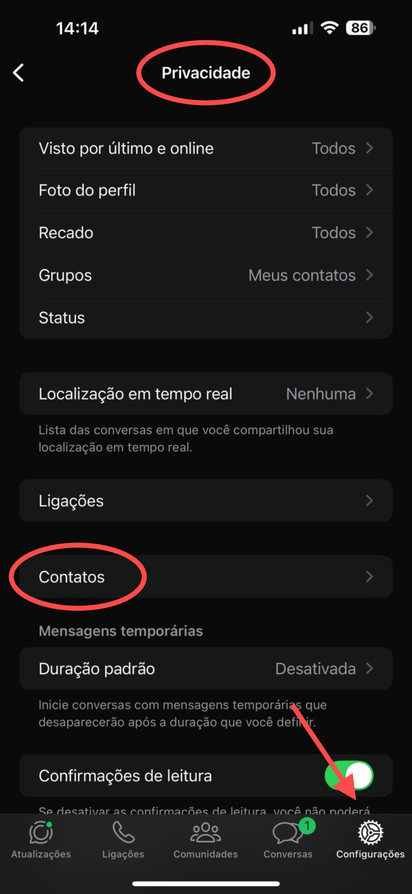
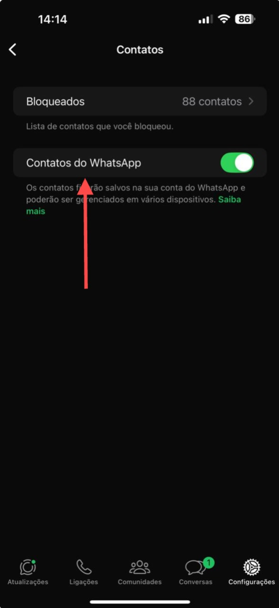

## Method

#### /contacts/add

`POST` https://api.z-api.io/instances/SUA_INSTANCIA/token/SEU_TOKEN/contacts/add

### Header

|      Key       |            Value            |
| :------------: |     :-----------------:     |
|  Client-Token  | **[ACCOUNT SECURITY TOKEN](../security/client-token)** |
---

## Concept

This method is responsible for saving WhatsApp contacts to your phone's contact list.

---

:::caution About This Feature

The method for adding contacts to the WhatsApp list will only work for accounts that have already received the necessary update. Make sure your WhatsApp account has received the update before using this feature; otherwise, the operation will not be completed successfully.

Additionally, you must allow WhatsApp to add contacts directly on your device. To do this, go to your app’s privacy settings and adjust the permissions so that WhatsApp can access and modify your contacts.

See the example in the images below: 
:::

<details>
 <summary>Click here to display the images.</summary>

 

</details>

## Attributes

### Required

| Attributes | Type   | Description                                             |
| :--------- | :----: | :------------------------------------------------------ |
| firstName  | string | First name of the contact to be added to the address book |
| phone      | string | Phone number of the contact to be added to the address book | 

### Optionals 

| Attributes | Type   | Description |
| :--------  | :----: | :-------- |
| lastName   | string | Last name of the contact to be added to the address book  |

---

## Request Body

```json
[
  {
    "firstName": "contact 1",
    "lastName": "name 2",
    "phone": "554499999999"
  },
  {
    "firstName": "contact 2",
    "lastName": "name 2",
    "phone": "554499998888"
  }
]
```

## Response

### 200

| Atributos | Tipo  | Descrição |
| :-- | :-- | :--   |
| success | boolean |  |
| errors  | array   |  |

Exemplo

```json
{
    "success": true,
    "errors": []
}
```

### 405

In this case, make sure you are sending the method specification correctly, meaning check if you sent POST or GET as specified at the beginning of this topic.

### 415

If you receive a 415 error, ensure you add the "Content-Type" of the object you are sending in the request headers, which is mostly "application/json".

---

## Code

<iframe src="//api.apiembed.com/?source=https://raw.githubusercontent.com/Z-API/z-api-docs/main/json-examples/add-contacts.json&targets=all" frameborder="0" scrolling="no" width="100%" height="500px" seamless></iframe>
