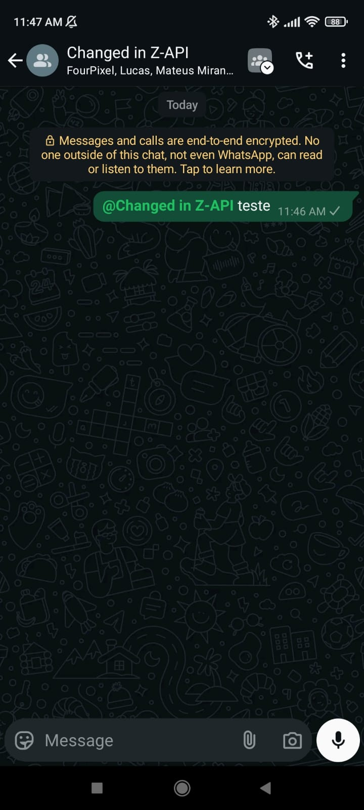

## Method

#### /send-text

`POST` https://api.z-api.io/instances/YOUR_INSTANCE/token/YOUR_TOKEN/send-text

### Header

|      Key       |            Value            |
| :------------: |     :-----------------:     |
|  Client-Token  | **[ACCOUNT SECURITY TOKEN](../security/client-token)** |
---

## Concept

This method is responsible for mentioning groups related to a community. Mentions can only be made in groups within a community, and the mentioned groups must belong to the same community.



---

## Attributes

### Required

| Attributes | Type   | Description |
| :--       | :-:    | :-- |
| phone     | string | ID of the group where the groups will be mentioned |
| message   | string | Text to be sent. Must contain @ with the group ID |
| groupMentioned | GroupMentioned[] | List of objects with the group data to be mentioned |

### GroupMentioned

| Attributes |  Type  | Description                     |
| :-------- | :----: | :---------------------------- |
| phone     | string | ID of the group to be mentioned |
| subject   | string | Name of the group |


### Optional

| Attributes | Type | Description |
| :-- | :-: | :-- |
| delayMessage | number | In this attribute, a delay is added to the message. You can decide between a range of 1~15 sec, meaning how many seconds it will wait to send the next message. (Ex "delayMessage": 5, ). The default delay if not specified is 1~3 sec |

---

## Request Body

```json
{
  "phone": "5511999999999-group",
  "message": "Welcome to *Z-API group* @1203634230225498-group",
  "groupMentioned": [
    {
      "phone": "1203634230225498-group",
      "subject": "Z-API subgroup"
    }
  ]
}
```

---

:::tip
It is also possible to mention participants in the message along with the group mentions
:::

## Response

### 200

| Attributes | Type   | Description      |
| :-------- | :----- | :------------- |
| zaapId    | string | ID in Z-API    |
| messageId | string | ID in WhatsApp |
| id | string | Added for compatibility with Zapier, it has the same value as messageId |

Example

```json
{
  "zaapId": "3999984263738042930CD6ECDE9VDWSA",
  "messageId": "D241XXXX732339502B68",
  "id": "D241XXXX732339502B68"
}
```

### 405

In this case, ensure that you are correctly sending the method specification, meaning check if you sent POST or GET as specified at the beginning of this topic.

### 415

If you receive a 415 error, make sure to add the "Content-Type" in the request headers for the object you are sending, in most cases "application/json".

---

## Webhook Response

Link to the webhook response (upon receiving)

[Webhook](../webhooks/on-message-received#example-of-text-response)

---

## Code

<iframe src="//api.apiembed.com/?source=https://raw.githubusercontent.com/Z-API/z-api-docs/main/json-examples/send-text.json&targets=all" frameborder="0" scrolling="no" width="100%" height="500px" seamless></iframe>
