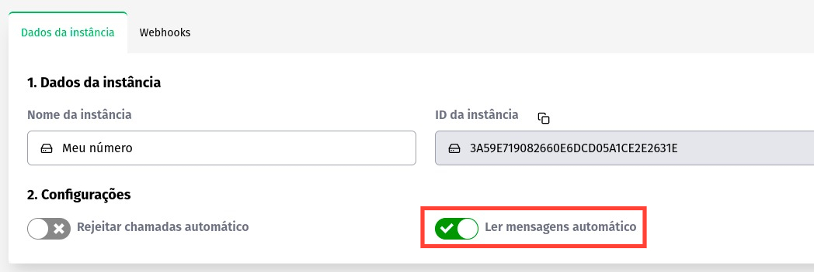

## Concept

This method activates the automatic reading of all messages received through the API.

### Header

|      Key       |            Value            |
| :------------: |     :-----------------:     |
|  Client-Token  | **[ACCOUNT SECURITY TOKEN](../security/client-token)** |

---

### Method

#### /update-auto-read-message

`PUT` https://api.z-api.io/instances/YOUR_INSTANCE/token/YOUR_TOKEN/update-auto-read-message

#### Request Body

```json
{
  "value": true or false
}
```

---

### Admin Panel



---

## Response

### 200

```json
{
  "value": true
}
```

### 405

In this case certify that you are sending the correct specification of the method. This means, verify if you sent a PUT or POST as specified at the beginning of this topic.

### 415

In case you receive 415 error, make sure to add the “Content-Type” of the object you are sending in the request headers, mostly “application/json”

---