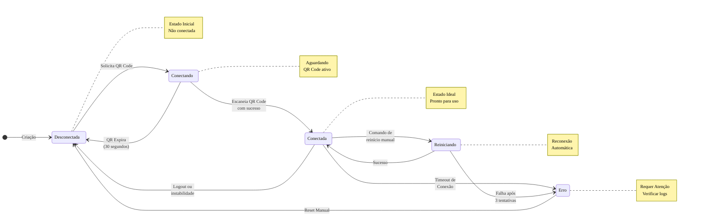

import { Icon } from '@site/src/components/shared/MdxIcon';

# <Icon name="Smartphone" size="lg" /> Managing Your Instance

The "instance" is the heart of your connection with the Z-API. It's the digital bridge that connects a number of WhatsApp to our platform, allowing your automations to send and receive messages.

This section covers everything you need to know to create, connect, and maintain healthy and active instances.

:::tip Fundamental Concept
The instance is the central point of all your automation. Understanding how to manage it is essential for keeping your integrations running perfectly!
:::

:::info Explanatory Article
For a simple and accessible explanation about instances using basic analogies, especially useful for new automators, see the article: [What Is an Instance? Understand How Your WhatsApp Becomes a Digital Assistant](/blog/o-que-e-uma-instancia-entenda-como-seu-whatsapp-vira-um-assistente-digital).
:::

---

## <Icon name="Info" size="md" /> What Is an Instance? A Metaphor

Think of an **instance as a virtual smartphone in the cloud, dedicated exclusively to your automation.**

- <Icon name="Smartphone" size="sm" /> Each instance is linked to **one unique WhatsApp number**.
- <Icon name="Globe" size="sm" /> Just like a cell phone, it needs to be **connected to the internet and WhatsApp** to function.
- <Icon name="MessageSquare" size="sm" /> All communication of your automation (sending and receiving messages) passes through this instance.

---

## <Icon name="RefreshCw" size="md" /> The Lifecycle of an Instance

An instance goes through different states. Understanding these states is crucial for managing your connection.

:::info Instance States
Each state represents a different phase of the connection. The goal is to keep your instance always in the "Connected" state!
:::

<ScrollRevealDiagram direction="up" initialZoom={3.0}>

</ScrollRevealDiagram>

<strong>Legenda do Diagrama</strong>

This diagram shows all possible states of an instance and their transitions:

**States**:
- **Disconnected**: Initial state, not connected
- **Connecting**: Waiting for QR Code scan
- **Connected**: Ideal state, ready to use
- **Restarting**: Attempting automatic reconnection
- **Error**: Error state that requires attention

**Transitions**:
- **Normal**: Disconnected → Connecting → Connected
- **Expiration**: Connecting → Disconnected (QR expires in 30s)
- **Reconnect**: Connected → Restarting → Connected/Erro
- **Error**: Connected → Error → Disconnected (manual reset)

**Notes**:
- State **Connected** is the ideal for operation
- State **Error** requires log verification and possible manual reset

### <Icon name="CircleDashed" size="sm" /> Instance States with Visual Indicators

| State | Icon | Color | Description | Required Action |
|:----- |:---- |:-- |:-------- |:-------------- |
| **Disconnected** | <Icon name="LogOut" size="xs" /> | Gray | The instance is not linked to any WhatsApp session. | **[Generate a QR Code](/docs/instance/qrcode)** to start the connection. |
| **Connecting** | <Icon name="QrCode" size="xs" /> | Yellow | A QR Code was generated and the instance is waiting for it to be scanned by the WhatsApp app. | Scan the QR Code with your phone. The QR Code expires in 30 seconds. |
| **Connected** | <Icon name="CircleCheck" size="xs" /> | Green | Success! The instance is online and ready to send and receive messages. | Monitor the status periodically. This is the ideal state for operation. |
| **Restarting** | <Icon name="RefreshCw" size="xs" /> | Blue | The instance is trying to re-establish a lost connection automatically. | Wait for the process to complete (usually takes a few seconds). |
| **Error** | <Icon name="XSquare" size="xs" /> | Red | The instance encountered a critical error and cannot connect. | Check logs, try manual reset or **[generate new QR Code](/docs/instance/qrcode)**. |

:::success Ideal State
The main task in managing an instance is to ensure it remains in the **"Connected"** state. This is the only state where your automation can function completely.
:::

---

## <Icon name="ListChecks" size="md" /> Essential Management Tasks

Navigate through the guides in this section to learn how to perform the most important operations.

### <Icon name="QrCode" size="sm" /> 1. Connect and Reconnect

- <Icon name="QrCode" size="xs" /> **[Get QR Code](/docs/instance/qrcode):** The first step for any new instance. Learn how to generate the QR Code to scan with your phone.
- <Icon name="RefreshCw" size="xs" /> **[Restart Instance](/docs/instance/reiniciar):** If your instance disconnects for a brief period, use this function to try re-establishing the session without needing to scan the QR Code again.

### <Icon name="Eye" size="sm" /> 2. Monitor Connection Health

- <Icon name="Circle" size="xs" /> **[Check Instance Status](/docs/instance/status):** The most important operation for daily use. Check if your instance is connected and see details about the linked device.

### <Icon name="UserCheck" size="sm" /> 3. Profile Settings

- <Icon name="Image" size="xs" /> **[Update Profile Picture](/docs/instance/atualizar-imagem-perfil):** Change the profile picture of the connected number.
- <Icon name="Edit3" size="xs" /> **[Update Name and Message](/docs/instance/atualizar-nome-perfil):** Modify the name and message (description) of the WhatsApp profile.

### <Icon name="Settings" size="sm" /> 4. Behavior Settings

- <Icon name="CheckCheck" size="xs" /> **[Auto Mark as Read](/docs/instance/leitura-automatica):** Configure the instance to automatically mark messages as read.
- <Icon name="PhoneOff" size="xs" /> **[Reject Calls](/docs/instance/rejeitar-chamadas):** Enable automatic rejection of voice and video calls.

---

## <Icon name="Rocket" size="md" /> Next Steps

Now that you understand the concepts, here's what to do next:

1. <Icon name="QrCode" size="xs" /> **[Connect Your Instance](/docs/instance/qrcode):** Follow the guide to generate your QR Code and put your instance online.
2. <Icon name="Circle" size="xs" /> **[Verify Status](/docs/instance/status):** Confirm that the connection was successful.
3. <Icon name="Settings" size="xs" /> **Explore Settings:** Customize your instance's behavior as needed.