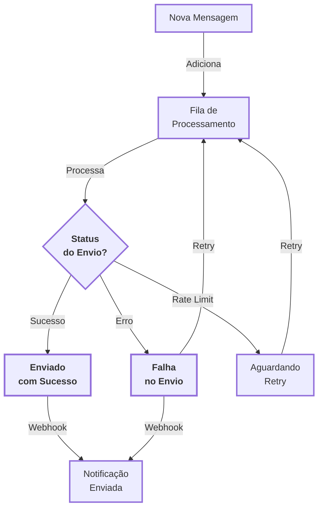

# <Icon name="List" size="lg" /> Message Queue

Manage your message queue through the Z-API. View pending messages, remove specific messages from the queue, and empty the entire processing queue when necessary.

:::tip Queue Management
The message queue allows you to monitor and control messages that are waiting for processing, essential for managing high volumes of sends!
:::

:::info Explanatory Article
For a didactic explanation about message queues using simple and practical analogies, especially useful for understanding why queues are crucial when sending thousands of messages, see the article: [Message Queue: How to Send Thousands of Messages Without Locking the System](/blog/fila-mensagens-como-enviar-milhares-sem-travar).
:::

---

## <Icon name="Info" size="md" /> Overview

The **Message Queue** section gathers endpoints that work with messages **not yet processed** by the instance. Use these operations to:

- <Icon name="Eye" size="sm" /> **Monitor the queue**: list messages waiting for delivery.
- <Icon name="XSquare" size="sm" /> **Remove specific message**: cancel only a `messageId` that should no longer be sent.
- <Icon name="Trash2" size="sm" /> **Empty the queue**: clear all pending items in emergency or reconfiguration situations.

:::warning Asynchronous Processing
The queue reflects the **asynchronous** state of processing. A message may have been accepted by the API but not yet sent to WhatsApp and will remain in the queue until processed.
:::

---

## <Icon name="ListChecks" size="md" /> Main Operations

Manage your message queue with these pages:

- <Icon name="List" size="xs" /> **View the queue**: [`GET https://api.z-api.io/instances/SUA_INSTANCIA/token/SEU_TOKEN/queue`](/docs/message-queue/fila) – list messages waiting for processing.
- <Icon name="XSquare" size="xs" /> **Remove specific message**: [`DELETE https://api.z-api.io/instances/SUA_INSTANCIA/token/SEU_TOKEN/queue/{messageId}`](/docs/message-queue/apagar-mensagem) – remove only one item from the queue.
- <Icon name="Trash2" size="xs" /> **Clear the queue**: [`DELETE https://api.z-api.io/instances/SUA_INSTANCIA/token/SEU_TOKEN/queue`](/docs/message-queue/apagar-fila) – empty the entire queue of the instance.

## <Icon name="BookOpen" size="md" /> Important Concepts

### <Icon name="List" size="sm" /> What is the Message Queue?

The message queue is the buffer where messages wait for processing before being delivered to WhatsApp. In high-volume scenarios, it's normal for the queue to have dozens or hundreds of messages at different stages.

### <Icon name="RefreshCw" size="sm" /> Processing Flow {#processing-flow}

The diagram below illustrates how messages are processed in the queue:

<ScrollRevealDiagram direction="up">

</ScrollRevealDiagram>

<strong>Legend of Diagram</strong>

This diagram shows how messages are processed in the queue.

**Main Flow**: New Message → Queue → Processing → Delivery Status? (Success) → Delivered → Notification

**Alternative Paths**:

- Delivery Status? (Error) → Failure → Retry → (returns to Queue)
- Delivery Status? (Rate Limit) → Waiting → Retry → (returns to Queue)

**Characteristics**: Asynchronous processing with automatic retries and notifications via webhook.

:::tip Learn to Read Diagrams
Not familiar with flow diagrams? Read our [complete guide on how to interpret diagrams and processes](/blog/como-ler-diagramas-fluxos-decisao).
:::

### <Icon name="CircleDashed" size="sm" /> Queue Status (Examples)

The exact states may vary depending on the API version, but generally you will find categories like:

- <Icon name="Clock" size="xs" /> **Pending**: waiting for processing.
- <Icon name="RefreshCw" size="xs" /> **Processing**: the message is being sent to WhatsApp.
- <Icon name="CircleCheck" size="xs" /> **Delivered**: processed successfully (usually does not remain in the queue).
- <Icon name="XSquare" size="xs" /> **Failed**: there was an error sending, which may require a retry or log analysis.

See the section [**Message Queue**](/docs/message-queue/fila) for details on fields and states returned by the API.

---

## <Icon name="CheckSquare" size="md" /> Prerequisites

To work with the message queue, you need:

- <Icon name="Smartphone" size="sm" /> **An active instance** with a valid `instanceId`.
- <Icon name="KeyRound" size="sm" /> **Access token** (`Client-Token`) with read and write permissions on the instance.
- <Icon name="Terminal" size="sm" /> **Testing tool** (such as cURL, Postman or an HTTP collection) to experiment with endpoints.

---

## <Icon name="ShieldCheck" size="md" /> Best Practices

- <Icon name="Eye" size="sm" /> **Monitor the queue periodically** to identify sending bottlenecks or recurring errors.
- <Icon name="FileText" size="sm" /> **Avoid emptying the queue without logging**: when using the total cleanup endpoint, log the reason in logs or internal systems.
- <Icon name="Shield" size="sm" /> **Handle errors idempotently**: when removing specific messages, consider the case where the `messageId` is no longer in the queue (e.g., already processed).
- <Icon name="CheckSquare" size="sm" /> **Validate your integrations in a test environment** before automating cleanups or removals in production.

:::tip Continuous Monitoring
Regularly monitor the queue to identify issues before they affect system performance!
:::

---

## <Icon name="Rocket" size="md" /> Next Steps

- <Icon name="List" size="sm" /> **View details of the list endpoint**: [`GET https://api.z-api.io/instances/SUA_INSTANCIA/token/SEU_TOKEN/queue`](/docs/message-queue/fila)
- <Icon name="XSquare" size="sm" /> **Learn to remove a specific message**: [`DELETE https://api.z-api.io/instances/SUA_INSTANCIA/token/SEU_TOKEN/queue/{messageId}`](/docs/message-queue/apagar-mensagem)
- <Icon name="Trash2" size="sm" /> **Understand how to empty the entire queue**: [`DELETE https://api.z-api.io/instances/SUA_INSTANCIA/token/SEU_TOKEN/queue`](/docs/message-queue/apagar-fila)