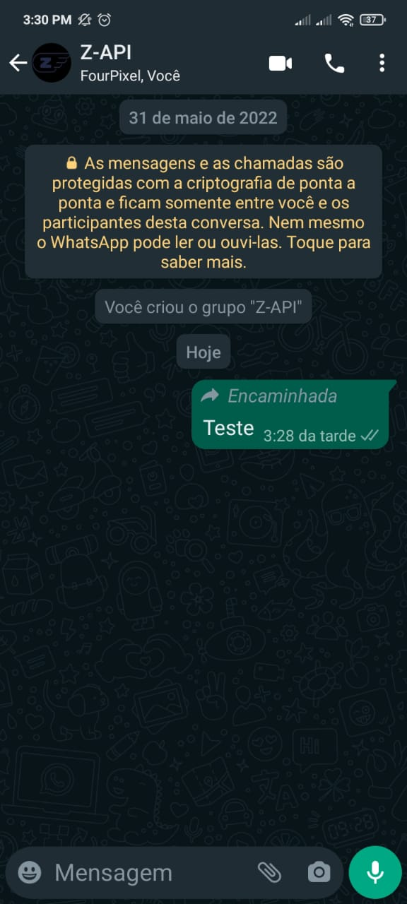

## Method

#### /forward-message


`POST` https://api.z-api.io/instances/SUA_INSTANCIA/token/SEU_TOKEN/forward-message

---

## Concept

Simple and straightforward, in this method, you can forward messages through the API by providing the messageId of the message you want to forward and the phone number of the chat where this messageId is located.



---

## Attributes

### Required

| Attributes   | Type   | Description |
| :-------     | :----: | :------   |
| phone        | string | Recipient (or group ID in case you want to send it to a group) telephone number in the format DDI DDD NUMERS Ex: 551199999999. IMPORTANT  only send numbers without formatting or a mask  |
| messageId    | string | Message ID that will be forwarded  |
| messagePhone | string | Phone number of the chat where the messageId is located |

### Optional

| Attributes   | Type   | Description |
| :---------   | :----: | :-------- |
| delayMessage | number | In this attribute a delay is added to the message. You can decide between a range of 1 - 15 secs (this is for how many seconds it will wait to send the next message EX: “delayMessage”:5,). The default delay is between 1 - 3 secs.|

---

## Request Body

```json
{
  "phone": "5511999999999",
  "messageId": "3999984263738042930CD6ECDE9VDWSA",
  "messagePhone": "5511888888888"
}
```

---

## Response

### 200

| Atributos | Tipo   | Descrição      |
| :-------- | :----- | :------------- |
| zaapId    | string | id no z-api    |

Example

```json
{
  "zaapId": "3999984263738042930CD6ECDE9VDWSA"
}
```

### 405

In this case certify that you are sending the correct specification of the method. This means, verify if you sent a POST or GET as specified at the beginning of this topic.

### 415

In case you receive 415 error, make sure to add the “Content-Type” of the object you are sending in the request headers, mostly “application/json”

---

## Webhook Response

Link para a response do webhook (ao receber)

[Webhook](../webhooks/on-message-received#exemplo-de-retorno-de-texto)

---

## Code

<iframe src="//api.apiembed.com/?source=https://raw.githubusercontent.com/Z-API/z-api-docs/main/json-examples/forward-message.json&targets=all" frameborder="0" scrolling="no" width="100%" height="500px" seamless></iframe>
