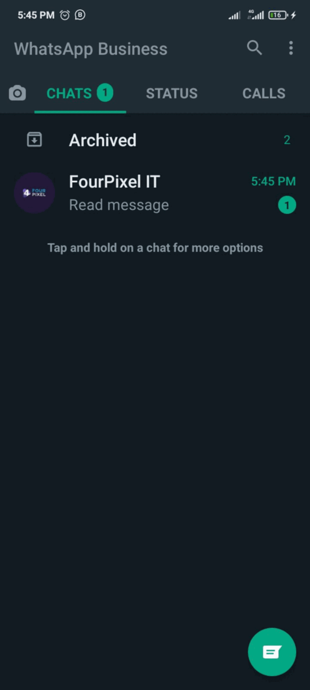

## Method 

#### /read-message

`POST` https://api.z-api.io/instances/SUA_INSTANCIA/token/SEU_TOKEN/read-message

---

## Concept 

Method used to mark a text message as read 



---

## Attributes

### Mandatory 

| Attributes | Type | Description  |
| :-- | :-: | :-- |
| phone | string | Recipient (or group ID in case you want to send it to a group) telephone number in the format DDI DDD NUMERS Ex: 551199999999. IMPORTANT  only send numbers without formatting or a mask  |
| messageId | string | Original messages id, in case the message was sent by you it is the code that comes in the response. In case it is a message sent by a contact you will receive this messageID through your webhook’s receive. |

### Optionals 

| Attributes | Type | Description |
| :-------- | :--: | :-------- |
|           |      |           |

---

## Request Body

```json
{
  "phone": "5511999998888",
  "messageId": "3999984263738042930CD6ECDE9VDWSA"
}
```

---

## Response

### 204

No content

| Attributes | Type | Description |
| :-------- | :--- | :-------- |
|           |      |           |

Example 

```json
{}
```

### 405

In this case certify that you are sending the correct specification of the method. This means, verify if you sent a POST or GET as specified at the beginning of this topic.
### 415

In case you receive 415 error, make sure to add the “Content-Type” of the object you are sending in the request headers, mostly “application/json”

---

## Webhook Response

Link for webhooks response (upon receiving)

[Webhook](../webhooks/on-message-received#response)

---

## Code

<iframe src="//api.apiembed.com/?source=https://raw.githubusercontent.com/Z-API/z-api-docs/main/json-examples/read-message.json&targets=all" frameborder="0" scrolling="no" width="100%" height="500px" seamless></iframe>
