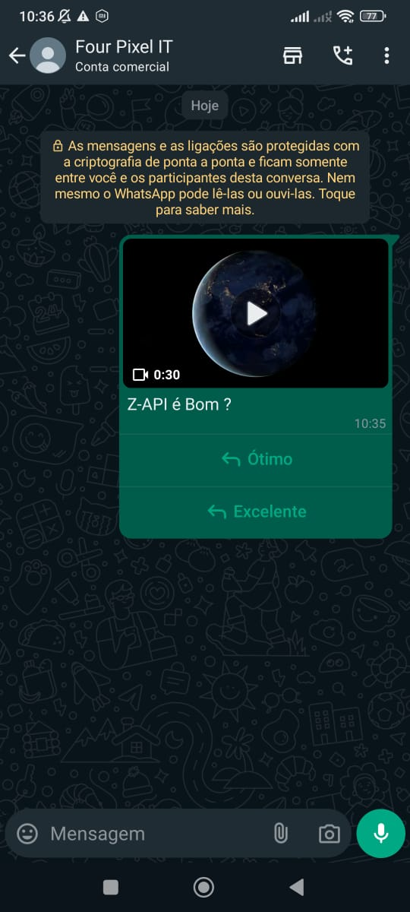

## Method

#### /send-button-list

`POST` https://api.z-api.io/instances/YOUR_INSTANCE/token/YOUR_TOKEN/send-button-list

### Header

|      Key       |            Value            |
| :------------: |     :-----------------:     |
|  Client-Token  | **[ACCOUNT SECURITY TOKEN](../security/client-token)** |
---

:::caution Warning
Button sending is currently available. For more details, visit the [Button Status](https://developer.z-api.io/en/tips/button-status) topic.
:::

## Concept

This method allows you to send videos with action buttons. The button content, e.g., YES/NO, can be chosen by the user and will be used as a response to the message sent along with the buttons.



---

## Attributes

### Required

| Attributes  | Type       | Description |
| :-------    | :-------:  | :------   |
| phone       | string     | Phone number (or group ID in the case of group sending) of the recipient in the format DDI DDD NUMBER e.g., 551199999999. **IMPORTANT** Send only numbers, without formatting or masking |
| message     | string     | Text to be sent  |
| buttonList  | buttonList | Button object |

:::important
 The "message" attribute cannot be empty!
:::

### Optional

| Attributes    | Type   | Description |
| :---------    | :----: | :-------- |
| delayMessage  | number | This attribute adds a delay to the message. You can choose a range of 1~15 seconds, meaning how many seconds it will wait to send the next message (e.g., "delayMessage": 5). The default delay, if not specified, is 1~3 seconds. |


### Button List

| Attributes |  Type  | Description                                |
| :--------- | :----: | :-----------------------------------       |
| video      | string | URL or Base64 of the video to be sent      |
| buttons    | button | List of buttons to be sent                |

### Button

| Attributes |  Type  | Description          |
| :--------- | :----: | :-----------------   |
| label      | string | Text for the button  |

### Optional Button

| Attributes |  Type  | Description              |
| :--------- | :----: | :---------------------   |
| id         | string | Button identifier        |

---

## Request Body

```json
{
  "phone": "5511999999999",
  "message": "Is Z-API Good?",
  "buttonList": {
    "video": "video URL",
    "buttons": [
      {
        "id": "1",
        "label": "Great"
      },
      {
        "id": "2",
        "label": "Excellent"
      }
    ]
  }
}
```

---

## Response

### 200

| Attributes | Type   | Description      |
| :--------- | :----- | :--------------- |
| zaapId     | string | ID on Z-API      |
| messageId  | string | ID on WhatsApp   |
| id         | string | Added for compatibility with Zapier, it has the same value as messageId |

Example

```json
{
  "zaapId": "3999984263738042930CD6ECDE9VDWSA",
  "messageId": "D241XXXX732339502B68",
  "id": "D241XXXX732339502B68"
}
```

### 405

In this case, ensure that you are correctly sending the method specification, i.e., verify if you sent POST or GET as specified at the beginning of this topic.

### 415

If you receive a 415 error, ensure to add the "Content-Type" header to the request object you are sending, which in most cases is "application/json".

---

## Webhook Response

Link to the webhook response (upon receiving)

[Webhook](../webhooks/on-message-received#button-with-video-return-example)

---

## Code

<iframe src="//api.apiembed.com/?source=https://raw.githubusercontent.com/Z-API/z-api-docs/main/json-examples/send-button-list-video.json&targets=all" frameborder="0" scrolling="no" width="100%" height="500px" seamless></iframe>
