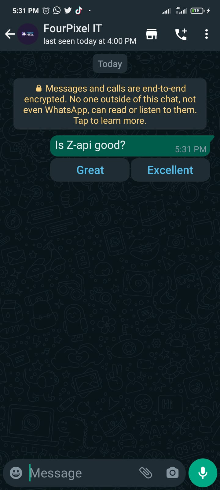

## Methods

#### /send-button-list

`POST` https://api.z-api.io/instances/YOUR_INSTANCE/token/YOUR_TOKEN/send-button-list

### Header

|      Key       |            Value            |
| :------------: |     :-----------------:     |
|  Client-Token  | **[ACCOUNT SECURITY TOKEN](../security/client-token)** |

---

:::danger Attention
Button shipments are currently unavailable. For more details, please access the topic [Button Functionality](https://developer.z-api.io/en/tips/button-status)
:::


## Concept 

In this method you will be able to send text messages with action buttons. Buttons content ex: YES / NO, they will be able to be chosen by the user and it will be used as an answer to the text that was sent.



---

## Attributes

### Required 

| Attributes | Type | Description |
| :-- | :-: | :-- |
| phone | string | Recipient (or group ID in case you want to send it to a group) telephone number in the format DDI DDD NUMERS Ex: 551199999999. IMPORTANT  only send numbers without formatting or a mask  |
| message | string | Text to be sent |
| buttonList | buttonList | Type button object |

### Optionals 

| Attributes | Type | Description |
| :-- | :-: | :-- |
| delayMessage | number | In this attribute a delay is added to the message. You can decide between a range of 1 - 15 secs (this is for how many seconds it will wait to send the next message EX: “delayMessage”:5,). The default delay is between 1 - 3 secs.|

### Button List

| Attributes |  Type  | Description                     |
| :-------- | :----: | :---------------------------- |
| buttons   | button | List of buttons to be sent    |

### Button

| Attributes |  Type  | Description          |
| :-------- | :----: | :----------------- |
| label     | string | Text for the button |

### Opcionais Button

| Attributes |  Type  | Description              |
| :-------- | :----: | :--------------------- |
| id        | string | Button identifier |

---

## Request Body

```json
{
  "phone": "5511999999999",
  "message": "Z-API é Bom ?",
  "buttonList": {
    "buttons": [
      {
        "id": "1",
        "label": "Ótimo"
      },
      {
        "id": "2",
        "label": "Excelente"
      }
    ]
  }
}
```

---

## Response

### 200

| Attributes | Type   | Description       |
| :-------- | :----- | :------------- |
| zaapId    | string | id no z-api    |
| messageId | string | id no whatsapp |

Example 

```json
{
  "zaapId": "3999984263738042930CD6ECDE9VDWSA",
  "messageId": "D241XXXX732339502B68"
}
```

### 405

In this case certify that you are sending the correct specification of the method. This means, verify if you sent a POST or GET as specified at the beginning of this topic.

### 415

In case you receive 415 error, make sure to add the “Content-Type” of the object you are sending in the request headers, mostly “application/json”

---

## Webhook Response

Link for webhooks response (upon receiving)

[Webhook](../webhooks/on-message-received#exemplo-de-retorno-de-texto-lista-de-botão)

---

## Code

<iframe src="//api.apiembed.com/?source=https://raw.githubusercontent.com/Z-API/z-api-docs/main/json-examples/send-button-list.json&targets=all" frameborder="0" scrolling="no" width="100%" height="500px" seamless></iframe>
