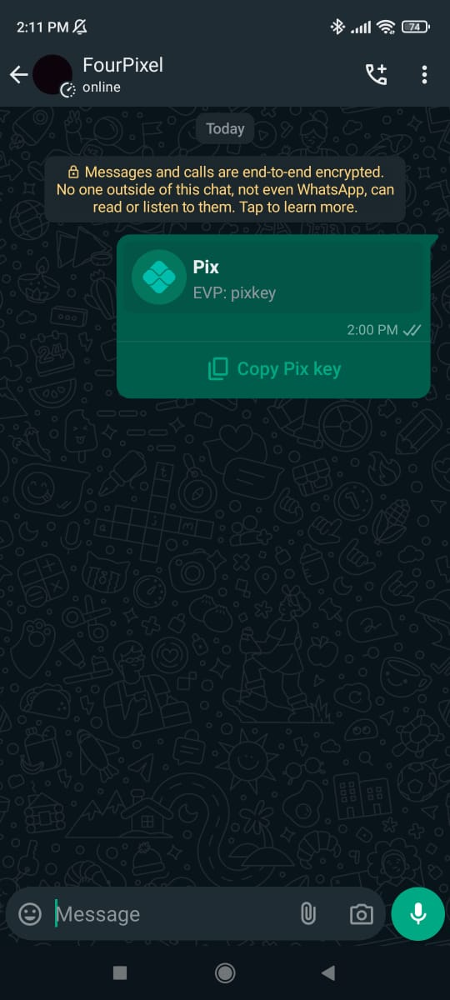

## Method

#### /send-button-pix

`POST` https://api.z-api.io/instances/YOUR_INSTANCE/token/YOUR_TOKEN/send-button-pix

### Header

|      Key       |            Value            |
| :------------: |     :-----------------:     |
|  Client-Token  | **[ACCOUNT SECURITY TOKEN](../security/client-token)** |
---

:::caution Attention
Button sending is currently available; for more details, visit the topic [Button Status](https://developer.z-api.io/tips/button-status).
:::

## Concept

With this method, you can send PIX key messages with a button to copy.



---

## Attributes

### Required

| Attributes  | Type   | Description |
| :---------: | :----: | :---------- |
| phone       | string | Recipient's phone number (or group ID for sending to groups) in the format COUNTRY CODE AREA CODE NUMBER, e.g., 551199999999. **IMPORTANT** Send only numbers, without formatting or mask. |
| pixKey      | string | PIX key      |
| type        | string | Type of PIX key (CPF, CNPJ, PHONE, EMAIL, EVP)  |

### Optional

| Atributos   | Tipo          | Descrição |
| :----------:| :-----------: | :-------- |
| merchantName         | string        | Title to be shown on the button (If left empty the default title will be 'Pix') |

---

## Request Body

```json
{
  "phone": "551199999999",
  "pixKey": "pix key",
  "type": "EVP"
}
```

---

:::warning Observação
On whatsapp web, pix messages received do not change the chat state, which means that the chat is not marked as unread and it also does not go to the top of the chat list. However, the message is rendered normally. This is a bug in the whatsapp web itself.
:::

## Response

### 200

| Attributes | Type   | Description                                      |
| :--------- | :----- | :----------------------------------------------- |
| zaapId     | string | ID in z-api                                      |
| messageId  | string | ID in WhatsApp                                    |
| id         | string | Added for compatibility with Zapier, it has the same value as messageId |

Example

```json
{
  "zaapId": "3999984263738042930CD6ECDE9VDWSA",
  "messageId": "D241XXXX732339502B68",
  "id": "D241XXXX732339502B68"
}
```

### 405

In this case, ensure that you are correctly following the method specification, i.e., check if you are sending a POST or GET request as specified at the beginning of this topic.

### 415

If you receive a 415 error, make sure to add the "Content-Type" header in your request, which is usually "application/json" for most objects you are sending.

---

## Webhook Response

Link to the webhook response (upon receipt)

[Webhook](../webhooks/on-message-received#pix-key-button-return-example)

---

## Code

<iframe src="//api.apiembed.com/?source=https://raw.githubusercontent.com/Z-API/z-api-docs/main/json-examples/send-button-pix.json&targets=all" frameborder="0" scrolling="no" width="100%" height="500px" seamless></iframe>
