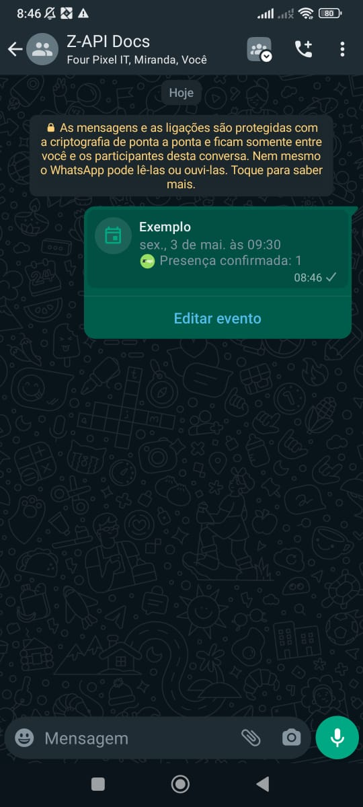

## Method

#### /send-event

`POST` https://api.z-api.io/instances/YOUR_INSTANCE/token/YOUR_TOKEN/send-event

### Header

|     Key      |                         Value                          |
| :----------: | :----------------------------------------------------: |
| Client-Token | **[ACCOUNT SECURITY TOKEN](../security/client-token)** |

---

## Concept

In this method, you can send messages of type Event.



---

## Attributes

### Required

| Attributes | Type | Description |
| :-- | :-: | :-- |
| phone | string | Recipient's phone number (or group ID for group messages) in the format CC DDD NUMBER. **IMPORTANT** Send only numbers, without formatting or masks. |
| event | Event | Event data |

### Event

| Attributes | Type | Description |
| :-- | :-: | :-- |
| name | string | Event name |
| description | string (optional) | Event description |
| dateTime | string | Event date and time (without timezone) |
| location | Location (optional) | Event location |
| callLinkType | string (voice/video) (optional) | Event call type (voice or video) |
| canceled | boolean | Defines if the event is canceled |

---

## Request Body

```json
{
  "phone": "120363019502650977-group",
  "event": {
    "name": "Event Name",
    "description": "Event Description",
    "dateTime": "2024-04-29T09:30:53.309Z",
    "location": {
      "name": "Location Name"
    },
    "callLinkType": "voice | video",
    "canceled": false
  }
}
```

---

## Response

### 200

| Attributes | Type | Description |
| :-- | :-- | :-- |
| zaapId | string | Z-api id |
| messageId | string | WhatsApp id |
| id | string | Added for compatibility with Zapier, it has the same value as messageId |

Example

```json
{
  "zaapId": "3999984263738042930CD6ECDE9VDWSA",
  "messageId": "D241XXXX732339502B68",
  "id": "D241XXXX732339502B68"
}
```

### 405

In this case, make sure you are correctly sending the method specification, meaning check if you sent the POST or GET as specified at the beginning of this topic.

### 415

If you receive a 415 error, make sure to add the "Content-Type" of the object you are sending in the request headers, mostly "application/json".

---

## Webhook Response

Link to the webhook response (upon receiving)

[Webhook](../webhooks/on-message-received#event-return-example)

---

## Code

<iframe src="//api.apiembed.com/?source=https://raw.githubusercontent.com/Z-API/z-api-docs/main/json-examples/send-event.json&targets=all" frameborder="0" scrolling="no" width="100%" height="500px" seamless></iframe>
