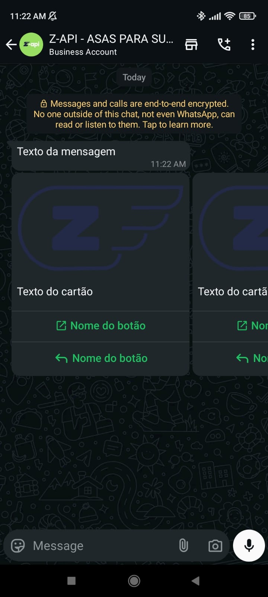

## Method

#### /send-carousel

`POST` https://api.z-api.io/instances/SUA_INSTANCIA/token/SEU_TOKEN/send-carousel

### Header

|      Key       |            Value            |
| :------------: |     :-----------------:     |
|  Client-Token  | **[ACCOUNT SECURITY TOKEN](../security/client-token)** |
---

:::caution Attention
Sending buttons accompanying the carousel is currently available, but there are some decisive factors for functionality. For more details, access the topic [Button Functionality](https://developer.z-api.io/en/tips/button-status)
:::

## Concept

With this method, you can send carousel messages with images, text, and action buttons. Using action buttons, you can redirect to links, make calls, and also provide standard responses.



---

## Attributes

### Required

| Attributes   | Type          | Description |
| :----------:| :-----------: | :-------- |
| phone         | string        | Phone number (or group ID in cases of sending to groups) of the recipient in the format DDI DDD NUMBER e.g., 551199999999. **IMPORTANT** Send only numbers, without formatting or mask |
| message       | string          | Text to be sent  |
| carousel      | carouselCard[]  | Array of objects with carousel cards |

### carouselCard

| Attributes |  Type  | Description                     |
| :-------: | :----: | :----------------------------: |
| text      | string | Card text  |
| image     | string | Card image |

### Optional carouselCard
| Attributes |  Type  | Description                     |
| :-------: | :----: | :----------------------------: |
| buttons   | buttonActions[] | Array of objects of type buttonActions |

### buttonActions

| Attributes |  Type  | Description                     |
| :-------: | :----: | :----------------------------: |
| type      | string | Button types to be sent (CALL, URL, REPLY) |
| phone     | string | Number assigned to the button if it is of type CALL |
| url       | string | Link assigned to the button if it is of type URL.   |
| label     | string | Button text |

### Optional buttonActions

| Attributes |  Type  | Description                    |
| :-------: | :----: | :---------------------:      |
| id        | string | Button identifier       |

### Optional
| Attributes    | Type   | Description |
| :----------: | :----: | :-------: |
| delayMessage | number | In this attribute, a delay is added to the message. You can choose a range from 1~15 sec, meaning how many seconds it will wait to send the next message. (e.g., "delayMessage": 5). The default delay if not specified is 1~3 sec |

---

## Request Body

```json
{
    "phone": "551199999999",
    "message": "Message text",
    "carousel": [
        {
            "text": "Card text",
            "image": "https://firebasestorage.googleapis.com/v0/b/zaap-messenger-web.appspot.com/o/logo.png?alt=media",
            "buttons": [
                {
                    "id": "1",
                    "label": "Button name",
                    "url": "https://z-api.io",
                    "type": "URL"
                },
                {
                    "id": "2",
                    "label": "Button name",
                    "type": "REPLY"
                }
            ]
        },
        {
            "text": "Card text",
            "image": "https://firebasestorage.googleapis.com/v0/b/zaap-messenger-web.appspot.com/o/logo.png?alt=media",
            "buttons": [
                {
                    "id": "1",
                    "label": "Button name",
                    "url": "https://z-api.io",
                    "type": "URL"
                },
                {
                    "id": "2",
                    "label": "Button name",
                    "type": "REPLY"
                }
            ]
        }
    ]
}
```

```json
{
    "phone": "551199999999",
    "message": "Message text",
    "carousel": [
        {
            "text": "Card text",
            "image": "https://firebasestorage.googleapis.com/v0/b/zaap-messenger-web.appspot.com/o/logo.png?alt=media"
        },
        {
            "text": "Card text",
            "image": "https://firebasestorage.googleapis.com/v0/b/zaap-messenger-web.appspot.com/o/logo.png?alt=media"
        }
    ]
}
```

---

## Response

### 200

| Attributes | Type   | Description      |
| :-------- | :----- | :------------- |
| zaapId    | string | id in z-api    |
| messageId | string | id in WhatsApp |
| id | string | Added for compatibility with Zapier, it has the same value as messageId |

Example

```json
{
  "zaapId": "3999984263738042930CD6ECDE9VDWSA",
  "messageId": "D241XXXX732339502B68",
  "id": "D241XXXX732339502B68"
}
```

### 405

In this case, ensure that you are correctly sending the method specification, i.e., check if you sent POST or GET as specified at the beginning of this topic.

### 415

If you receive a 415 error, make sure to add the "Content-Type" header in the request with the object type you are sending, which in most cases is "application/json".

---

## Webhook Response

Link to the webhook response (upon receipt)

[Webhook](../webhooks/on-message-received#carousel-return-example)

---

## Code

<iframe src="//api.apiembed.com/?source=https://raw.githubusercontent.com/Z-API/z-api-docs/main/json-examples/send-carousel.json&targets=all" frameborder="0" scrolling="no" width="100%" height="500px" seamless></iframe>
